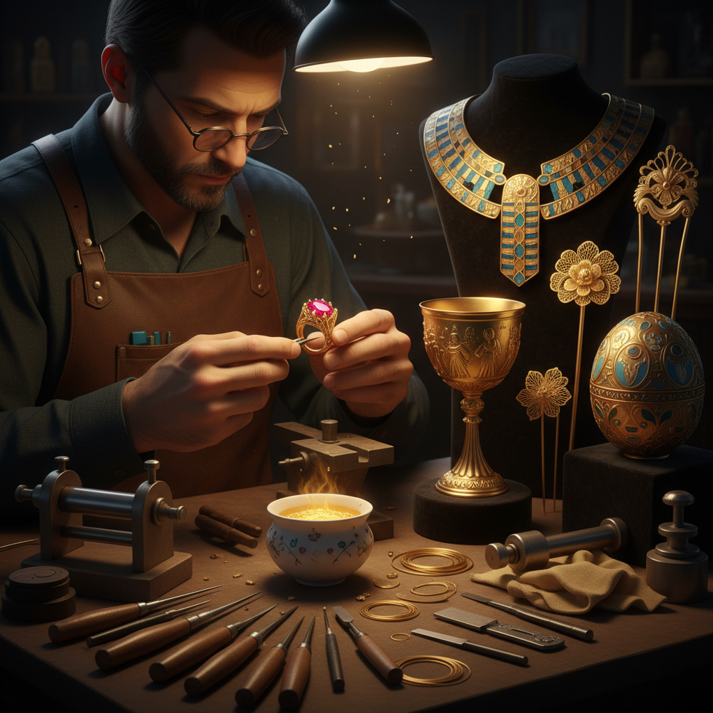

# Goldsmithing Art 金器艺术

> "Gold is the sun made solid — incorruptible, eternal, glowing with the same warm light whether freshly cast or buried for three thousand years. The goldsmith works with the most precious of metals, shaping it into crowns and chalices, into filigree so fine it looks like frozen lace, into settings that hold gemstones like captured stars. Gold forgives nothing: every mark, every scratch, every imperfection is preserved forever in its soft, yielding surface." — Unknown

## 概述

金器艺术（Goldsmithing Art）是以黄金为主要材料，通过锻造、铸造、雕刻、镶嵌和表面处理等技法创造珠宝、器物和装饰品的贵金属工艺艺术——包括金首饰、金器皿、金冠、金佛像和各种金制艺术品的制作。金器艺术是人类文明中最崇高的工艺传统之一。

金器艺术的实践包括：1）金首饰——金制的项链、戒指、耳环等；2）金器皿——金制的杯、盘、壶等；3）金冠和权杖——王室金器；4）金佛像——宗教金制造像；5）金丝镶嵌——金丝编织和镶嵌工艺；6）金箔工艺——金箔的制作和应用；7）当代金艺——将金作为当代艺术媒介的创作。

## 核心特征

| 特征 | 描述 |
|------|------|
| 永恒 | 不氧化不腐蚀 |
| 光泽 | 温暖的金色光泽 |
| 柔软 | 极好的延展性 |
| 珍贵 | 最珍贵的金属 |
| 象征 | 权力和神圣的象征 |
| 精密 | 极其精密的工艺 |

## 视觉特征

- **金色**：温暖的金色光泽
- **反射**：高度的光线反射
- **精细**：极其精细的工艺细节
- **镶嵌**：宝石的镶嵌
- **纹饰**：精美的表面纹饰
- **光影**：金面上的光影变化

## 代表作品

| 作品 | 艺术家/文化 | 年代 | 意义 |
|------|-------------|------|------|
| *Tutankhamun's mask* | 古埃及 | 公元前1323年 | 古埃及金器巅峰 |
| *Scythian gold* | 斯基泰 | 公元前4世纪 | 草原金器艺术 |
| *Cellini Salt Cellar* | Benvenuto Cellini | 1543 | 文艺复兴金器 |
| *Fabergé eggs* | Peter Carl Fabergé | 1885-1917 | 俄罗斯金器 |
| *Chinese gold artifacts* | 中国传统 | 古代至今 | 中国金器 |

## 历史时间线

| 时期 | 事件 |
|------|------|
| 公元前4000年 | 最早的金器制作 |
| 古代 | 各文明的金器传统 |
| 中世纪 | 宗教金器和王室金器 |
| 文艺复兴 | 金器艺术的高峰 |
| 当代 | 金器的当代艺术实践 |

## 中国语境

金器艺术在中国有悠久的传统——中国的金器制作可追溯到商代。中国古代的金器以其精湛的工艺著称——如汉代的金缕玉衣、唐代的金银器、明代的金冠等都是世界级的金器杰作。中国的花丝镶嵌工艺中，金丝工艺是最高级的形式——用极细的金丝编织出精美的图案。中国的佛教艺术中，金佛像和鎏金铜佛是重要的金器形式。中国当代的一些珠宝设计师将传统金器工艺与现代设计相结合——创造出既有传统韵味又具现代感的金饰。中国的金器收藏市场非常活跃——古代金器在拍卖市场上屡创高价。中国的黄金消费量居世界前列——从传统金饰到投资金条，黄金在中国文化中有特殊的地位。

## AI生成概念图

## 与其他风格的关系

- **Silversmithing** → 银器艺术
- **Jewelry Art** → 珠宝艺术
- **Filigree** → 花丝工艺
- **Metal Art** → 金属艺术
- **Sacred Art** → 宗教艺术
- **Luxury Craft** → 奢侈工艺

---

*浮光艺志 | Chronicle of Artistry*
