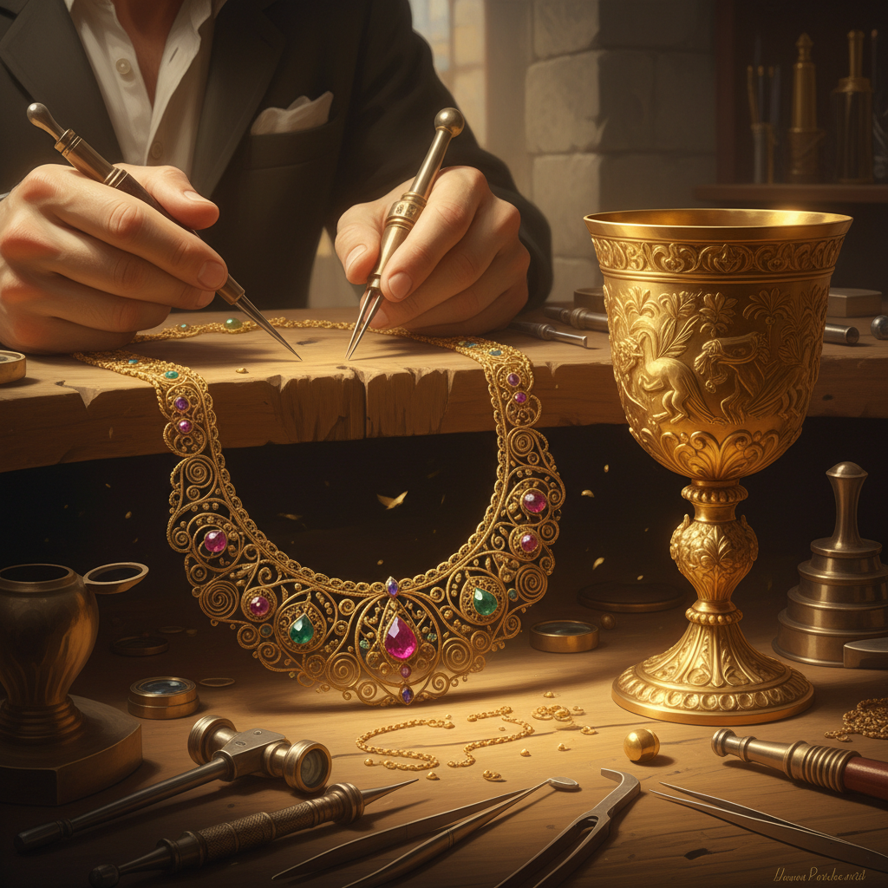

# Goldsmithing 金匠工艺

> "The goldsmith works with the sun's metal — every piece carries the weight of eternity." — Unknown

## 概述

金匠工艺（Goldsmithing）是以黄金为主要材料的精密金属加工艺术——涵盖锻造、铸造、焊接、镶嵌、雕刻、珐琅等全部金属工艺技法。金匠是人类历史上最受尊敬的工匠之一，从古埃及法老的黄金面具到中世纪的圣物箱，从文艺复兴的Cellini到当代的高级珠宝，金匠工艺代表了人类对材料的最高掌控力和对美的最极致追求。

金匠工艺的哲学在于：永恒的材料配得上永恒的技艺——黄金不会腐蚀、不会褪色，它要求与之匹配的完美工艺。

## 核心特征

| 特征 | 描述 |
|------|------|
| 黄金 | 以黄金为主要材料 |
| 综合 | 综合多种金属技法 |
| 精密 | 极其精密的工艺 |
| 奢华 | 材料本身的珍贵 |
| 永恒 | 黄金的永恒性 |
| 传统 | 深厚的师徒传统 |

## 视觉特征

- **金色**：黄金的温暖光泽
- **精密**：极其精密的细节
- **光泽**：抛光的镜面效果
- **奢华**：材料的天然奢华感
- **多技法**：多种技法的综合
- **宝石**：常与宝石结合

## 代表作品

| 作品 | 艺术家 | 年代 | 意义 |
|------|--------|------|------|
| *图坦卡蒙金面具* | 匿名 | 公元前1323年 | 古埃及金匠巅峰 |
| *Vaphio gold cups* | 匿名 | 公元前1500年 | 迈锡尼金杯 |
| *Cellini Salt Cellar* | Benvenuto Cellini | 1543 | 文艺复兴金匠杰作 |
| *Fabergé eggs* | Fabergé workshop | 1885-1917 | 近代金匠巅峰 |
| *Contemporary haute joaillerie* | Various | 当代 | 当代高级珠宝 |

## 历史时间线

| 时期 | 事件 |
|------|------|
| 公元前4000年 | 最早的黄金加工 |
| 古埃及 | 金匠工艺的早期巅峰 |
| 古希腊-罗马 | 地中海金匠传统 |
| 中世纪 | 教会金匠和行会制度 |
| 文艺复兴 | Cellini等大师 |
| 19世纪 | Fabergé的极致工艺 |
| 当代 | 高级珠宝和艺术金匠 |

## 中国语境

中国的金匠工艺历史悠久——从商代的金箔到汉代的金缕玉衣，从唐代的金银器到明清的宫廷金器。中国传统金匠技法包括锤鍱、錾刻、花丝、镶嵌、鎏金等。北京的花丝镶嵌是国家级非物质文化遗产，代表了中国金匠工艺的最高水平。当代中国的高级珠宝品牌也在传承和创新金匠工艺。

## AI生成概念图

## 与其他风格的关系

- **Jewelry** → 珠宝制作的核心
- **Granulation** → 金珠粒工艺
- **Filigree** → 花丝工艺
- **Repoussé** → 锤揲技法
- **Enamel** → 珐琅装饰
- **Lost-Wax Casting** → 失蜡铸造

---

*浮光艺志 | Chronicle of Artistry*
