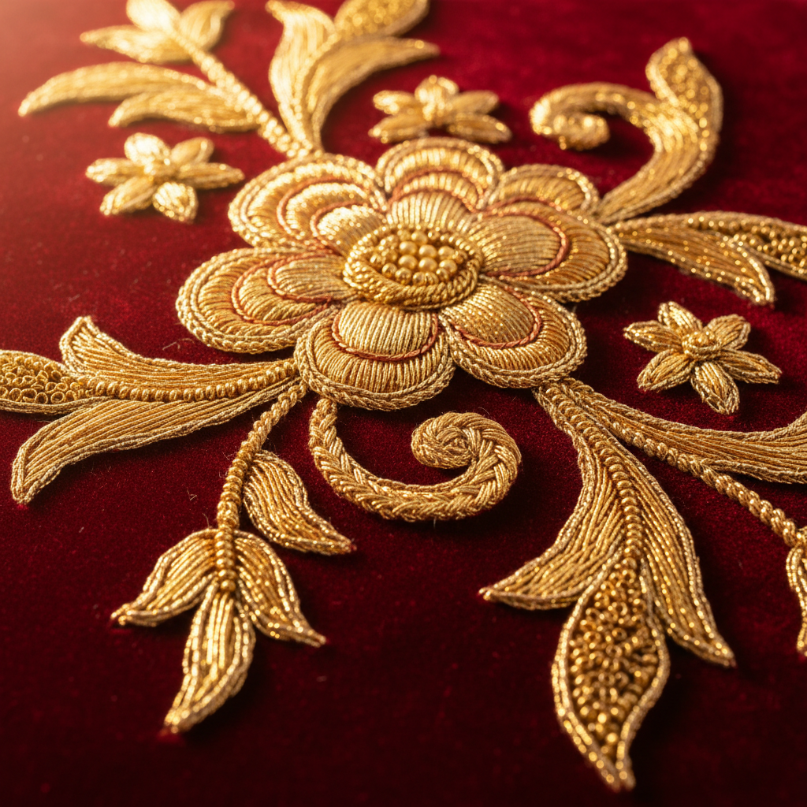

# Goldwork Art 金线绣艺术

> "Goldwork is embroidery's most opulent tradition — metal threads of gold, silver, and copper are couched, padded, and manipulated to create surfaces that shimmer and catch light with every movement. From medieval ecclesiastical vestments to contemporary textile art, goldwork transforms fabric into something that seems to glow from within, carrying centuries of sacred and royal associations in every gleaming stitch." — Unknown

## 概述

金线绣艺术（Goldwork Art）是使用金属线（金线、银线、铜线及各种金属材料）进行刺绣的传统技法——通过钉线、填充、切割和各种特殊技法创造出闪耀的金属表面效果。金线绣是最古老和最奢华的刺绣形式之一，广泛用于宗教法衣、皇室服饰和军装装饰。

金线绣艺术的实践包括：1）Couching——将金属线钉在织物表面；2）Or nué——用彩色丝线覆盖金线创造图案；3）Padding——在金线下填充创造立体效果；4）Cutwork——切割金属线创造纹理；5）Pearl purl——使用螺旋金属线；6）Check thread——使用方格纹金属线；7）Plate work——使用扁平金属片；8）当代金线绣——将传统技法与现代设计结合的创作。

## 核心特征

| 特征 | 描述 |
|------|------|
| 奢华 | 极其奢华的材料 |
| 闪耀 | 金属的光泽和闪耀 |
| 立体 | 丰富的立体效果 |
| 古老 | 数千年的历史 |
| 神圣 | 宗教和皇室传统 |
| 复杂 | 极其复杂的技法 |

## 视觉特征

- **金光**：金属线的闪耀光泽
- **立体**：填充和堆叠的立体感
- **纹理**：不同金属线的纹理变化
- **对比**：金属与织物的对比
- **庄严**：庄严华贵的整体感
- **光影**：随角度变化的光影效果

## 代表作品

| 作品 | 艺术家/文化 | 年代 | 意义 |
|------|-------------|------|------|
| *Opus Anglicanum* | 英国 | 13-14世纪 | 英国中世纪金线绣 |
| *Imperial Chinese dragon robes* | 中国 | 明清 | 龙袍金线绣 |
| *Russian Orthodox vestments* | 俄罗斯 | 中世纪至今 | 东正教法衣 |
| *Military goldwork* | 欧洲 | 18-19世纪 | 军装金线装饰 |
| *Contemporary goldwork* | 当代 | 当代 | 当代金线绣 |

## 历史时间线

| 时期 | 事件 |
|------|------|
| 古代 | 金线绣的起源（埃及、中东） |
| 中世纪 | Opus Anglicanum的黄金时代 |
| 明清 | 中国宫廷金线绣的巅峰 |
| 18-19世纪 | 军装金线绣的发展 |
| 当代 | 金线绣的艺术化复兴 |

## 中国语境

金线绣艺术在中国有极其悠久和辉煌的传统。中国的"盘金绣"是最重要的金线绣技法——将金线盘成各种图案并用丝线钉固在织物上。中国宫廷的龙袍和凤袍大量使用金线绣——以金线绣龙凤、云纹、海水江崖等图案。中国的"京绣"（宫廷绣）以金线绣著称——是清代宫廷服饰的主要装饰技法。中国苏绣中的"金银线绣"将金线与丝线结合——创造出独特的光泽效果。中国的戏曲服装中大量使用金线绣——增添舞台的华丽效果。中国当代的一些刺绣艺术家重新探索金线绣——将传统宫廷技法与当代艺术表达结合。中国的非物质文化遗产保护中，盘金绣被列为重要保护项目——传承这一珍贵的宫廷工艺。

## AI生成概念图

## 与其他风格的关系

- **Stumpwork** → 立体绣
- **Crewelwork** → 毛线绣
- **Ecclesiastical Embroidery** → 教会刺绣
- **Chinese Embroidery** → 中国刺绣
- **Military Art** → 军事艺术
- **Textile Art** → 纺织艺术

---

*浮光艺志 | Chronicle of Artistry*
