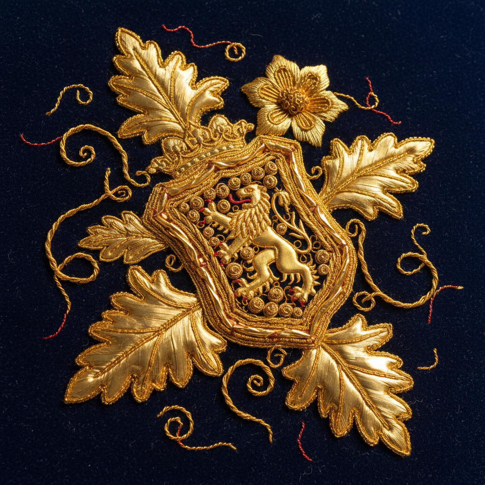

# Goldwork Embroidery Art 金线刺绣艺术

> "Goldwork is embroidery's crown — real gold and silver threads, wires, and plates are couched, padded, and stitched onto fabric to create surfaces that blaze with metallic splendor. The gold does not pass through the fabric like ordinary thread but lies on the surface, held in place by tiny stitches of silk, preserving every inch of precious metal while creating textures from smooth satin to rough bark." — Unknown

## 概述

金线刺绣艺术（Goldwork Embroidery Art）是一种使用金属线（金线、银线、铜线）在织物表面进行刺绣的传统装饰技法——金属线通常不穿过织物，而是铺设在表面用丝线固定（couching），以保存珍贵的金属材料。金线刺绣是最华丽和最昂贵的刺绣形式之一，历史上用于宗教法衣、王室服饰和军事徽章。

金线刺绣艺术的实践包括：1）铺金（Couching）——将金属线铺在表面用丝线固定；2）垫绣——在垫料上铺金创造立体效果；3）金片绣——使用金属片（purl）创造纹理；4）金板绣——使用扁平金属条；5）金网绣——用金属线创造网格效果；6）混合技法——金线与丝线的结合；7）当代金线刺绣——将传统技法与现代设计结合的创作。

## 核心特征

| 特征 | 描述 |
|------|------|
| 金属 | 使用真金属线 |
| 表面 | 金属线铺在表面 |
| 华丽 | 极其华丽的效果 |
| 昂贵 | 材料极其昂贵 |
| 宗教 | 宗教和王室传统 |
| 立体 | 可创造立体效果 |

## 视觉特征

- **光泽**：金属的华丽光泽
- **立体**：垫绣的立体效果
- **质感**：多种金属纹理
- **华丽**：极其华丽的整体感
- **对比**：金属与织物的对比
- **庄严**：庄严神圣的气质

## 代表作品

| 作品 | 艺术家/文化 | 年代 | 意义 |
|------|-------------|------|------|
| *Opus Anglicanum* | 英国 | 13-14世纪 | 英国中世纪金线刺绣 |
| *Byzantine vestments* | 拜占庭 | 中世纪 | 拜占庭宗教法衣 |
| *Royal School of Needlework* | 英国 | 1872年起 | 皇家刺绣学校 |
| *Military goldwork* | 欧洲 | 18-19世纪 | 军事金线刺绣 |
| *Contemporary goldwork* | 国际 | 当代 | 当代金线刺绣 |

## 历史时间线

| 时期 | 事件 |
|------|------|
| 古代 | 金线刺绣的起源 |
| 中世纪 | Opus Anglicanum的黄金时代 |
| 文艺复兴 | 宫廷金线刺绣的繁荣 |
| 18-19世纪 | 军事和宗教金线刺绣 |
| 当代 | 金线刺绣的艺术化发展 |

## 中国语境

金线刺绣在中国有极其悠久和精湛的传统。中国的金银线绣（盘金绣）是传统刺绣的重要技法——在宫廷服饰和宗教用品中广泛使用。中国的龙袍和凤袍大量使用金线刺绣——代表了皇权和尊贵。中国苏绣、粤绣、蜀绣和湘绣中都有金线刺绣的传统——各有特色。中国的京绣（宫绣）以金线刺绣著称——是国家级非物质文化遗产。中国当代的刺绣艺术家将传统金线技法与现代设计结合——在高级定制时装和艺术品中应用。中国的刺绣教育中，金线刺绣作为高级技法——在专业课程中教授。

## AI生成概念图

## 与其他风格的关系

- **Embroidery** → 刺绣艺术
- **Stumpwork** → 立体刺绣
- **Crewel** → 毛线刺绣
- **Textile Art** → 纺织艺术
- **Religious Art** → 宗教艺术
- **Couture** → 高级定制

---

*浮光艺志 | Chronicle of Artistry*
