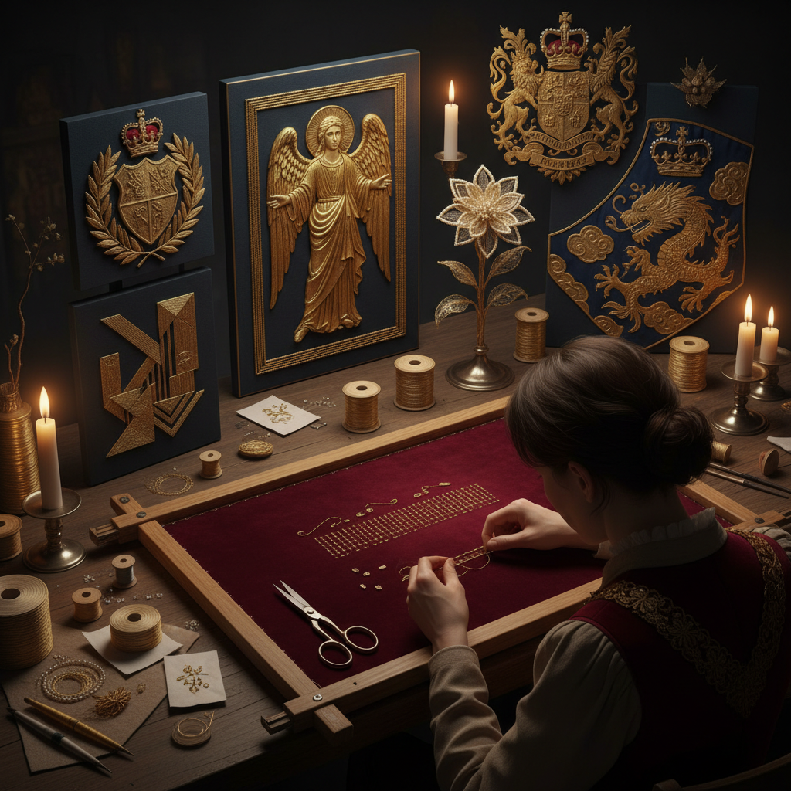

# Goldwork Embroidery 金线刺绣

> "Goldwork is embroidery's most regal tradition — metal threads couched, padded, and layered to catch light from every angle, transforming fabric into surfaces that shimmer like armor, glow like treasure, and carry the weight of centuries of royal, ecclesiastical, and military ceremony." — Unknown

## 概述

金线刺绣（Goldwork Embroidery）是一种使用金属线（金线、银线、铜线及其合金）在织物上进行刺绣的古老技艺。金线刺绣不同于普通刺绣——金属线通常不穿过织物，而是铺设在表面用细丝线固定（couching/钉线法），因为金属线太脆弱或太粗无法穿过织物。金线刺绣的技法包括：钉线法（couching）、填充法（padding）、切割法（cutwork）、珠片法（purl work）等。

金线刺绣有极其悠久的历史——从古埃及的金线装饰到拜占庭的宗教刺绣，从中世纪英国的Opus Anglicanum到中国的盘金绣。金线刺绣传统上用于宗教法衣、皇室礼服、军事徽章和贵族装饰。当代金线刺绣在高级定制时装（Haute Couture）、艺术刺绣和文物修复中仍有重要地位。

## 核心特征

| 特征 | 描述 |
|------|------|
| 金属线 | 使用金属线材 |
| 钉线法 | 核心couching技法 |
| 光泽 | 金属的光泽效果 |
| 立体 | 填充的立体效果 |
| 奢华 | 极其奢华的视觉 |
| 传统 | 悠久的宫廷传统 |

## 视觉特征

- **光泽**：金属线的闪耀光泽
- **立体**：填充的立体浮雕效果
- **奢华**：皇室级的奢华感
- **纹理**：多种金属线的纹理变化
- **对比**：金属与织物的对比
- **庄严**：庄严华贵的气质

## 代表作品

| 作品 | 艺术家 | 年代 | 意义 |
|------|--------|------|------|
| *Opus Anglicanum vestments* | 英国工匠 | 中世纪 | 中世纪金线刺绣 |
| *Imperial Chinese dragon robes* | 中国宫廷 | 明清 | 中国盘金绣龙袍 |
| *Military goldwork insignia* | Various | 18-20世纪 | 军事金线徽章 |
| *Haute Couture goldwork* | Lesage | 当代 | 高定金线刺绣 |
| *RSN goldwork* | Royal School of Needlework | 当代 | 英国皇家刺绣学校 |

## 历史时间线

| 时期 | 事件 |
|------|------|
| 古代 | 古埃及和近东的金线装饰 |
| 拜占庭 | 宗教金线刺绣的鼎盛 |
| 中世纪 | Opus Anglicanum的辉煌 |
| 明清 | 中国盘金绣的精致发展 |
| 当代 | 高级定制和艺术刺绣中的金线 |

## 中国语境

金线刺绣在中国有极其辉煌的传统——中国的"盘金绣"是金线刺绣的东方代表。明清皇室的龙袍、凤袍大量使用盘金绣技法——金线盘成龙纹、云纹、花卉等图案。中国的金线刺绣是国家级非物质文化遗产。苏绣中的"金银绣"、粤绣中的"金绒混绣"都是金线刺绣的地方变体。当代中国的金线刺绣在文物修复、高端定制和艺术创作中仍有重要应用。

## AI生成概念图

## 与其他风格的关系

- **Embroidery** → 刺绣
- **Needle Painting** → 针绣绘画
- **Haute Couture** → 高级定制
- **Ecclesiastical Art** → 宗教艺术
- **Metalwork** → 金属工艺
- **Textile Art** → 纺织艺术

---

*浮光艺志 | Chronicle of Artistry*
