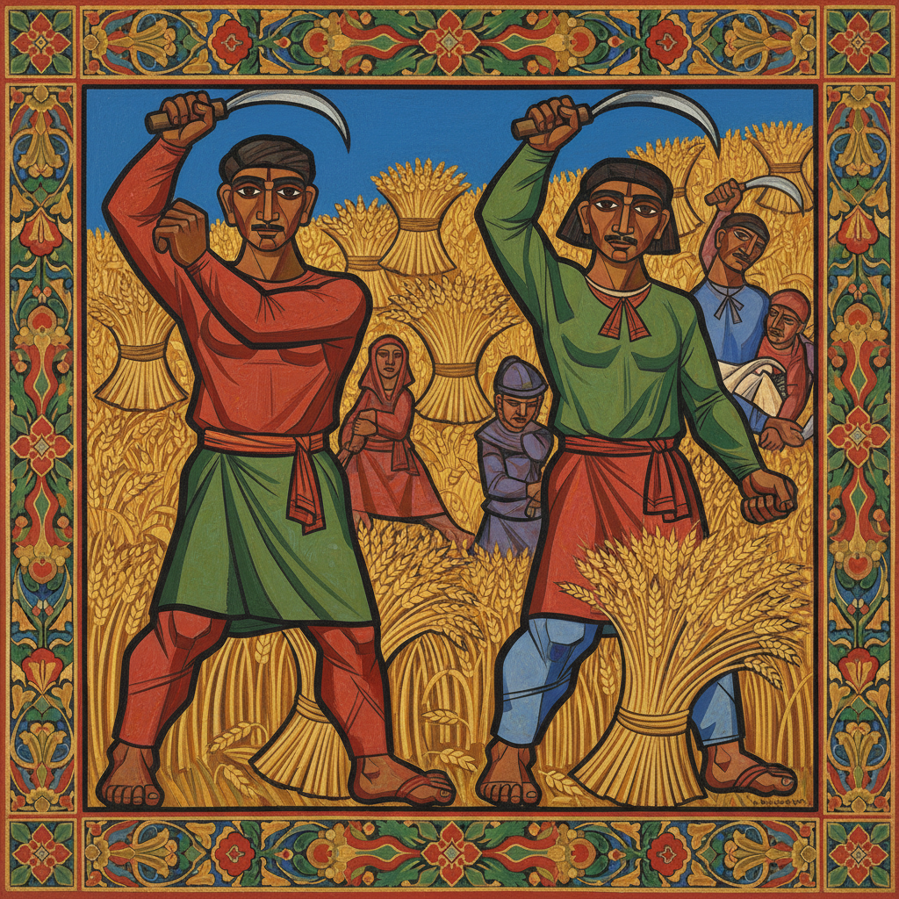

# Goncharova Art 冈察洛娃艺术

> "I shake off the dust of the West and I consider all those people who do not value the East inferior." — Natalia Goncharova

## 概述

冈察洛娃艺术（Goncharova Art）是20世纪初俄罗斯先锋派画家娜塔莉亚·谢尔盖耶芙娜·冈察洛娃（Natalia Sergeyevna Goncharova, 1881-1962）创立的新原始主义和辐射主义绑画风格。冈察洛娃是俄罗斯先锋派运动中最重要的女性艺术家——她将俄罗斯民间艺术、圣像画传统和西方现代主义融为一体，创造了一种充满原始力量和装饰美感的独特风格。

冈察洛娃与米哈伊尔·拉里奥诺夫共同创立了"辐射主义"（Rayonism）——一种以光线辐射为基础的抽象绑画理论。但她最具影响力的作品是新原始主义时期的创作——将俄罗斯农民生活、民间版画（lubok）和圣像画的元素以现代形式重新表达。她后来成为杰出的舞台设计师，为佳吉列夫的俄罗斯芭蕾舞团设计了多部经典作品的布景和服装。

冈察洛娃艺术的核心要素包括：1）新原始主义——民间艺术的现代转化；2）辐射主义——光线辐射的抽象表达；3）民间版画——俄罗斯lubok传统；4）圣像画——东正教圣像的现代诠释；5）装饰力量——强烈的装饰性和原始力量；6）舞台设计——绑画与表演艺术的融合；7）女性先锋——打破性别界限的艺术勇气。

## 核心特征

| 特征 | 描述 |
|------|------|
| 新原始主义 | 民间艺术现代转化 |
| 辐射主义 | 光线辐射抽象表达 |
| 民间版画 | 俄罗斯lubok传统 |
| 圣像画 | 东正教圣像现代诠释 |
| 装饰力量 | 强烈装饰性原始力量 |
| 舞台设计 | 绑画与表演艺术融合 |

## 视觉特征

- **粗犷线条**：有力而粗犷的轮廓线
- **鲜艳平涂**：大面积的鲜艳色彩
- **农民形象**：劳动中的农民
- **民间图案**：民间版画风格的图案
- **辐射线条**：光线辐射的抽象线条
- **装饰构图**：强烈的装饰性构图

## 代表作品

| 作品 | 年代 | 意义 |
|------|------|------|
| *收割* (Harvesting) | 1911 | 新原始主义代表 |
| *骑自行车的人* (Cyclist) | 1913 | 未来主义与原始主义 |
| *猫* (Cats) | 1913 | 辐射主义作品 |
| *西班牙女人* (Spanish Woman) | 1916 | 装饰风格 |
| *四福音书* (The Evangelists) | 1911 | 宗教现代化 |
| *金鸡* (Le Coq d'Or) 舞台设计 | 1914 | 舞台艺术 |

## 历史时间线

| 时期 | 事件 |
|------|------|
| 1881年 | 出生于图拉省 |
| 1901-1909年 | 莫斯科学习绑画 |
| 1910-1913年 | 新原始主义和辐射主义时期 |
| 1913年 | 举办大型回顾展 |
| 1914年 | 为佳吉列夫设计《金鸡》 |
| 1915年 | 移居巴黎 |
| 1962年 | 在巴黎去世 |

## 中国语境

冈察洛娃在中国的知名度相对有限，但她的艺术理念对中国当代艺术有重要的启示。她将本民族民间艺术（lubok版画、圣像画）与西方现代主义相结合的方法，为中国艺术家提供了一种"民族现代化"的参考路径——如何在保持民族文化根基的同时实现艺术语言的现代转化。冈察洛娃作为20世纪初最重要的女性先锋艺术家之一，她的成就也为讨论中国女性艺术家的历史贡献提供了比较视角。她的新原始主义——从民间艺术中汲取力量——与中国当代艺术中"寻根"运动有深层的共鸣。

## 概念图

## 与其他风格的关系

- **Rayonism** → 辐射主义（共同创立）
- **Larionov** → 拉里奥诺夫（伴侣和合作者）
- **Neo-Primitivism** → 新原始主义
- **Futurism** → 未来主义
- **Russian Folk Art** → 俄罗斯民间艺术
- **Ballets Russes** → 俄罗斯芭蕾舞团

---

*浮光艺志 | Chronicle of Artistry*
