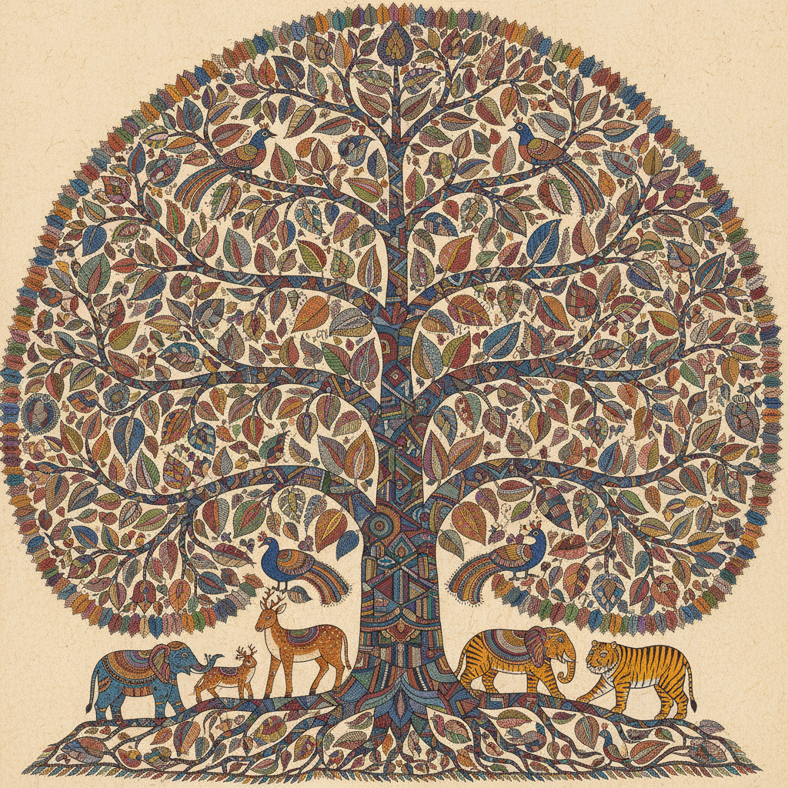

# Gond Art 贡德绘画

> **"每一个点都是一颗种子——中印度森林部落用点和线编织万物的灵魂。"**

## 概述

贡德绘画（Gond Art / गोंड कला）是印度中部贡德部落（Gond tribe）的传统绘画艺术，主要分布在中央邦（Madhya Pradesh）、恰蒂斯加尔邦和奥里萨邦。贡德人是印度最大的部落群体之一（约1200万人），其绘画传统以精细的点线填充和对自然万物的灵性描绘著称。1980年代，艺术家Jangarh Singh Shyam将贡德绘画从墙壁和地面带入画布和纸面，使其获得国际艺术界的认可。

## 核心特征

- **点线填充**：用精细的点和线填满每一个形状
- **万物有灵**：树木、动物、河流都有灵魂和故事
- **梦境与现实**：融合日常观察和精神世界的意象
- **自然主题**：森林、动物、鸟类、树木是核心题材
- **鲜艳色彩**：当代作品使用丙烯颜料的鲜艳色彩
- **装饰性图案**：每种动物和植物有独特的内部纹理

## 视觉特征

- 精细的点和线构成的内部纹理
- 每个生物体内部有独特的图案世界
- 鲜艳的色彩对比（蓝、红、黄、绿）
- 流畅的有机轮廓线
- 大尺度的动物和树木形象
- 叙事性的场景构图

## 代表艺术家

| 艺术家 | 贡献 |
|--------|------|
| Jangarh Singh Shyam (1962–2001) | 贡德绘画现代化的先驱 |
| Bhajju Shyam | 国际知名，《伦敦丛林》作者 |
| Durga Bai | 女性贡德艺术家代表 |
| Venkat Raman Singh Shyam | 当代贡德绘画大师 |

## 与其他风格的关系

| 风格 | 关系 |
|------|------|
| Warli Art | 共享印度部落艺术传统 |
| Madhubani | 共享印度民间绘画传统 |
| 澳大利亚原住民点画 | 共享点状填充和万物有灵 |
| Art Brut/素人艺术 | 共享非学院派的原生力量 |
| 当代插画 | 贡德风格影响全球插画设计 |

## 概念图

---

*浮光艺志 | Chronicle of Artistry*
