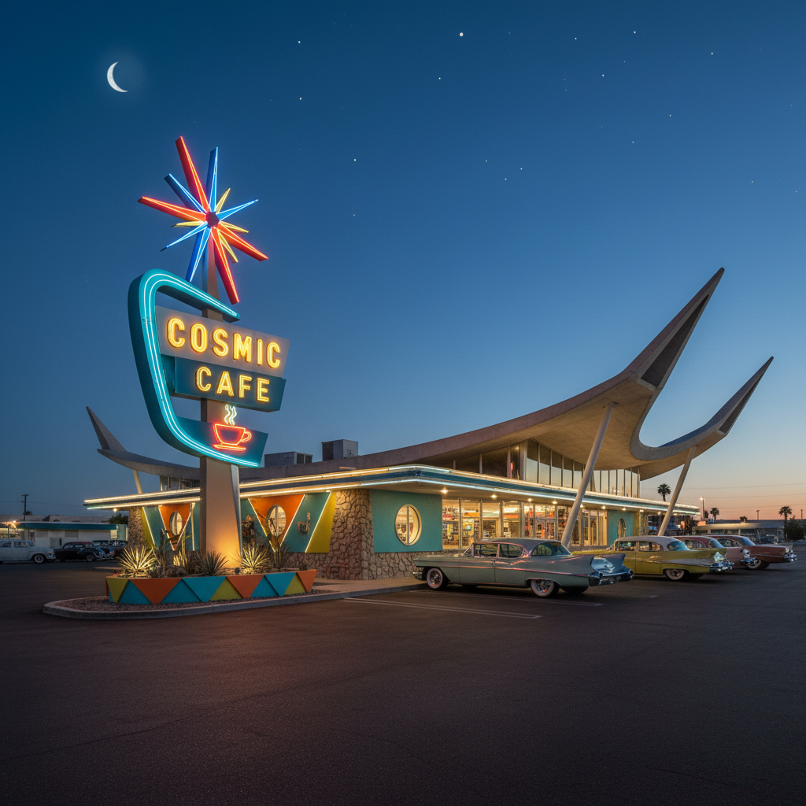

# Googie 古吉风格



> **"飞碟屋顶、霓虹星爆、原子图案——未来就在路边的咖啡店。"**

## 概述

| 维度 | 描述 |
|------|------|
| 时期 | 1945–1970s |
| 别名 | Googie, Populuxe, Doo Wop, Coffee Shop Modern, 古吉建筑 |
| 核心色彩 | 霓虹粉、太空银、原子橙、星爆黄、公路蓝 |
| 关键元素 | 上翘屋顶、星爆图案、回旋镖、飞碟造型、霓虹灯 |
| 代表人物 | John Lautner, Wayne McAllister, Armet & Davis |
| 关联风格 | Streamline Moderne, Atompunk, Retro-Futurism, Mid-Century Modern |

---

## 历史脉络

| 年份 | 事件 |
|------|------|
| 1949 | John Lautner设计好莱坞Googies咖啡店——风格命名来源 |
| 1952 | Douglas Haskell在《House and Home》杂志命名"Googie" |
| 1950s | 麦当劳金色拱门——Googie风格的商业化巅峰 |
| 1957 | 人造卫星发射——太空竞赛加速Googie美学 |
| 1962 | 西雅图太空针塔——Googie精神的城市地标 |
| 1960s | Las Vegas霓虹大道——Googie的极致表达 |
| 1970s | 国际风格取代Googie——许多建筑被拆除 |
| 2000s | Googie建筑保护运动——怀旧复兴 |

### 核心哲学

Googie的精神是**"未来是乐观的——每个路边餐厅都是通往太空的门户"**：
- "建筑就是广告——必须从高速公路上一眼看到"
- "原子时代 + 太空竞赛 + 汽车文化 = Googie"
- "飞碟屋顶 = 我们即将飞向太空"
- "霓虹灯 = 未来是发光的"
- "普通人也配拥有未来感——不只是精英"

---

## 视觉语法

### 色彩系统

```
主色：
  霓虹粉 (#FF69B4) — 兴奋、未来
  太空银 (#C0C0C0) — 金属、科技
  原子橙 (#FF6347) — 能量、活力
  星爆黄 (#FFD700) — 太阳、乐观

辅色：
  公路蓝 (#4169E1) — 天空、自由
  薄荷绿 (#98FB98) — 清新、50年代
  深红 (#DC143C) — 霓虹、夜晚

建筑元素：
  上翘屋顶 — 克服重力、飞行
  悬臂结构 — 悬浮、未来
  大面积玻璃 — 透明、开放
  霓虹招牌 — 夜间可见、吸引力
  星爆装饰 — 原子、太空

规则：
  - 大胆、夸张、引人注目
  - 几何形状 + 有机曲线
  - 必须从车内一眼看到
  - 乐观、民主、大众化
  - 未来感 > 实用性
```

### 标志性元素

| 类别 | 元素 |
|------|------|
| 建筑 | 上翘屋顶、悬臂、飞碟造型 |
| 图案 | 星爆、回旋镖、原子、抛物线 |
| 材料 | 钢、玻璃、混凝土、霓虹 |
| 场所 | 咖啡店、加油站、汽车旅馆、保龄球馆 |
| 招牌 | 巨型霓虹、未来字体、箭头 |
| 态度 | 乐观、大众、商业、娱乐 |

---

## 与千禧怀旧/当代的关系

### The Jetsons美学
- 《杰森一家》(1962) = Googie的动画化
- Googie建筑 = "我们以为2000年会是这样"
- 千禧怀旧中的"失落的未来" = Googie的遗产

### 对当代的影响
- In-N-Out Burger的棕榈树+箭头 = Googie遗产
- Las Vegas复古区 = Googie保护
- Fallout游戏系列 = Googie + Atompunk
- "Retro Diner"美学 = Googie的商业延续

---

## 设计应用

| 场景 | 应用方式 |
|------|----------|
| 餐饮 | 复古餐厅+霓虹+星爆 |
| 游戏 | 原子时代+复古未来 |
| 品牌 | 乐观+大众+怀旧+趣味 |
| 建筑 | 保护+复兴+致敬 |

---

## 相关风格

← [Streamline Moderne 流线型现代](streamline-moderne.md) | [Atompunk 原子朋克](atompunk.md) →

↑ [返回千禧怀旧目录](README.md) | [返回总目录](../README.md)
