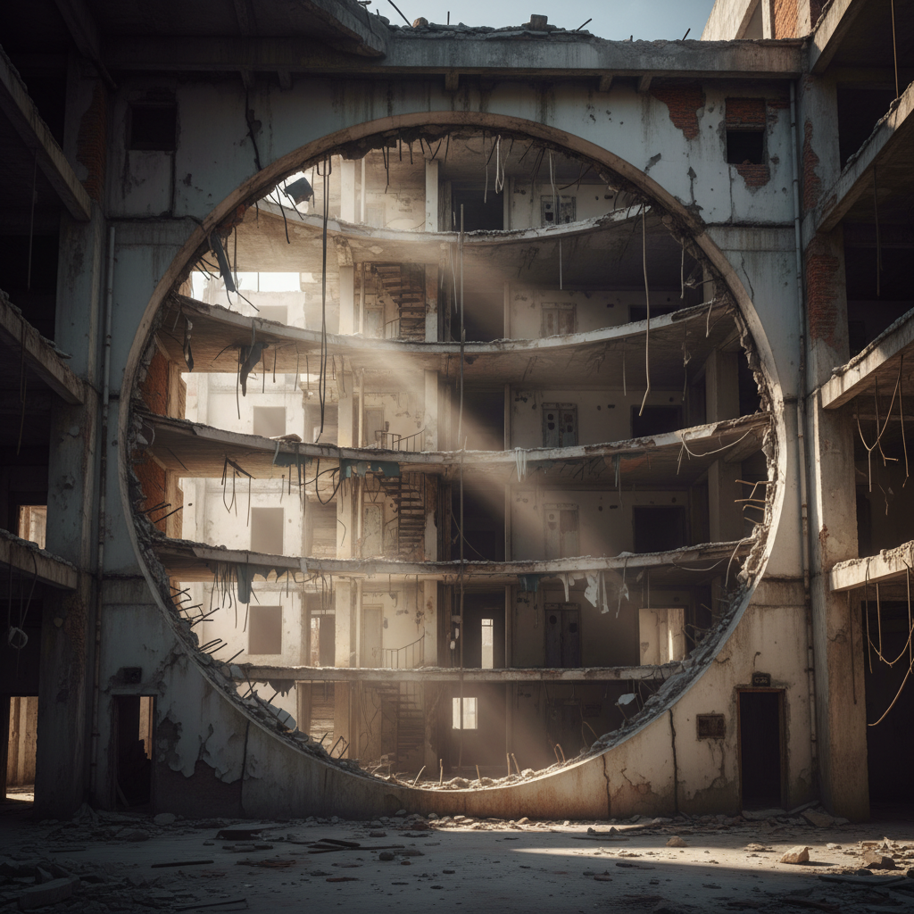

# Gordon Matta-Clark 戈登·马塔-克拉克

> **时期：** 1943–1978  
> **关键词：** 建筑切割、无政府建筑、城市考古、解构空间

## 概述

Gordon Matta-Clark 是美国艺术家，以对废弃建筑进行大胆切割而闻名——他用电锯在即将拆除的房屋中切出圆形、锥形或对角线的空洞，将建筑的隐藏结构（地板层、管道、墙壁内部）暴露出来，创造出既是雕塑又是建筑批评的临时作品。他于35岁因癌症去世。

## 风格特征

- **建筑切割**：在真实建筑中切出几何形状的空洞
- **暴露隐藏结构**：揭示建筑内部通常不可见的层次和材料
- **临时性**：作品存在于建筑被拆除之前的短暂时间内
- **光的引入**：切割创造出意想不到的光线通道和视觉穿透
- **城市批评**：作品质疑财产、居住和城市更新的政治

## 代表作品

- *Splitting*（1974）
- *Conical Intersect*（1975）
- *Day's End*（1975）
- *Circus or The Caribbean Orange*（1978）

## 历史意义

Matta-Clark 创造了"无政府建筑"（Anarchitecture）的概念，将建筑从居住功能解放为雕塑和社会批评的媒介。他的作品影响了后来的解构主义建筑、场域特定艺术和城市干预艺术。

## 概念图

