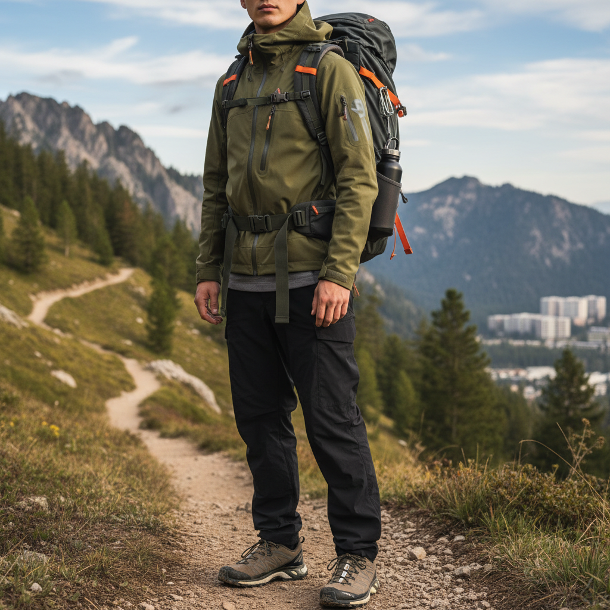

# Gorpcore 户外核



> **"穿着始祖鸟去咖啡馆——当登山装备成为都市时尚。"**

## 概述

| 维度 | 描述 |
|------|------|
| 时期 | 2017–至今 |
| 别名 | Gorpcore, Outdoor Voices, Techwear Lite, Trail Fashion |
| 核心色彩 | 橄榄绿、黑色、卡其、橙色（安全色）、灰色 |
| 关键元素 | 冲锋衣、登山鞋、机能裤、腰包、水壶 |
| 代表人物 | 始祖鸟(Arc'teryx)、Salomon、The North Face |
| 关联风格 | Normcore, Techwear, Cottagecore, Health Goth |

---

## 历史脉络

### 什么是 GORP？

"GORP" 原意是 **Good Old Raisins and Peanuts**（好老式的葡萄干和花生），指登山时吃的混合坚果零食。Gorpcore 就是把这种"户外徒步者"的穿着带入城市日常。

### 2017–2019：从功能到时尚

Gorpcore 的转折点：
- **2017**：《The Cut》首次使用 "Gorpcore" 一词
- **2018**：Balenciaga 与 The North Face 的联名暗示高端时尚接纳户外
- **2019**：Salomon 从专业跑鞋变成潮流单品
- 始祖鸟从"中年爸爸的冲锋衣"变成"年轻人的身份标识"

### 2020–2022：疫情加速

COVID-19 再次成为催化剂：
- 封城期间，户外活动成为少数被允许的社交方式
- 徒步、露营、骑行爆发 → 户外装备需求暴增
- "在自然中"成为一种社交媒体内容类型
- 功能性服装的舒适性在居家时代被重新评价

### 2023–至今：奢侈化

Gorpcore 进入奢侈品领域：
- Arc'teryx 被安踏收购后价格飙升
- LOEWE × On Running 联名
- Moncler 的持续增长
- "Quiet Outdoor" = Quiet Luxury + Gorpcore

---

## 视觉语法

### 色彩系统

```
主色（取自自然+安全色）：
  橄榄绿 (#556B2F) — 最核心的 Gorpcore 色
  黑色 (#1A1A1A) — 技术面料的基底
  卡其/沙色 (#C3B091) — 沙漠/岩石
  石灰灰 (#808080) — 混凝土+岩石

点缀色（安全/警示色）：
  安全橙 (#FF6600) — 登山绳、标志
  荧光黄 (#CCFF00) — 反光条
  钴蓝 (#0047AB) — 水壶、背包

质感：
  Gore-Tex / 防水面料
  尼龙/Cordura
  Vibram 橡胶底
  反光材料
  网眼/透气面料
```

### 标志性元素

| 类别 | 元素 | 品牌代表 |
|------|------|----------|
| 外套 | 硬壳冲锋衣 | Arc'teryx, Patagonia |
| 鞋 | 越野跑鞋/登山靴 | Salomon, Hoka, Merrell |
| 裤子 | 机能裤/速干裤 | Arc'teryx, Gramicci |
| 包 | 腰包/胸包/登山包 | Osprey, Gregory |
| 配饰 | 登山扣、水壶、头灯 | Nalgene, Petzl |
| 帽子 | 渔夫帽/鸭舌帽 | Patagonia |

### Gorpcore vs Techwear

| 维度 | Gorpcore | Techwear |
|------|----------|----------|
| 来源 | 户外运动 | 赛博朋克/军事 |
| 色调 | 自然色+安全色 | 全黑/暗色 |
| 品牌 | Arc'teryx, Patagonia | ACRONYM, Nike ACG |
| 情绪 | 亲近自然、健康 | 都市生存、未来感 |
| 场景 | 山野→城市 | 城市→未来 |

---

## 与千禧怀旧的关系

Gorpcore 与千禧怀旧的关系是**间接但有趣**的：

### 90年代户外文化的回潮
- 90年代 The North Face 的 Nuptse 羽绒服 → 2020s 的复刻热潮
- 90年代 Timberland 大黄靴 → 嘻哈文化中的户外元素
- Patagonia 的"不要买这件夹克"(2011) → 反消费主义的消费主义

### 对数字生活的反动
- 千禧怀旧怀念的是"更好的数字时代"
- Gorpcore 逃离的是"所有的数字时代"
- 两者共享对当下的不满，但方向相反

---

## 中国语境

Gorpcore 在中国的爆发：
- **始祖鸟现象**：从专业户外到"中产标配"
- **露营热**：2021–2022 年小红书露营内容爆发
- **徒步文化**：城市周边徒步成为年轻人社交方式
- **"山系"穿搭**：日本 mountain style 的中国化
- **品牌溢价**：始祖鸟在中国的价格远超海外

---

## 设计应用

| 场景 | 应用方式 |
|------|----------|
| 品牌设计 | 功能字体+自然色板+等高线图案 |
| 包装 | 防水材质+荧光色标签+极简信息 |
| 空间 | 原木+岩石+绿植+功能照明 |
| UI | 地图元素+数据可视化+深色模式 |

---

## 延伸阅读

- Aesthetics Wiki: [Gorpcore](https://aesthetics.fandom.com/wiki/Gorpcore)
- 《The Cut》"Gorpcore" 原始报道 (2017)
- 始祖鸟品牌文化分析

---

## 相关风格

← [Normcore 正常核](normcore.md) | [Techwear 机能穿搭](techwear.md) →

↑ [返回千禧怀旧目录](README.md) | [返回总目录](../README.md)
