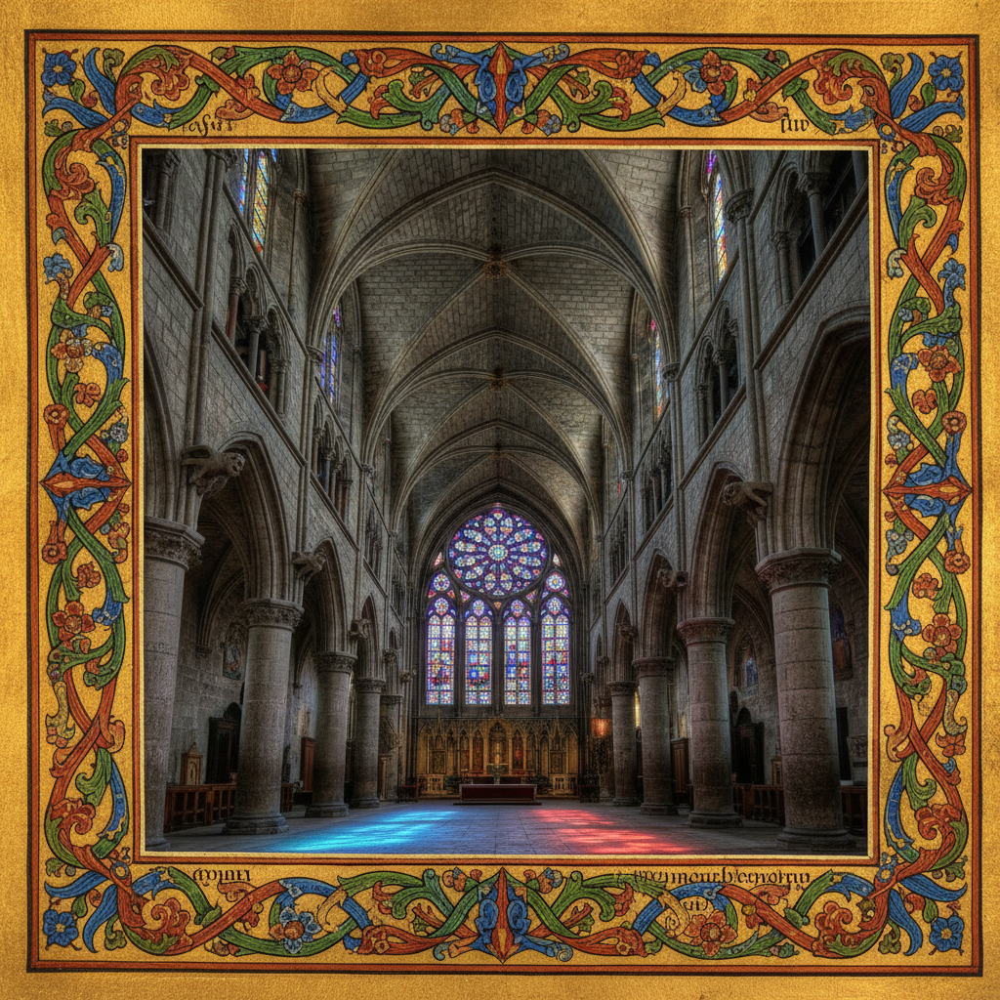

# Gothic Art 哥特艺术



> **"尖拱直指天堂、彩色玻璃过滤神圣之光——中世纪用建筑和图像触摸上帝。"**

## 概述

| 维度 | 描述 |
|------|------|
| 时期 | 1140–1500/影响至今 |
| 别名 | Gothic Art, Medieval Gothic, Gothic Architecture, 哥特艺术 |
| 核心色彩 | 深色+宝石色、金色、深蓝、深红、彩色玻璃色 |
| 关键元素 | 尖拱、飞扶壁、彩色玻璃、手抄本装饰、垂直感 |
| 代表人物 | 无名工匠群体、Giotto(过渡期)、Limbourg Brothers |
| 关联风格 | Romanesque, Pre-Raphaelite, Gothic Revival, Dark Academia, Gothic Subculture |

---

## 历史脉络

| 年份 | 事件 |
|------|------|
| 1140 | 圣丹尼修道院——哥特建筑诞生 |
| 1163 | 巴黎圣母院开始建造 |
| 1200s | 哥特式大教堂遍布欧洲 |
| 1300s | 国际哥特风格——精细装饰 |
| 1400s | 晚期哥特/火焰哥特——极致装饰 |
| 1800s | Gothic Revival——哥特复兴 |
| 2020s | "Gothic aesthetic"在亚文化中持续 |

### 核心哲学

哥特艺术的精神是**"让石头变成光——让建筑变成祈祷"**：
- 垂直 = 升天（"一切向上——指向天堂"）
- 光 = 神圣（"彩色玻璃把阳光变成上帝的语言"）
- 精细 = 虔诚（"每一个雕刻都是对上帝的奉献"）
- 巨大 = 谦卑（"在大教堂面前——人是渺小的"）
- "哥特大教堂是中世纪的'总体艺术'——建筑+雕塑+绘画+光"

---

## 视觉语法

### 色彩系统

```
建筑/雕塑：
  石灰色 (#C0C0C0) — 石头
  金色 (#DAA520) — 装饰、圣物
  黑色 (#000000) — 铁艺、阴影

彩色玻璃：
  宝石蓝 (#0F52BA) — 天空、圣母
  宝石红 (#DC143C) — 基督、殉道
  翡翠绿 (#50C878) — 自然、希望
  金黄 (#FFD700) — 神圣、光

手抄本：
  金箔 — 装饰、神圣
  群青 — 珍贵颜料
  朱红 — 首字母装饰
  羊皮纸色 — 背景

质感：
  石头 — 雕刻、纹理
  玻璃 — 透光、色彩
  金箔 — 闪耀、装饰
  羊皮纸 — 手抄本
```

### 标志性元素

| 类别 | 元素 |
|------|------|
| 建筑 | 尖拱、飞扶壁、玫瑰窗、尖塔 |
| 装饰 | 彩色玻璃、石雕、金箔、藤蔓 |
| 图像 | 圣经故事、圣人、怪兽(gargoyle) |
| 手抄本 | 装饰首字母、边框、微型画 |
| 精神 | 垂直、光、精细、神圣、敬畏 |
| 态度 | 虔诚、精细、匿名、集体、永恒 |

---

## 与千禧怀旧的关系

### "Gothic"的多重含义
- Gothic Art (中世纪) ≠ Gothic Subculture (1980s+)
- 但两者共享：黑暗、神秘、精细、戏剧性
- "Dark Academia"美学 = 哥特建筑的当代粉丝
- 哥特大教堂 = Instagram上最受欢迎的建筑类型之一

### 对Fantasy视觉的影响
- 哥特建筑 → 所有奇幻世界的城堡和教堂
- → 《指环王》《哈利波特》的视觉基础
- → 游戏中的"中世纪"世界观
- "没有哥特艺术——就没有Fantasy的视觉语言"

---

## 中国语境

- 哥特建筑在中国的遗存（教堂）
- 中国哥特亚文化群体
- 中国游戏中的哥特/中世纪元素
- 与中国传统建筑的对比

---

## 设计应用

| 场景 | 应用方式 |
|------|----------|
| 游戏 | 中世纪+奇幻+建筑+世界观 |
| 品牌 | 神秘+精细+历史+高端 |
| 时尚 | 哥特+暗黑+蕾丝+十字架 |
| 空间 | 教堂+酒店+餐厅+展览 |

---

## 相关风格

← [Renaissance 文艺复兴](renaissance.md) | [Gothic Subculture 哥特亚文化](gothic.md) →

↑ [返回千禧怀旧目录](README.md) | [返回总目录](../README.md)
