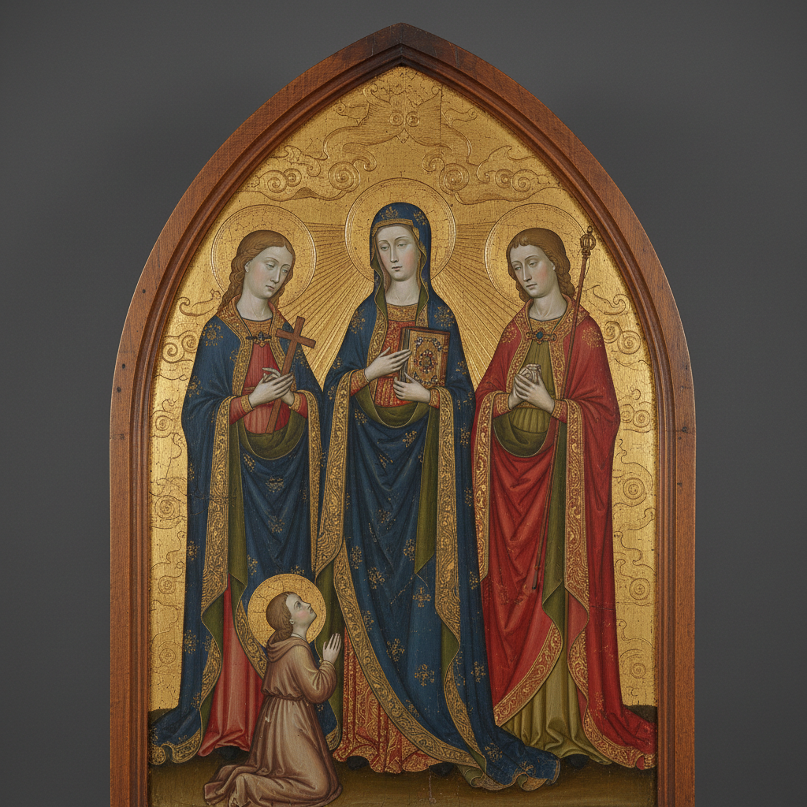

# Gothic Painting 哥特式绘画

> **时期：** 1200年代–1400年代  
> **关键词：** 金色背景、宗教虔诚、线性优雅、祭坛画、中世纪

## 概述

Gothic Painting（哥特式绘画）是中世纪晚期欧洲的宗教艺术传统——在哥特式大教堂的彩色玻璃窗旁，画家们用金色背景、优雅的线条和虔诚的姿态描绘圣经故事和圣徒生平。乔托的人性化圣母、西蒙尼·马丁尼的优雅线条——哥特式绘画在神圣与人间之间寻找平衡，用金光代表天堂的永恒。

## 风格特征

- **金色背景**：代表神圣的超越空间
- **线性优雅**：流畅的轮廓和衣褶
- **宗教主题**：圣母、基督、圣徒、天使
- **等级比例**：重要人物画得更大
- **装饰性**：精致的图案和边框

## 代表人物与作品

- 乔托·迪·邦多内 阿西西壁画
- 西蒙尼·马丁尼《天使报喜》
- 杜乔·迪·博尼塞尼亚 锡耶纳祭坛画
- 让·富凯 法国宫廷细密画

## 概念图

