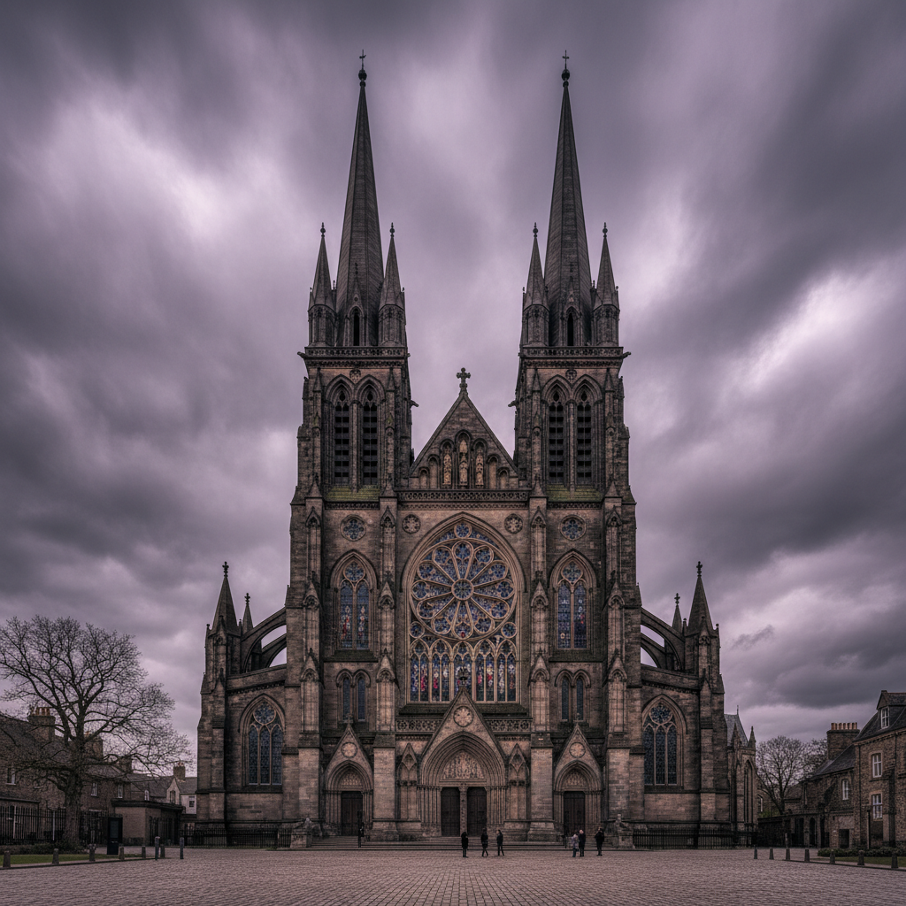

# Gothic Revival 哥特复兴



> **"尖拱、飞扶壁、玫瑰窗——中世纪的灵魂在工业时代重生。"**

## 概述

| 维度 | 描述 |
|------|------|
| 时期 | 1740s–1900s（建筑）/ 影响至今 |
| 别名 | Gothic Revival, Neo-Gothic, 哥特复兴, 新哥特 |
| 核心色彩 | 石灰灰、深红砖、铁黑、彩色玻璃的宝石色 |
| 关键元素 | 尖拱、飞扶壁、玫瑰窗、尖塔、垂直线条 |
| 代表人物 | Augustus Pugin, John Ruskin, Viollet-le-Duc, George Gilbert Scott |
| 关联风格 | Gothic Art, Arts and Crafts, Pre-Raphaelite, Dark Academia |

---

## 历史脉络

| 年份 | 事件 |
|------|------|
| 1749 | Horace Walpole改建Strawberry Hill——哥特复兴萌芽 |
| 1836 | Pugin《对比》出版——哥特复兴的理论基础 |
| 1840s | 英国议会大厦重建——哥特复兴的国家级实践 |
| 1850s | John Ruskin《威尼斯之石》——哥特复兴的美学圣经 |
| 1860s | 哥特复兴传播到美国、加拿大、澳大利亚 |
| 1880s | 哥特复兴开始让位于Art Nouveau |
| 20世纪 | 大学建筑（牛津、剑桥、耶鲁）延续哥特复兴 |

### 核心哲学

哥特复兴的精神是**"中世纪的手工艺和精神性 > 工业时代的机械和物质主义"**：
- Pugin："尖拱是基督教建筑的唯一正确形式"
- Ruskin："哥特式的'不完美'比古典的'完美'更有灵魂"
- "工业革命摧毁了美——我们必须回到中世纪寻找它"
- "垂直线条 = 向上 = 向神 = 精神性"
- "手工石雕 > 机器生产——每一块石头都有工匠的灵魂"

---

## 视觉语法

### 色彩系统

```
主色：
  石灰灰 (#808080) — 石材、永恒
  深红砖 (#8B0000) — 维多利亚红砖
  铁黑 (#1C1C1C) — 铸铁、结构
  彩色玻璃 — 宝石红、钴蓝、翡翠绿、金黄

辅色：
  象牙 (#FFFFF0) — 石灰石、纯净
  深绿 (#006400) — 常春藤、时间
  金色 (#DAA520) — 圣物、装饰

建筑元素：
  尖拱 — 哥特的DNA
  飞扶壁 — 结构即装饰
  玫瑰窗 — 光线的神学
  尖塔 — 向天空延伸
  垂直线条 — 一切向上

规则：
  - 垂直 > 水平
  - 尖拱 > 圆拱
  - 装饰 = 结构（不可分离）
  - 光线通过彩色玻璃 = 神圣
  - 不对称 > 对称（Ruskin的观点）
```

### 标志性元素

| 类别 | 元素 |
|------|------|
| 建筑 | 尖拱、飞扶壁、尖塔、玫瑰窗 |
| 材料 | 石材、铸铁、彩色玻璃、木雕 |
| 装饰 | 三叶草、四叶草、尖拱花窗 |
| 场所 | 教堂、大学、议会、火车站 |
| 植物 | 常春藤、哥特花园 |
| 态度 | 精神性、反工业、浪漫、崇高 |

---

## 与千禧怀旧/当代的关系

### Dark Academia的建筑基础
- Dark Academia的"古老大学"= 哥特复兴建筑
- 牛津、剑桥、耶鲁 = 哥特复兴的教育建筑
- "在尖拱下读书" = Dark Academia的核心场景

### 对当代的影响
- 霍格沃茨 = 哥特复兴建筑的流行文化化
- 当代"新哥特"住宅设计
- 哥特复兴教堂 → 改造为loft/画廊/餐厅

---

## 设计应用

| 场景 | 应用方式 |
|------|----------|
| 建筑 | 教育建筑+宗教建筑+改造 |
| 品牌 | 传统+精神+学术+高端 |
| 游戏 | 哥特城堡+中世纪+暗黑 |
| 空间 | 尖拱元素+彩色玻璃+石材 |

---

## 相关风格

← [Gothic Art 哥特艺术](gothic-art.md) | [Arts and Crafts 工艺美术运动](arts-and-crafts.md) →

↑ [返回千禧怀旧目录](README.md) | [返回总目录](../README.md)
