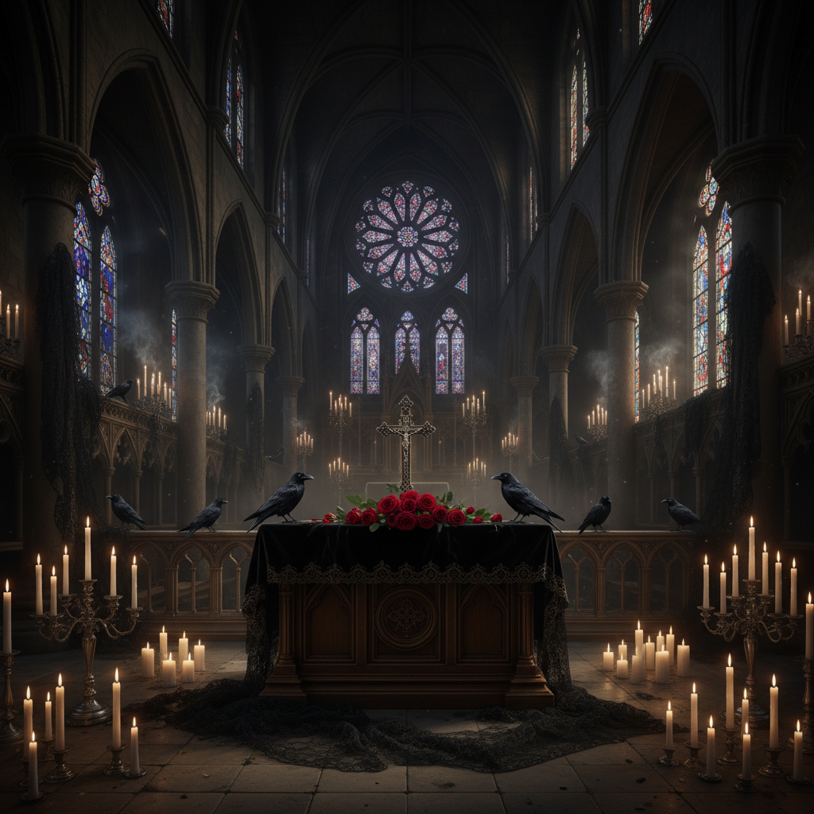

# Gothic 哥特美学



> **"黑色蕾丝、尖拱窗、蝙蝠翅膀——在黑暗中找到美。"**

## 概述

| 维度 | 描述 |
|------|------|
| 时期 | 12世纪建筑 / 1980s 亚文化 / 至今 |
| 别名 | Gothic, Goth, Gothic Revival, Dark Aesthetic |
| 核心色彩 | 黑色、深红、紫色、银色 |
| 关键元素 | 尖拱、玫瑰窗、蝙蝠、十字架、蕾丝 |
| 代表人物 | Bauhaus (乐队)、Siouxsie、Tim Burton |
| 关联风格 | Dark Academia, Dark Romantic, Cybergoth, Pastel Goth |

---

## 历史脉络

### 从大教堂到亚文化

| 年份 | 事件 |
|------|------|
| 12世纪 | 哥特式建筑——尖拱、飞扶壁、玫瑰窗 |
| 1764 | 《奥特兰托城堡》——哥特文学诞生 |
| 1818 | 《弗兰肯斯坦》——哥特科幻 |
| 1897 | 《德古拉》——哥特恐怖经典 |
| 1979 | Bauhaus "Bela Lugosi's Dead"——哥特摇滚诞生 |
| 1980s | 哥特亚文化在英国形成 |
| 1990s | 哥特进入主流（Tim Burton、The Crow） |
| 2020s | 哥特元素在时尚和设计中持续影响 |

### 核心哲学

Gothic 的精神是**"黑暗不是邪恶——是另一种美"**：
- 死亡是生命的一部分——不需要回避
- 黑暗中有浪漫、有诗意、有力量
- "正常"是无聊的——怪异是有趣的
- 美不需要明亮——阴影也是美
- 对维多利亚时代、中世纪的浪漫化

---

## 视觉语法

### 色彩系统

```
主色：
  黑色 (#000000) — 基础、一切
  深红 (#8B0000) — 血、玫瑰、激情
  紫色 (#4B0082) — 神秘、皇室
  银色 (#C0C0C0) — 月光、金属

辅色：
  白色 (#FFFFFF) — 苍白、对比
  深绿 (#006400) — 常春藤、墓地
  金色 (#B8860B) — 古老、装饰

规则：
  - 黑色是基础
  - 深色调为主
  - 偶尔的强烈对比（红/白 vs 黑）
  - 金属质感（银、铁）
  - 烛光的暖色

质感：
  蕾丝 — 精致、维多利亚
  丝绒 — 奢华、触感
  铁艺 — 栏杆、十字架
  石材 — 大教堂、墓碑
  蜡 — 蜡烛、融化
```

### 标志性元素

| 类别 | 元素 |
|------|------|
| 建筑 | 尖拱、飞扶壁、玫瑰窗、塔楼 |
| 符号 | 十字架、蝙蝠、乌鸦、骷髅、玫瑰 |
| 服装 | 黑色蕾丝、紧身胸衣、长裙、斗篷 |
| 妆容 | 苍白底妆、黑色眼线、深色唇 |
| 文学 | 吸血鬼、幽灵、古堡、月夜 |
| 音乐 | 哥特摇滚、暗潮、工业 |

---

## 与千禧怀旧的关系

### 哥特的千禧分支
- Mall Goth (1998–2008) = 商场版哥特
- Cybergoth = 哥特 + 赛博
- Pastel Goth = 哥特 + 粉彩
- E-Girl/E-Boy = 哥特的 TikTok 转世

### Tim Burton 效应
- 《剪刀手爱德华》《僵尸新娘》= 哥特主流化
- "可爱的哥特"= Tim Burton 的贡献
- Wednesday (2022) = 哥特的最新主流化
- 哥特从"可怕"变成了"酷"

---

## 中国语境

- "哥特风"在中国的流行
- 中国哥特式建筑（教堂、校园）
- 与中国恐怖/玄幻文化的交叉
- 中国哥特亚文化社区
- Lolita 中的 Gothic Lolita 分支

---

## 设计应用

| 场景 | 应用方式 |
|------|----------|
| 品牌 | 黑色+装饰字体+银色+神秘 |
| 空间 | 尖拱+烛光+深色+铁艺+丝绒 |
| 时尚 | 黑色蕾丝+银饰+紧身+层叠 |
| 数字 | 暗色主题+装饰边框+哥特字体 |

---

## 相关风格

← [Dark Romantic 暗黑浪漫](dark-romantic.md) | [Cybergoth 赛博哥特](cybergoth.md) →

↑ [返回千禧怀旧目录](README.md) | [返回总目录](../README.md)
