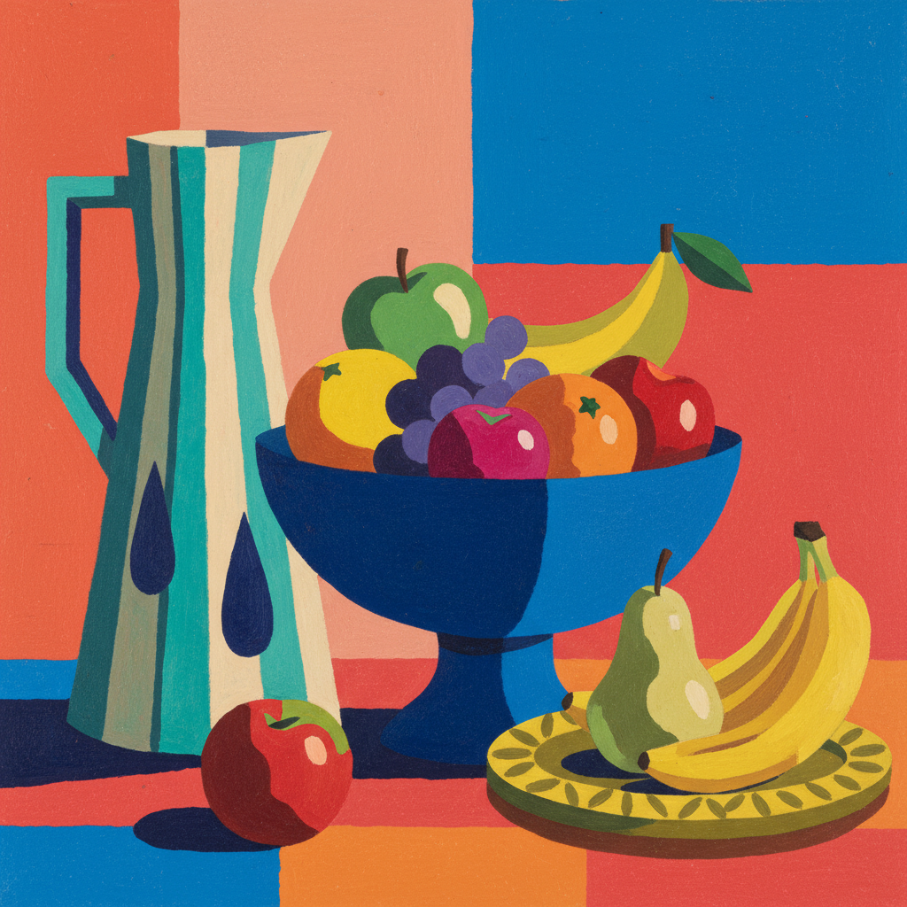

# Gouache Art 水粉画

> **时期：** 中世纪–至今  
> **关键词：** 不透明水彩、哑光质感、平涂色块、插画、设计稿

## 概述

Gouache（水粉）是一种不透明的水溶性颜料，以其丝绒般的哑光质感和鲜艳的平涂效果著称。从中世纪手抄本的装饰到20世纪的商业插画和动画背景，水粉以其快干、易修改、色彩饱满的特性成为设计师和插画师的首选媒介。

## 风格特征

- **不透明覆盖**：可以浅色覆盖深色
- **哑光质感**：干燥后呈丝绒般无光泽表面
- **平涂效果**：适合大面积均匀色块
- **快速干燥**：适合快速工作和层叠
- **可重新激活**：加水可重新溶解修改

## 代表人物与作品

- 亨利·马蒂斯 剪纸系列（水粉涂色纸）
- 雅各布·劳伦斯《迁徙》系列
- 宫崎骏工作室 动画背景
- 当代插画师广泛使用

## 概念图

