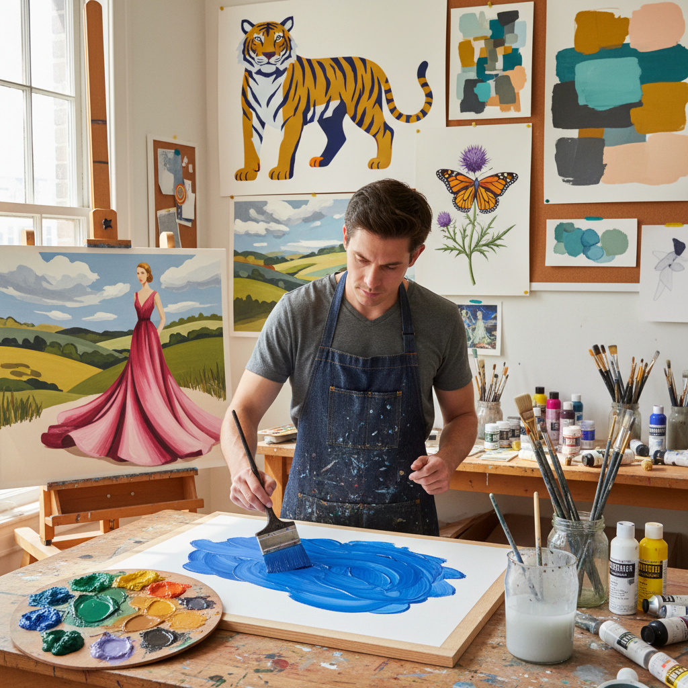

# Gouache Painting 水粉画

> "Gouache is watercolor's bolder sibling — opaque where watercolor is transparent, forgiving where watercolor is merciless, it covers mistakes with creamy confidence and dries to a velvety matte surface that photographs like no other medium." — Unknown

## 概述

水粉画（Gouache Painting）是一种以阿拉伯胶为粘合剂、添加白色颜料或白垩使其不透明的水性绘画媒介。水粉画与水彩画使用相同的粘合剂（阿拉伯胶），但水粉画是不透明的——它可以覆盖底层颜色，而水彩画是透明的。水粉画干燥后呈现柔和的哑光表面，色彩均匀平整。

水粉画在设计、插画和纯艺术领域都有广泛应用。在设计领域，水粉画曾是广告和平面设计的主要媒介（在数字设计出现之前）。在插画领域，水粉画因其平整的色彩和易于复制的特性而受欢迎。在纯艺术领域，水粉画因其独特的哑光质感和快速工作的特性而被许多画家使用。水粉画的一个特点是：干燥后颜色会变浅（与湿时相比），这需要经验来掌握。

## 核心特征

| 特征 | 描述 |
|------|------|
| 不透明 | 不透明的水性颜料 |
| 哑光 | 哑光的表面 |
| 可覆盖 | 可以覆盖底层 |
| 快干 | 干燥速度快 |
| 可重溶 | 干燥后可重新溶解 |
| 平整 | 平整均匀的色彩 |

## 视觉特征

- **哑光**：柔和的哑光表面
- **平整**：平整均匀的色块
- **柔和**：柔和的色调
- **粉质**：略带粉质感
- **鲜艳**：鲜艳的色彩
- **设计感**：强烈的设计感

## 代表作品

| 作品 | 艺术家 | 年代 | 意义 |
|------|--------|------|------|
| *Gouache landscapes* | Henri Matisse | 20世纪 | 大师的水粉画 |
| *Design gouaches* | Various | 20世纪 | 设计领域的水粉画 |
| *Illustration gouaches* | Various | 20世纪 | 插画水粉画 |
| *Contemporary gouache art* | Various | 当代 | 当代水粉画艺术 |
| *Gouache studies* | Various | 历史 | 户外写生水粉画 |

## 历史时间线

| 时期 | 事件 |
|------|------|
| 中世纪 | 手稿装饰中的不透明水彩 |
| 16世纪 | "Gouache"一词的出现 |
| 18-19世纪 | 水粉画在写生中的流行 |
| 20世纪初 | 设计和插画领域的主要媒介 |
| 20世纪中 | 纯艺术中的水粉画发展 |
| 当代 | 水粉画的复兴和社交媒体推广 |

## 中国语境

水粉画在中国有极其广泛的应用和深厚的传统。中国的美术教育体系中，水粉画是基础训练的重要组成部分——几乎所有学习美术的中国学生都会接受水粉画训练。中国的高考美术考试中，水粉画（色彩）是必考科目之一。中国的水粉画教学强调色彩关系、冷暖对比和空间表现。中国的水粉画传统与西方有所不同——中国更强调写实训练，而西方更多用于设计和插画。

## AI生成概念图

## 与其他风格的关系

- **Watercolor** → 水彩画
- **Tempera Painting** → 蛋彩画
- **Acrylic Painting** → 丙烯画
- **Casein Painting** → 酪蛋白画
- **Illustration** → 插画
- **Graphic Design** → 平面设计

---

*浮光艺志 | Chronicle of Artistry*
