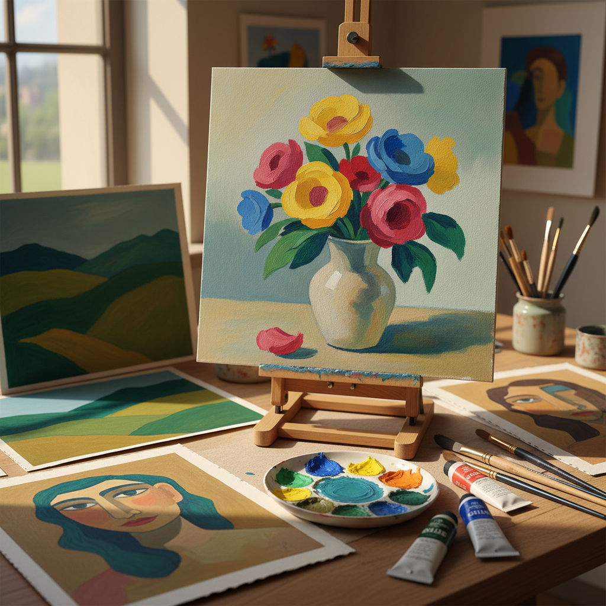

# Gouache 水粉画

> "Gouache is the most democratic of mediums — accessible, forgiving, and endlessly versatile." — Mary Whyte

## 概述

水粉画（Gouache，源自意大利语guazzo"水坑"）是一种不透明的水性颜料绘画——与水彩的透明不同，水粉以其覆盖力和哑光质感著称。从中世纪的手抄本插图到20世纪的商业插画，从设计草图到独立艺术创作，水粉画以其快干、可修改、色彩鲜明的特性成为最实用的绘画媒介之一。

水粉画的魅力在于它的平民性——不需要油画的复杂准备，不需要水彩的精确控制，却能创造出独特的哑光美感。

## 核心特征

| 特征 | 描述 |
|------|------|
| 不透明 | 颜料具有覆盖力 |
| 哑光 | 干后呈现哑光质感 |
| 快干 | 比油画快得多的干燥速度 |
| 可修改 | 可以覆盖和修改 |
| 平涂 | 适合大面积平涂 |
| 水溶性 | 用水稀释和清洗 |

## 视觉特征

- **哑光**：独特的哑光表面质感
- **平坦**：均匀平坦的色彩区域
- **鲜明**：色彩鲜明而不刺眼
- **柔和**：比丙烯更柔和的质感
- **覆盖**：可以浅色覆盖深色
- **纸质**：通常在纸上创作

## 代表作品

| 作品 | 艺术家 | 年代 | 意义 |
|------|--------|------|------|
| *Gouache studies* | J.M.W. Turner | 1800s-40s | 大师的水粉研究 |
| *Gouache paintings* | Henri Matisse | 1940s-50s | 剪纸前的水粉底稿 |
| *Illustrations* | Alphonse Mucha | 1890s-1900s | 新艺术运动的水粉插画 |
| *Design works* | Sonia Delaunay | 1920s-30s | 装饰艺术的水粉设计 |
| *Paintings* | Jacob Lawrence | 1940s-60s | 美国叙事水粉画 |
| *Contemporary gouache* | Various | 2000s+ | 当代水粉复兴 |

## 历史时间线

| 时期 | 事件 |
|------|------|
| 中世纪 | 手抄本插图中的水粉 |
| 16-17世纪 | 微型画和设计草图 |
| 18世纪 | 风景画家的户外写生 |
| 19世纪 | Turner等大师的水粉研究 |
| 20世纪初 | 商业插画和设计的主要媒介 |
| 1940s-60s | Jacob Lawrence的叙事水粉 |
| 当代 | 独立艺术家的水粉复兴 |

## 中国语境

水粉画在中国有特殊地位——它是中国美术教育体系中的基础课程，几乎所有学美术的学生都从水粉开始。中国的"水粉画"概念比西方的gouache更广泛，包含了更多的技法和风格。中国水粉画在写生、设计基础和色彩训练中扮演核心角色。许多中国画家在水粉画上有独特的成就。

## AI生成概念图

## 与其他风格的关系

- **Watercolor** → 水彩是水粉的透明对应
- **Acrylic** → 丙烯是水粉的永久版本
- **Illustration** → 水粉是传统插画的主要媒介
- **Design** → 水粉是设计草图的经典工具
- **Tempera** → 蛋彩画与水粉有相似的哑光质感
- **Poster Art** → 海报设计大量使用水粉

---

*浮光艺志 | Chronicle of Artistry*
