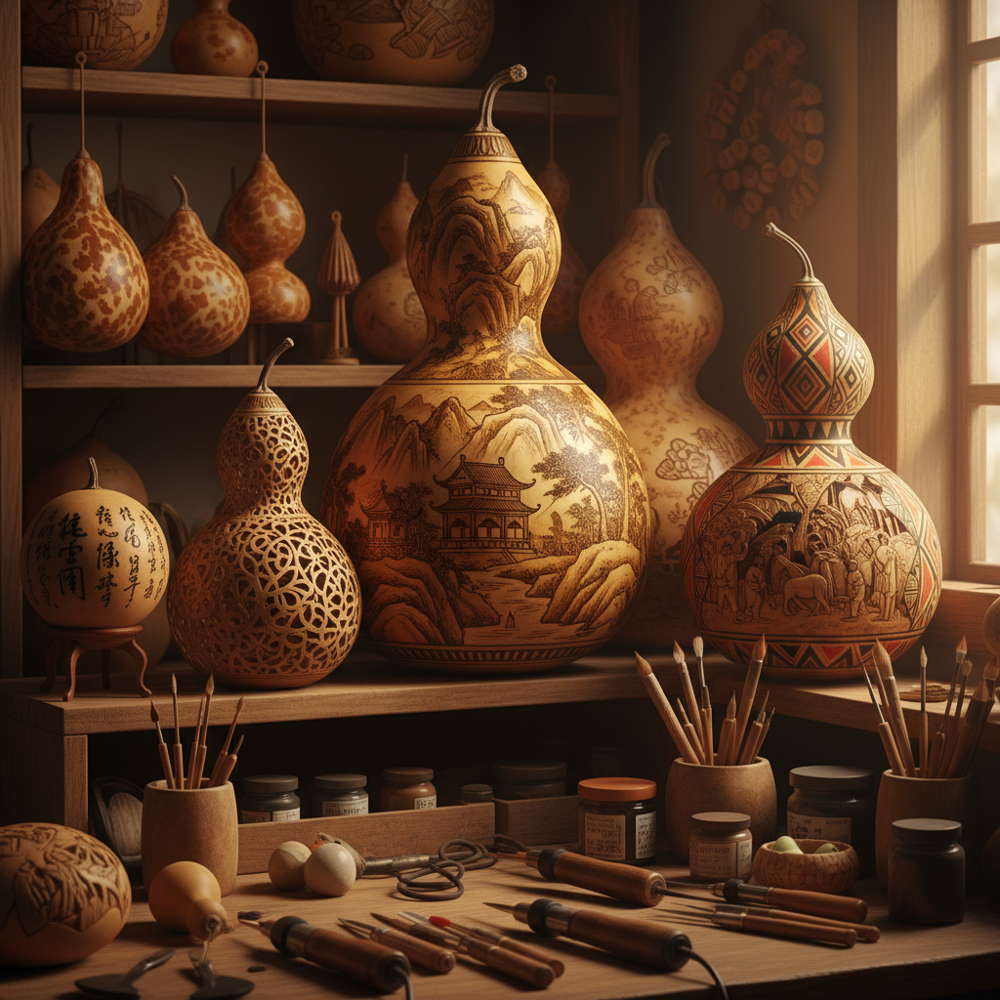

# Gourd Art 葫芦艺术

> "A gourd is nature's ready-made vessel — grown on a vine, dried by the sun, hollowed by time. Its smooth curved surface invites the artist's hand: to carve, to burn, to paint, to polish. Every culture that grew gourds found art in them, from African water carriers etched with tribal patterns to Chinese cricket cages carved with landscapes. The gourd is perhaps the only art medium that you can plant in spring and carve in autumn." — Unknown

## 概述

葫芦艺术（Gourd Art）是以干燥的葫芦为画布和雕刻材料进行艺术创作的实践——利用葫芦天然的曲面形态，通过雕刻、烙画、彩绑、镂空、镶嵌等技法创造装饰性和艺术性作品。葫芦艺术在世界各地的农耕文化中都有悠久的传统。

葫芦艺术的实践包括：1）葫芦烙画——用烙铁在葫芦表面烫出图案；2）葫芦雕刻——在葫芦表面雕刻浮雕或镂空图案；3）葫芦彩绑——在葫芦表面绑画装饰图案；4）葫芦镂空——将葫芦雕刻成灯罩或装饰品；5）葫芦拼接——将多个葫芦组合成造型；6）葫芦乐器——用葫芦制作的乐器（如葫芦丝）；7）微型葫芦——在极小的葫芦上进行精细创作。

## 核心特征

| 特征 | 描述 |
|------|------|
| 天然 | 天然的有机形态 |
| 曲面 | 独特的曲面画布 |
| 多技 | 多种装饰技法 |
| 文化 | 深厚的文化象征 |
| 实用 | 可兼具实用功能 |
| 生长 | 从种植到创作 |

## 视觉特征

- **曲面**：葫芦的天然曲面
- **棕色**：烙画的棕色调
- **镂空**：精细的镂空图案
- **光影**：镂空葫芦的光影效果
- **有机**：有机的自然形态
- **纹理**：葫芦表面的天然纹理

## 代表作品

| 作品 | 艺术家 | 年代 | 意义 |
|------|--------|------|------|
| *中国葫芦雕刻* | 传统 | 古代至今 | 中国葫芦工艺 |
| *African gourd art* | 传统 | 古代至今 | 非洲葫芦装饰 |
| *Peruvian gourd carving* | 传统 | 古代至今 | 秘鲁葫芦雕刻 |
| *Gourd lamps* | Various | 当代 | 镂空葫芦灯 |
| *Contemporary gourd art* | Various | 当代 | 当代葫芦艺术 |

## 历史时间线

| 时期 | 事件 |
|------|------|
| 史前 | 葫芦作为最早的容器 |
| 古代 | 各文化的葫芦装饰传统 |
| 中国古代 | 葫芦的文化象征确立 |
| 近代 | 葫芦工艺的精细化 |
| 当代 | 葫芦艺术的国际化发展 |

## 中国语境

葫芦艺术在中国有极其深厚的文化传统。葫芦在中国文化中是重要的吉祥物——"葫芦"谐音"福禄"，象征福气和官运。中国的葫芦工艺极其丰富——兰州的刻葫芦是国家级非物质文化遗产，以精细的针刻和彩绘闻名；天津的范制葫芦（模具葫芦）是独特的活体造型艺术；北京的葫芦烙画有数百年历史。中国传统文化中葫芦的用途极广——从药葫芦、酒葫芦到蛐蛐葫芦、鸣虫葫芦，从葫芦丝乐器到葫芦装饰品。中国的葫芦文化节和葫芦收藏市场非常活跃。中国当代的一些艺术家将葫芦与现代设计结合——创造出融合传统与当代的葫芦艺术品。

## AI生成概念图

## 与其他风格的关系

- **Pyrography** → 烙画艺术
- **Carving Art** → 雕刻艺术
- **Folk Art** → 民间艺术
- **Natural Material Art** → 天然材料艺术
- **Lamp Art** → 灯艺术
- **Chinese Traditional Craft** → 中国传统工艺

---

*浮光艺志 | Chronicle of Artistry*
