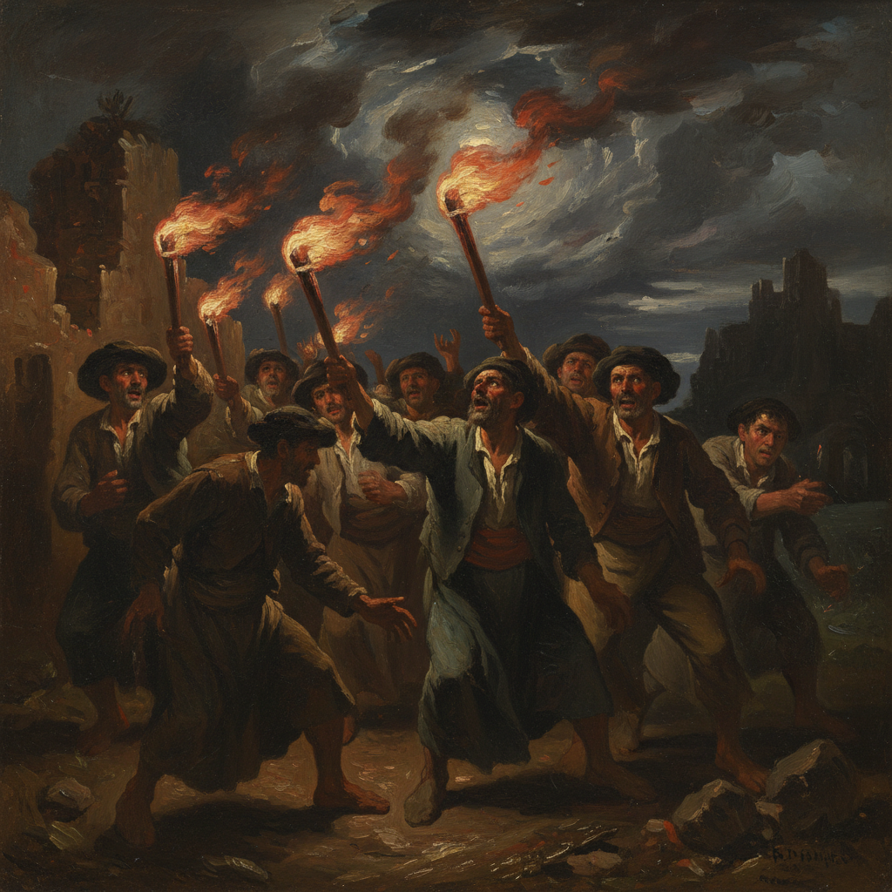

# Francisco Goya 戈雅

> "The sleep of reason produces monsters." — Francisco Goya

## 概述

弗朗西斯科·何塞·德·戈雅-卢西恩特斯（Francisco José de Goya y Lucientes，1746–1828）是西班牙画家和版画家，被视为古典大师中的最后一位和现代艺术的第一位。他的艺术生涯跨越了从洛可可的轻快到浪漫主义的黑暗——从宫廷挂毯设计到"黑色绘画"的噩梦，从皇家肖像到战争的恐怖。

戈雅是第一个将艺术从美的义务中解放出来的画家——他证明了丑陋、恐怖和疯狂同样是艺术的合法领地。他的版画系列《战争的灾难》和晚期"黑色绘画"预示了表现主义和超现实主义。

## 核心特征

| 特征 | 描述 |
|------|------|
| 极端跨度 | 从洛可可的轻快到黑色绘画的噩梦 |
| 社会批判 | 对权力、迷信和暴力的尖锐批判 |
| 黑暗想象 | 晚期作品中的噩梦和怪物 |
| 战争真相 | 第一个如实描绘战争恐怖的画家 |
| 版画革新 | 蚀刻版画的革命性创新 |
| 心理深度 | 对人性黑暗面的深刻揭示 |

## 视觉特征

- **早期**：明亮的洛可可色彩，优雅的宫廷场景
- **中期**：精确的肖像画，微妙的心理揭示
- **版画**：黑白的戏剧性，梦魇般的想象
- **晚期**：黑色绘画——深褐、黑色、暗红的噩梦
- **笔触**：从精确到晚期的狂放自由
- **光线**：从明亮到黑暗的极端转变

## 代表作品

| 作品 | 年代 | 意义 |
|------|------|------|
| *The Third of May 1808* | 1814 | 现代战争画的开端——无名英雄的牺牲 |
| *Saturn Devouring His Son* | 1819-23 | 黑色绘画——人性的恐怖 |
| *Los Caprichos* 版画系列 | 1799 | "理性沉睡，怪物苏醒" |
| *The Disasters of War* | 1810-20 | 战争恐怖的第一次如实记录 |
| *The Nude Maja / The Clothed Maja* | 1797-1805 | 西班牙第一幅真人裸体画 |
| *Charles IV Family Portrait* | 1800-01 | 最诚实的皇家肖像——丑陋的真相 |

## 真实作品（公共领域）

| 作品 | 来源 |
|------|------|
| *The Third of May 1808* | [Museo del Prado](https://www.museodelprado.es/en/the-collection/art-work/the-3rd-of-may-1808-in-madrid/5e177409-2993-4240-97fb-847a02c6496c) |
| *Saturn Devouring His Son* | [Wikimedia](https://commons.wikimedia.org/wiki/File:Francisco_de_Goya,_Saturno_devorando_a_su_hijo_(1819-1823).jpg) |
| *Los Caprichos* | [Wikimedia](https://commons.wikimedia.org/wiki/Category:Los_Caprichos) |

> ⚠️ 本条目优先使用真实作品。

## AI生成概念图

## 与其他风格的关系

- **Romanticism** → 浪漫主义黑暗面的先驱
- **Expressionism** → 黑色绘画预示了表现主义
- **Surrealism** → 梦魇般的想象启发了超现实主义
- **Realism** → 战争画的残酷现实主义
- **Manet** → 马奈直接受戈雅影响
- **Francis Bacon** → 培根从戈雅的恐怖中汲取灵感

---

*浮光艺志 | Chronicle of Artistry*
