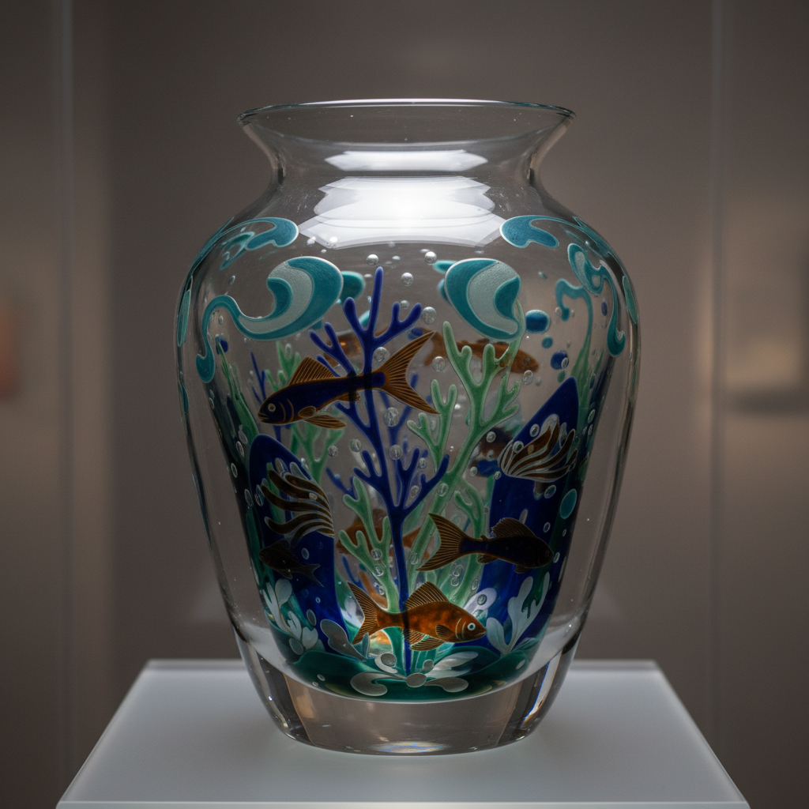

# Graal Art 格拉尔玻璃艺术

> "Graal is painting sealed within glass — a colored glass vessel is first blown, then cooled and carved or etched with a design, then reheated and encased in a layer of clear glass so that the decoration floats suspended within the transparent walls like an image trapped in ice, protected forever from touch and time." — Unknown

## 概述

格拉尔玻璃艺术（Graal Art）是一种由瑞典奥雷福斯（Orrefors）玻璃厂在1916年发明的精美技法——先吹制一个有色玻璃泡，冷却后在表面进行雕刻、蚀刻或切割装饰，然后重新加热并在外层包裹一层透明玻璃，使装饰图案永久封存在透明玻璃层内。格拉尔技法创造出独特的深度感和永恒感。

格拉尔玻璃艺术的实践包括：1）初始吹制——吹制有色玻璃泡；2）冷加工——在冷却后进行雕刻或蚀刻；3）重新加热——将雕刻好的泡重新加热；4）包裹——在外层包裹透明玻璃；5）最终吹制——将包裹后的整体吹制成型；6）多层——可以有多层颜色和图案；7）当代格拉尔——将传统技法与现代创作结合。

## 核心特征

| 特征 | 描述 |
|------|------|
| 封存 | 图案封存在玻璃内 |
| 雕刻 | 冷态下的雕刻装饰 |
| 包裹 | 透明玻璃的外层包裹 |
| 深度 | 独特的视觉深度感 |
| 瑞典 | 瑞典奥雷福斯的发明 |
| 永恒 | 永久保护的装饰 |

## 视觉特征

- **深度**：图案悬浮在玻璃内的深度感
- **透明**：外层透明玻璃的通透
- **色彩**：内层有色玻璃的色彩
- **雕刻**：精美的雕刻图案
- **永恒**：被封存的永恒感
- **优雅**：优雅精致的整体效果

## 代表作品

| 作品 | 艺术家/文化 | 年代 | 意义 |
|------|-------------|------|------|
| *Orrefors Graal* | 瑞典 | 1916年起 | 奥雷福斯格拉尔 |
| *Simon Gate Graal* | 瑞典 | 1920年代 | 西蒙·盖特格拉尔 |
| *Edward Hald fish graal* | 瑞典 | 1930年代 | 爱德华·哈尔德鱼纹格拉尔 |
| *Ingeborg Lundin Ariel* | 瑞典 | 1950年代 | 英格堡·伦丁阿里尔 |
| *Contemporary graal* | 国际 | 当代 | 当代格拉尔 |

## 历史时间线

| 时期 | 事件 |
|------|------|
| 1916年 | 奥雷福斯发明格拉尔技法 |
| 1920-30年代 | 格拉尔的黄金时代 |
| 1937年 | Ariel技法（格拉尔变体）的发明 |
| 20世纪后半 | 技法的国际传播 |
| 当代 | 全球玻璃艺术家的实践 |

## 中国语境

格拉尔玻璃与中国的当代玻璃艺术有一定的关联。中国的内画——在玻璃内部进行绘画的传统，与格拉尔有相似的"内部装饰"理念。中国的套料玻璃——多层玻璃的组合与格拉尔有技术上的相似性。中国当代的玻璃艺术教育中，格拉尔作为重要的装饰技法——在相关课程中教授。中国的玻璃艺术家——有一些学习和实践格拉尔技法。中国的工艺美术展览中，格拉尔风格的作品——在国际交流展中展示。

## AI生成概念图

## 与其他风格的关系

- **Ariel Glass** → 阿里尔玻璃
- **Cameo Glass** → 浮雕玻璃
- **Overlay Glass** → 套色玻璃
- **Swedish Glass** → 瑞典玻璃
- **Studio Glass** → 工作室玻璃
- **Orrefors** → 奥雷福斯

---

*浮光艺志 | Chronicle of Artistry*
