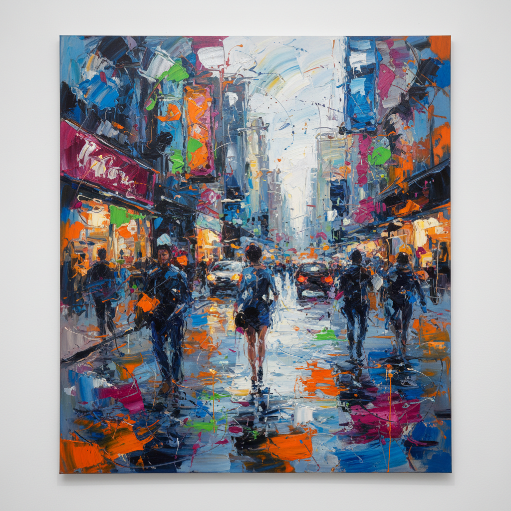

# Grace Hartigan 格蕾丝·哈蒂根

> **时期：** 1922–2008  
> **关键词：** 第二代抽象表现主义、都市能量、色彩狂欢、女性先锋

## 概述

Grace Hartigan 是第二代纽约画派的核心成员，也是1950年代少数与男性同行平起平坐的女性抽象表现主义画家。她的作品在纯抽象和具象之间自由游走，以都市生活的能量、橱窗展示的色彩和街头的混乱活力为灵感，创造出兼具力量感和感性的大尺幅绘画。

## 风格特征

- **抽象与具象的融合**：在同一画面中自由切换抽象笔触和可辨识形象
- **都市色彩**：受商店橱窗、广告和街头景观启发的鲜艳色调
- **大尺幅能量**：画面充满身体性的笔触运动和即兴决断
- **文学性标题**：作品常以诗歌、电影或文学为灵感来源
- **拒绝分类**：刻意避免被归入任何单一风格阵营

## 代表作品

- *Grand Street Brides*（1954）
- *City Life*（1956）
- *Shinnecock Canal*（1957）
- *Billboard*（1957）

## 历史意义

Hartigan 是1950年代纽约艺术界最受尊敬的年轻画家之一，她的作品被MoMA和Whitney收藏时她还不到35岁。她证明了女性可以在最"男性化"的艺术运动中占据中心位置。

## 概念图

