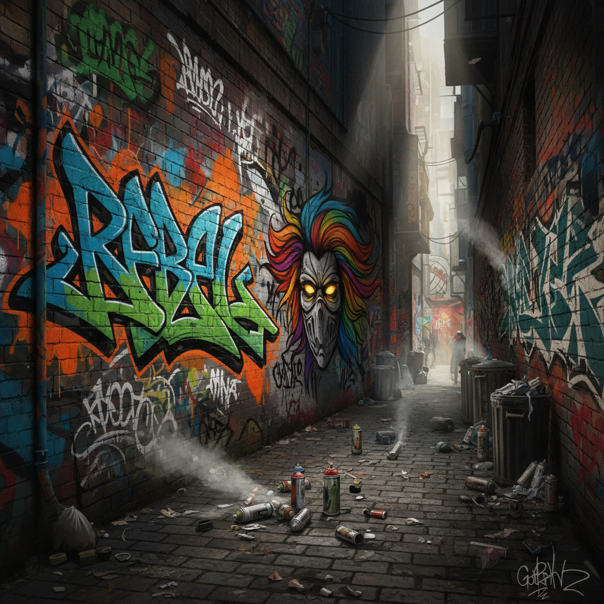

# Graffiti Art 涂鸦艺术

> "Graffiti is one of the few tools you have if you have almost nothing." — Banksy

## 概述

涂鸦艺术（Graffiti Art）是在公共空间的墙壁、火车车厢和其他表面上创作的视觉艺术形式。起源于1960-70年代纽约的街头文化，涂鸦从最初的签名标记（tags）发展为复杂的字体设计和大型壁画。它是嘻哈文化的四大元素之一，也是当代最具争议性的艺术形式——在非法破坏和合法艺术之间游走。

涂鸦的力量在于它的民主性和颠覆性——任何人都可以拿起喷漆罐在城市中留下自己的声音。

## 核心特征

| 特征 | 描述 |
|------|------|
| 公共性 | 在公共空间创作 |
| 非法性 | 通常未经许可——游击式创作 |
| 字体性 | 以字体设计为核心 |
| 喷漆 | 喷漆罐是主要工具 |
| 身份性 | 通过tag建立街头身份 |
| 临时性 | 可能被覆盖或清除 |

## 视觉特征

- **字体**：复杂的、风格化的字母设计
- **色彩**：鲜艳的喷漆色彩
- **尺度**：从小型tag到整面墙的作品
- **流动**：喷漆的流动和滴落
- **层次**：多层喷涂和覆盖
- **3D效果**：字母的立体化处理

## 代表作品

| 作品/艺术家 | 年代 | 特征 |
|-------------|------|------|
| TAKI 183 | 1971 | 纽约涂鸦的先驱——第一个被媒体报道的writer |
| Dondi White | 1970s-80s | 地铁涂鸦的大师 |
| Lee Quiñones | 1970s-80s | 从地铁到画廊 |
| Jean-Michel Basquiat | 1977-88 | 从SAMO涂鸦到艺术明星 |
| Banksy | 1990s-至今 | 政治涂鸦的全球影响 |
| Os Gêmeos | 1990s-至今 | 巴西涂鸦的独特风格 |

## 历史时间线

| 时期 | 事件 |
|------|------|
| 1960s末 | 费城和纽约的早期tagging |
| 1971 | TAKI 183——纽约时报报道 |
| 1970s | 纽约地铁涂鸦的黄金时代 |
| 1980s | 涂鸦进入画廊——Basquiat、Haring |
| 1989 | 纽约地铁"清洁列车"运动 |
| 1990s-2000s | 全球涂鸦文化的扩散 |
| 2000s-至今 | Banksy——涂鸦的全球化和商业化 |

## 中国语境

涂鸦在中国从2000年代开始发展，北京、上海、广州、成都等城市形成了活跃的涂鸦社区。中国涂鸦融合了汉字书法和西方字体设计，创造出独特的视觉语言。一些城市（如深圳、成都）设立了合法涂鸦墙，为涂鸦提供了创作空间。中国的涂鸦艺术家如DALeast在国际上获得认可。

## AI生成概念图

## 与其他风格的关系

- **Street Art** → 街头艺术是涂鸦的扩展形式
- **Pop Art** → 波普艺术的大众文化精神与涂鸦相通
- **Calligraphy Art** → 涂鸦的字体设计与书法有深层联系
- **Expressionism** → 涂鸦的即时性和情感表达
- **Lowbrow Art** → 低眉艺术与涂鸦共享亚文化根基
- **Public Art** → 涂鸦是最草根的公共艺术

---

*浮光艺志 | Chronicle of Artistry*
