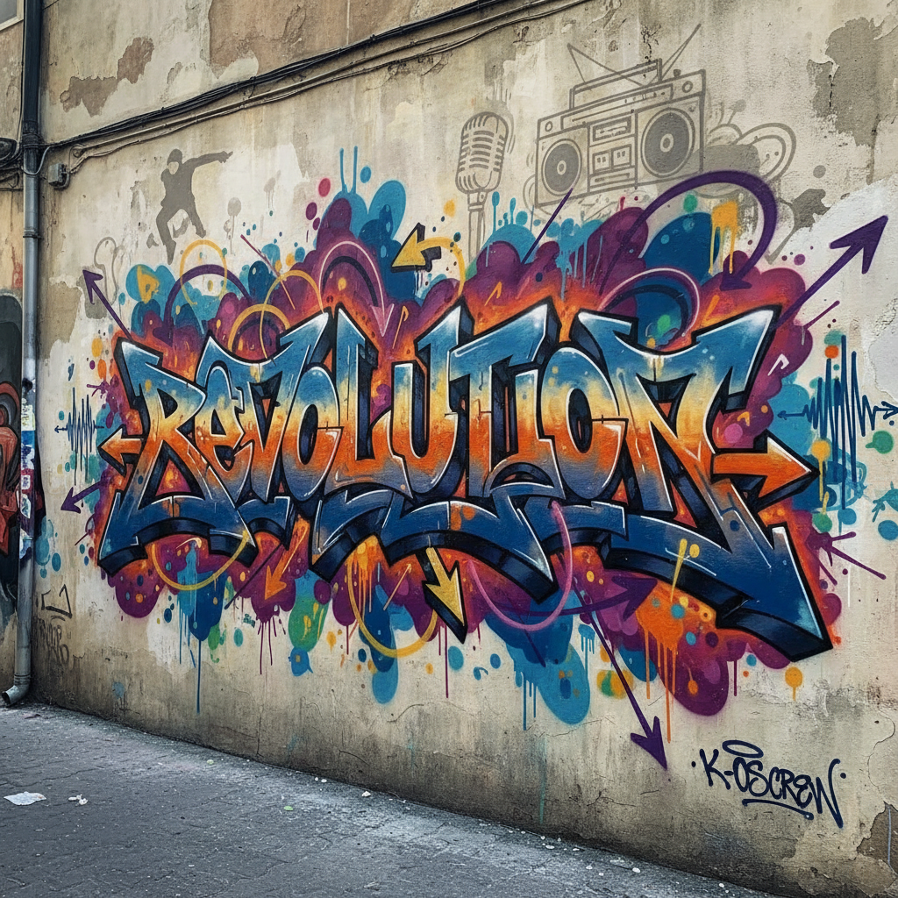

# Graffiti Wildstyle 涂鸦狂野风格

> **时期：** 1970年代–至今  
> **关键词：** 字母变形、交错箭头、不可读性、地下文化、视觉爆炸

## 概述

Wildstyle（狂野风格）是涂鸦艺术中最复杂和最具技术性的字母风格。字母被极度扭曲、交错、装饰，加入箭头、星星和连接线，使文字几乎不可辨认——可读性的牺牲换来了视觉复杂度的极致。只有涂鸦圈内的人才能解读这些"密码"，这种排他性本身就是其文化价值的一部分。

## 风格特征

- **字母变形**：极度扭曲和拉伸的字母形态
- **交错结构**：字母之间的复杂穿插和连接
- **箭头装饰**：指向各方向的尖锐箭头
- **多层色彩**：渐变、阴影和高光的层次
- **不可读性**：故意追求的辨识难度

## 代表人物与作品

- Tracy 168（Wildstyle先驱）
- Zephyr（纽约地铁涂鸦传奇）
- Seen（"涂鸦教父"）
- Daim（3D立体涂鸦）

## 概念图

