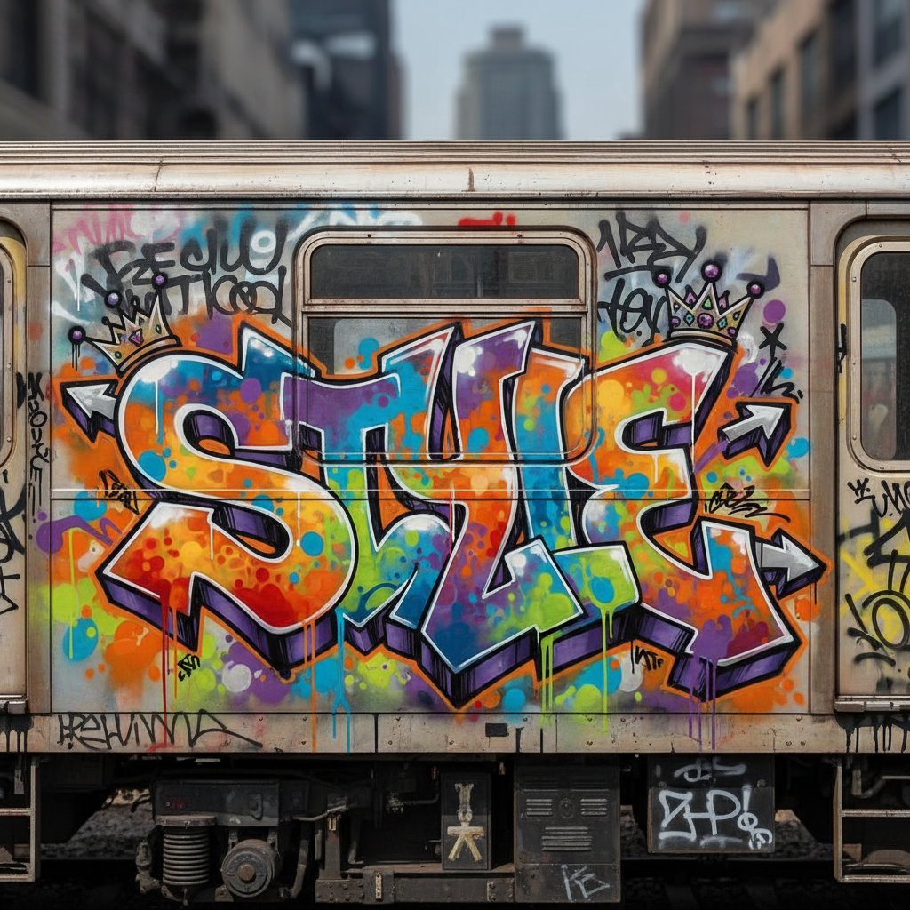

# Graffiti 涂鸦艺术



> **"一罐喷漆、一个名字、一面墙——在城市的皮肤上刻下'我存在'。"**

## 概述

| 维度 | 描述 |
|------|------|
| 时期 | 1960s–至今 |
| 别名 | Graffiti, Aerosol Art, Writing, 涂鸦 |
| 核心色彩 | 喷漆全色谱、荧光色、金属色、黑色轮廓 |
| 关键元素 | 字体设计(Lettering)、标签(Tag)、大作(Piece)、风格化字母 |
| 代表人物 | TAKI 183, SEEN, DONDI, FUTURA, KAWS |
| 关联风格 | Street Art, Hip-Hop, Punk, Lowbrow, Typography |

---

## 历史脉络

| 年份 | 事件 |
|------|------|
| 1969 | TAKI 183——纽约第一个被报道的涂鸦写手 |
| 1970s | 纽约地铁涂鸦黄金时代——Whole Car |
| 1983 | 电影《Wild Style》——涂鸦文化记录 |
| 1984 | 电影《Beat Street》——涂鸦进入主流 |
| 1990s | 涂鸦全球化——欧洲、亚洲、南美 |
| 2000s | 从地下到画廊——KAWS, FUTURA |
| 2020s | 涂鸦字体设计影响主流品牌 |

### 核心哲学

涂鸦的精神是**"我的名字必须被看到——在最多人经过的地方"**：
- 名字 = 存在（"写下名字 = 证明我活过"）
- 风格 = 身份（"每个写手的字体都是独一无二的签名"）
- 城市 = 画布（"城市不属于广告商——也属于我们"）
- 竞争 = 进化（"比谁画得更大、更高、更危险"）
- "涂鸦是世界上最大的艺术运动——也是最被误解的"

---

## 视觉语法

### 色彩系统

```
主色：
  喷漆全色谱 — 无限制
  荧光色 — 夜间可见、冲击
  金属银/金 — 标签、闪耀
  黑色 — 轮廓、阴影

规则：
  - 高饱和高对比
  - 颜色越多越"炫"
  - 渐变(fade)是核心技术
  - 与背景形成对比

风格分类：
  Tag — 单色快速签名
  Throw-up — 双色快速大字
  Piece — 多色精细大作
  Wildstyle — 极度复杂字体

质感：
  喷漆 — 雾化、渐变、滴落
  Cap技术 — 粗细线条控制
  墙面 — 砖、混凝土、金属
  层叠 — 多层喷涂
```

### 标志性元素

| 类别 | 元素 |
|------|------|
| 字体 | Wildstyle、Bubble、Block、3D、Calligraphy |
| 技法 | Tag、Throw-up、Piece、Whole Car、Bombing |
| 元素 | 箭头、星星、皇冠、引号、光芒 |
| 场所 | 地铁、墙壁、火车、桥洞、屋顶 |
| 文化 | Hip-Hop四元素之一、Crew、Battle |
| 态度 | 竞争、风格、城市、身份、反叛 |

---

## 与千禧怀旧的关系

### 从犯罪到奢侈品
- KAWS: 从涂鸦写手到亿万美元艺术家
- 涂鸦字体 → 品牌Logo → 奢侈品联名
- "涂鸦是Hip-Hop文化的视觉语言——而Hip-Hop统治了世界"
- Supreme, Stüssy——涂鸦DNA的商业化

### 字体设计的影响
- 涂鸦 = 世界上最大的"字体设计"实验室
- Wildstyle → 当代字体设计的灵感
- "涂鸦写手是不知道自己是字体设计师的字体设计师"

---

## 中国语境

- 中国涂鸦文化的发展（北京、上海、广州）
- 中国涂鸦艺术家群体
- 中国城市对涂鸦的态度
- 中国品牌对涂鸦美学的采用

---

## 设计应用

| 场景 | 应用方式 |
|------|----------|
| 品牌 | 街头+年轻+态度+城市+Hip-Hop |
| 字体 | 涂鸦风格字体+Logo+标题 |
| 时尚 | 街头品牌+联名+印花+配饰 |
| 空间 | 壁画+商业空间+活动+城市更新 |

---

## 相关风格

← [Street Art 街头艺术](street-art.md) | [Hip-Hop 嘻哈](hip-hop.md) →

↑ [返回千禧怀旧目录](README.md) | [返回总目录](../README.md)
