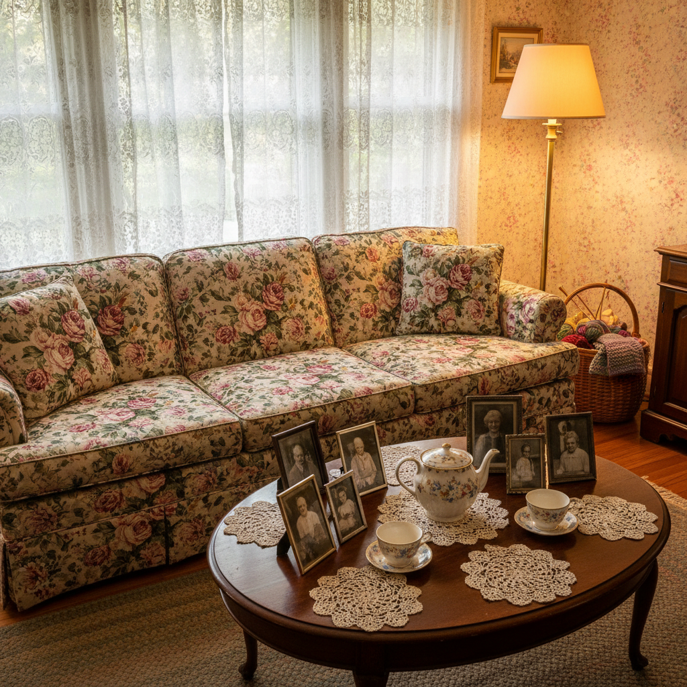

# Grandmacore 奶奶核



> **"碎花沙发、手钩桌布、瓷器柜里的茶杯——奶奶的客厅才是真正的避风港。"**

## 概述

| 维度 | 描述 |
|------|------|
| 时期 | 2020–至今 |
| 别名 | Grandmacore, Granny Chic, Nana Aesthetic |
| 核心色彩 | 米色、淡粉、薰衣草、鼠尾草绿、奶油白 |
| 关键元素 | 碎花、钩针、瓷器、茶壶、旧家具 |
| 代表人物 | Harry Styles (珍珠项链)、Zara Home |
| 关联风格 | Cottagecore, Bloomcore, Light Academia, Coastal Grandmother |

---

## 历史脉络

### 2020：对"奶奶美学"的重新发现

Grandmacore 在 2020 年作为一种美学标签出现，核心是对**祖母辈生活方式和物品的怀旧与重新欣赏**：

**被重新发现的"奶奶物品"**：
- 碎花沙发和窗帘
- 手钩桌布和毛毯
- 瓷器茶具和银器
- 旧相框和针线盒
- 花园里的玫瑰和薰衣草

### 文化背景

| 驱动力 | 解释 |
|--------|------|
| 疫情隔离 | 人们渴望家庭温暖和安全感 |
| 反快时尚 | 奶奶的东西用了几十年——可持续 |
| 慢生活运动 | 钩针、烘焙、园艺 = 慢下来 |
| 代际怀旧 | 怀念和祖母在一起的童年时光 |
| Harry Styles | 男性穿珍珠项链、针织背心 |

### 核心哲学

Grandmacore 的吸引力在于它代表了一种**无条件的温暖**：
- 奶奶的家 = 永远有热茶和饼干
- 奶奶的审美 = 不追潮流，只追舒适
- 奶奶的物品 = 有故事、有记忆、有温度
- 在焦虑的时代，"像奶奶一样生活"是一种治愈

---

## 视觉语法

### 色彩系统

```
主色：
  米色 (#F5F5DC) — 旧家具、墙壁
  淡粉 (#FFE4E1) — 碎花、瓷器
  薰衣草 (#E6E6FA) — 花园、香包
  鼠尾草绿 (#9DC183) — 植物、茶具
  奶油白 (#FFFDD0) — 桌布、蕾丝

辅色：
  浅蓝 (#ADD8E6) — 瓷器花纹
  玫瑰粉 (#FF007F 低饱和) — 花朵
  木色 (#DEB887) — 旧家具

质感：
  钩针/编织 — 毛毯、桌布
  瓷器 — 茶杯、花瓶
  碎花布 — 沙发、窗帘
  蕾丝 — 桌布、窗帘边
  旧木 — 家具、相框
```

### 标志性元素

| 类别 | 元素 |
|------|------|
| 家具 | 碎花沙发、摇椅、梳妆台、瓷器柜 |
| 纺织 | 钩针毛毯、碎花窗帘、蕾丝桌布 |
| 器物 | 瓷器茶具、银勺、旧相框、针线盒 |
| 食物 | 自制饼干、果酱、茶、派 |
| 花园 | 玫瑰、薰衣草、绣球花 |
| 活动 | 钩针、烘焙、读书、写信、园艺 |

---

## 与千禧怀旧的关系

### 童年的奶奶记忆
- 很多千禧一代/Z世代的童年有"去奶奶家"的记忆
- 奶奶家的碎花沙发、瓷器柜、花园
- 这些记忆在成年后变成了一种"安全感"的象征

### 与 Coastal Grandmother 的关系
- Coastal Grandmother = 有钱的、住海边的奶奶
- Grandmacore = 更普遍的、任何奶奶的家
- 两者共享"奶奶的智慧和温暖"的核心

---

## 中国语境

- "外婆风"/"奶奶风"穿搭
- 对传统手工艺（刺绣、编织、剪纸）的重新欣赏
- 小红书上的"复古家居"/"中古家具"
- 与"新中式"家居的交叉
- 对"慢生活"的向往

---

## 设计应用

| 场景 | 应用方式 |
|------|----------|
| 品牌 | 碎花图案+手写字体+暖色调+复古插画 |
| 包装 | 碎花+蕾丝边+手工质感 |
| 空间 | 碎花+旧木+瓷器+植物+柔和照明 |
| 数字 | 暖色滤镜+碎花边框+手绘元素 |

---

## 相关风格

← [Cottagecore 田园核](cottagecore.md) | [Coastal Grandmother 海岸祖母](coastal-grandmother.md) →

↑ [返回千禧怀旧目录](README.md) | [返回总目录](../README.md)
