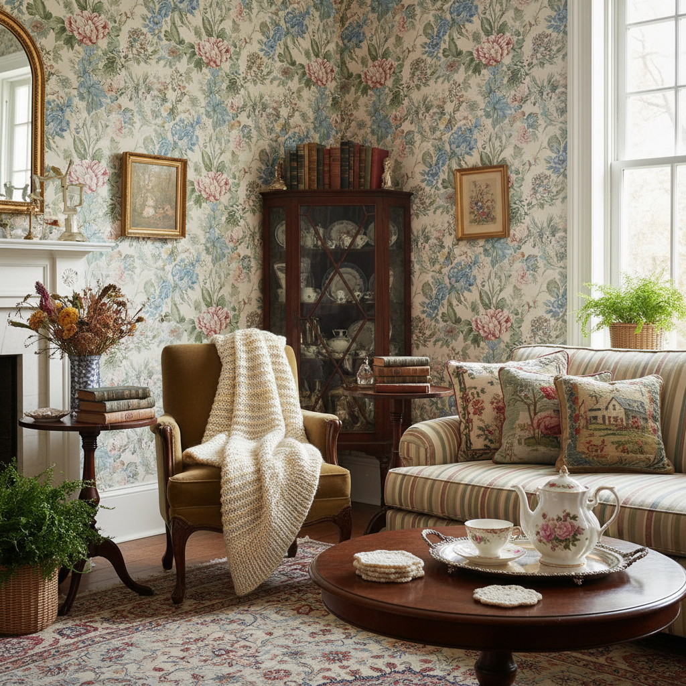

# Grandmillennial 千禧祖母



> **"碎花壁纸、针织毯、骨瓷茶杯——千禧一代爱上了奶奶的审美。"**

## 概述

| 维度 | 描述 |
|------|------|
| 时期 | 2019–至今 |
| 别名 | Grandmillennial, Granny Chic, New Traditional |
| 核心色彩 | 粉色、绿色、蓝色（柔和版）、奶油白、金色 |
| 关键元素 | 碎花、针织、骨瓷、流苏、壁纸、古董家具 |
| 代表人物 | House Beautiful、Anthropologie、Laura Ashley 复兴 |
| 关联风格 | Cottagecore, Regencycore, Cluttercore, Coastal Grandmother |

---

## 历史脉络

### "奶奶风"的逆袭

| 年份 | 事件 |
|------|------|
| 2015–18 | 极简主义统治室内设计 |
| 2019 | House Beautiful 命名 "Grandmillennial" |
| 2020 | 疫情居家——人们渴望"温暖"的空间 |
| 2021 | Laura Ashley 品牌复兴 |
| 2022–至今 | 从室内扩展到时尚、生活方式 |

### 它反对什么？

| 极简主义说 | Grandmillennial 说 |
|-----------|-------------------|
| "白墙最好" | "碎花壁纸更有温度" |
| "少即是多" | "多即是温暖" |
| "现代家具" | "古董更有故事" |
| "中性色" | "粉色和绿色很美" |
| "断舍离" | "奶奶的茶杯我要留着" |

### 核心哲学

Grandmillennial 的精神是**"传统不是过时——是永恒"**：
- 奶奶的审美经过了时间的考验
- 手工艺（针织、刺绣）值得尊重
- "老派"不是贬义——是品质的证明
- 家应该像被拥抱——不是像画廊
- 传承 > 潮流

---

## 视觉语法

### 色彩系统

```
主色：
  柔粉 (#FFB6C1) — 玫瑰、碎花
  鼠尾草绿 (#9DC183) — 植物、壁纸
  瓷蓝 (#4682B4) — 青花瓷、织物
  奶油白 (#FFFDD0) — 蕾丝、瓷器
  金色 (#DAA520) — 镜框、五金

辅色：
  薰衣草 (#E6E6FA) — 花朵
  珊瑚 (#FF7F50) — 温暖
  深绿 (#006400) — 植物

规则：
  - 柔和但不苍白
  - 图案丰富（碎花、条纹、格子）
  - 混搭图案是特色
  - 金色作为装饰
  - 温暖色温

质感：
  碎花 — 壁纸、织物、瓷器
  针织 — 毯子、抱枕
  蕾丝 — 桌布、窗帘
  瓷器 — 骨瓷、青花
  木材 — 古董家具、深色木
```

### 标志性元素

| 类别 | 元素 |
|------|------|
| 墙面 | 碎花壁纸、画框墙、镜子 |
| 家具 | 古董椅、梳妆台、书柜 |
| 纺织 | 针织毯、碎花抱枕、蕾丝桌布 |
| 瓷器 | 骨瓷茶具、花瓶、装饰盘 |
| 植物 | 鲜花、干花、室内植物 |
| 手工 | 刺绣、针织、十字绣 |

---

## 与千禧怀旧的关系

### "我想要奶奶家的感觉"
- 千禧一代的童年记忆 = 奶奶家
- 碎花沙发、骨瓷茶杯、针织毯 = 安全感
- 长大后的极简公寓 = 冰冷
- Grandmillennial = "我想回到那种温暖"

### 与 Cottagecore 的交叉
- 两者都渴望"慢生活"和"手工艺"
- Cottagecore = 乡村版
- Grandmillennial = 城市版
- 共同精神：传统、手工、温暖

---

## 中国语境

- "千禧祖母风"/"奶奶风"在小红书的讨论
- 与"中古风"/"vintage"的交叉
- 中国版：景德镇瓷器+刺绣+红木家具
- 对"北欧极简"的反叛
- "有温度的家"的追求

---

## 设计应用

| 场景 | 应用方式 |
|------|----------|
| 空间 | 碎花壁纸+古董家具+针织品+瓷器 |
| 品牌 | 碎花图案+衬线字体+柔和色+手工质感 |
| 时尚 | 碎花裙+珍珠+针织开衫+蕾丝 |
| 包装 | 碎花+金色+复古字体+手工感 |

---

## 相关风格

← [Cottagecore 田园核](cottagecore.md) | [Cluttercore 杂物核](cluttercore.md) →

↑ [返回千禧怀旧目录](README.md) | [返回总目录](../README.md)
