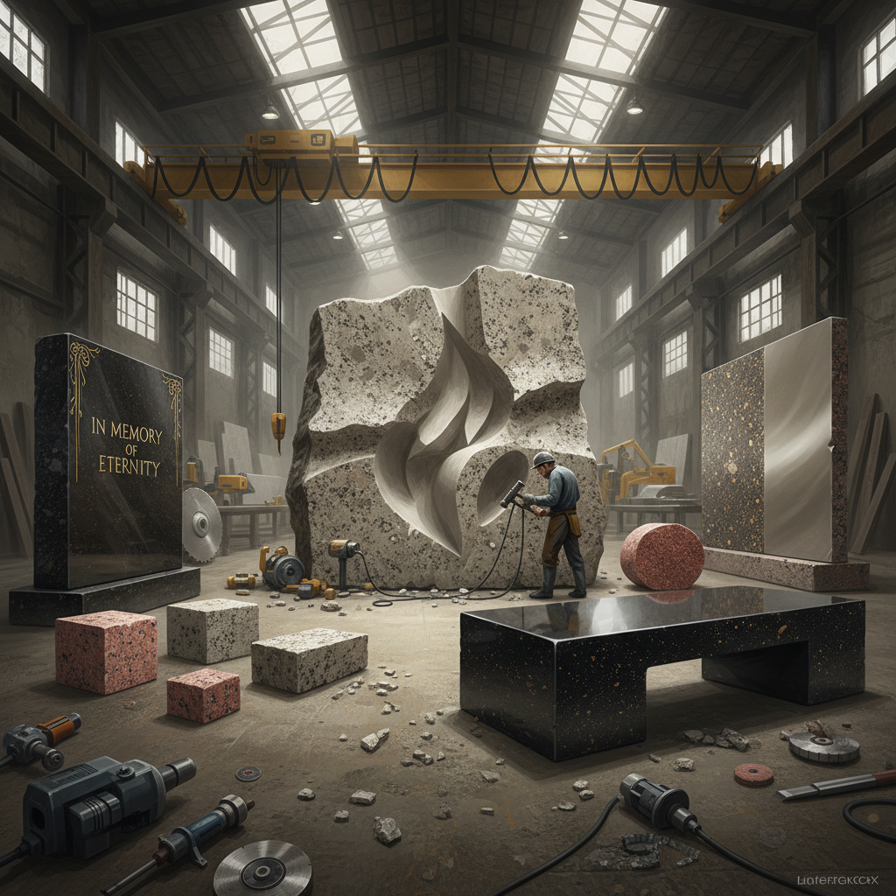

# Granite Art 花岗岩艺术

> "Granite is the backbone of continents — formed deep in the earth under unimaginable pressure and heat, then thrust upward to become mountains. It is the hardest common stone, the most resistant to time, the most permanent of all sculptural materials. What you carve in granite will outlast everything else humanity has built." — Unknown

## 概述

花岗岩艺术（Granite Art）是以花岗岩为主要材料进行艺术创作的实践——利用花岗岩的极端硬度、耐久性、丰富的矿物色彩和可抛光性创造雕塑、建筑和纪念碑。花岗岩是地球上最坚硬的常见石材之一，因此花岗岩艺术代表了对永恒的追求。

花岗岩艺术的实践包括：1）花岗岩雕塑——用花岗岩雕刻大型雕塑和纪念碑；2）花岗岩建筑——用花岗岩建造的建筑和结构；3）花岗岩石刻——在花岗岩表面刻写文字和图案；4）花岗岩铺装——用花岗岩设计的地面图案；5）花岗岩家具——用花岗岩制作的桌面和台面；6）花岗岩景观——用花岗岩设计的景观元素；7）当代花岗岩雕塑——用花岗岩创作的当代抽象雕塑。

## 核心特征

| 特征 | 描述 |
|------|------|
| 坚硬 | 极其坚硬 |
| 永恒 | 最耐久的石材 |
| 斑晶 | 可见的矿物晶体 |
| 多色 | 从白到黑的色彩范围 |
| 厚重 | 视觉和物理的厚重感 |
| 抗风化 | 极强的抗风化能力 |

## 视觉特征

- **斑点**：矿物晶体的斑点纹理
- **光泽**：抛光后的镜面光泽
- **多色**：石英、长石、云母的色彩
- **厚重**：厚重的视觉感受
- **粗犷**：未抛光时的粗犷质感
- **永恒**：永恒不变的感觉

## 代表作品

| 作品 | 艺术家 | 年代 | 意义 |
|------|--------|------|------|
| *Egyptian obelisks* | 古埃及 | 古代 | 花岗岩方尖碑 |
| *Mount Rushmore* | Gutzon Borglum | 1927-1941 | 花岗岩山体雕刻 |
| *Granite sculptures* | Isamu Noguchi | 20世纪 | 现代花岗岩雕塑 |
| *Stone of Scone* | Unknown | 古代 | 历史花岗岩文物 |
| *Contemporary granite* | Various | 当代 | 当代花岗岩艺术 |

## 历史时间线

| 时期 | 事件 |
|------|------|
| 古埃及 | 花岗岩方尖碑和石棺 |
| 古代 | 各文化的花岗岩建筑 |
| 中世纪 | 花岗岩城堡和教堂 |
| 19-20世纪 | 花岗岩纪念碑 |
| 当代 | 花岗岩当代雕塑 |

## 中国语境

花岗岩艺术在中国有重要的文化和历史地位。中国许多重要的石刻和建筑使用花岗岩——泰山的摩崖石刻、福建的花岗岩石塔（如泉州东西塔）、以及众多花岗岩石桥都是中国花岗岩艺术的代表。中国福建、山东、广东等地出产优质花岗岩，当地有悠久的花岗岩雕刻传统。中国的花岗岩石狮、石牌坊是传统建筑装饰的重要元素。中国当代的花岗岩雕塑在城市公共艺术中占有重要地位——许多城市广场和纪念性建筑使用花岗岩作为主要材料。中国的花岗岩加工技术在全球领先，是世界最大的花岗岩生产和出口国之一。

## AI生成概念图

## 与其他风格的关系

- **Marble Art** → 大理石艺术
- **Stone Carving** → 石雕
- **Monumental Art** → 纪念碑艺术
- **Architecture** → 建筑
- **Land Art** → 大地艺术
- **Minimalism** → 极简主义

---

*浮光艺志 | Chronicle of Artistry*
