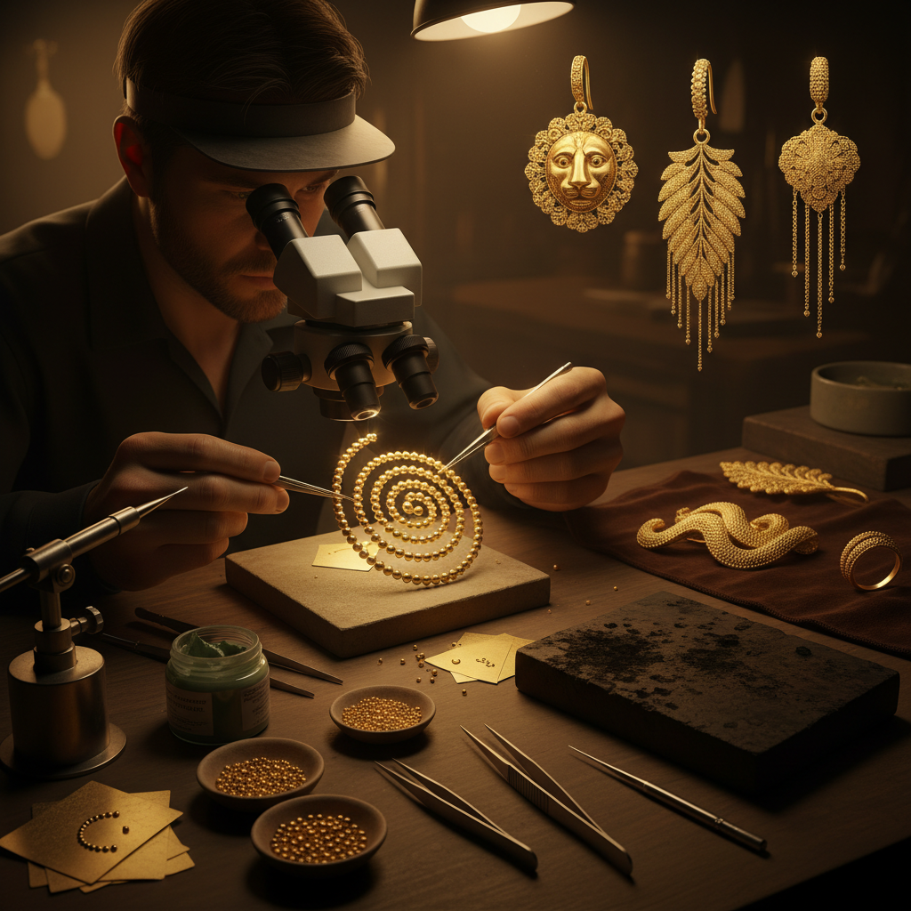

# Granulation Art 金属珠粒艺术

> "Granulation is the jeweler's pointillism — thousands of tiny metal spheres, each smaller than a grain of sand, fused to a metal surface without solder, creating texture and pattern through accumulated points of light. The ancient Etruscans mastered this art so completely that modern jewelers spent centuries trying to rediscover their secret: how to attach gold dust to gold without melting either into the other." — Unknown

## 概述

金属珠粒艺术（Granulation Art）是将极小的金属球粒（通常为金或银）排列并熔接在金属表面上形成装饰图案的精密珠宝工艺——通过精确控制温度，使球粒与基底在不使用焊料的情况下实现分子级别的结合（共晶焊接），保持每个球粒的完美球形。

金属珠粒艺术的实践包括：1）经典珠粒——将金球排列成几何图案；2）线状珠粒——球粒排列成线条；3）面状珠粒——球粒覆盖整个表面；4）渐变珠粒——不同大小球粒的渐变排列；5）图案珠粒——球粒组成具象图案；6）与花丝结合——珠粒与花丝工艺的结合；7）当代珠粒——将传统技法与现代设计结合的创作。

## 核心特征

| 特征 | 描述 |
|------|------|
| 微小 | 极其微小的金属球粒 |
| 精密 | 极其精密的排列 |
| 无焊 | 不使用焊料的结合 |
| 质感 | 独特的颗粒质感 |
| 光影 | 球粒表面的光影效果 |
| 古老 | 极其古老的技法 |

## 视觉特征

- **颗粒**：密集的金属球粒
- **光点**：每个球粒反射的光点
- **纹理**：独特的颗粒纹理
- **图案**：球粒组成的图案
- **金色**：金球的温暖光泽
- **精细**：极其精细的细节

## 代表作品

| 作品 | 艺术家/文化 | 年代 | 意义 |
|------|-------------|------|------|
| *Etruscan gold jewelry* | 伊特鲁里亚 | 公元前7-5世纪 | 古代珠粒巅峰 |
| *Sumerian gold* | 苏美尔 | 公元前2500年 | 最早的珠粒工艺 |
| *John Paul Miller* | John Paul Miller | 20世纪 | 现代珠粒复兴 |
| *Korean gold crowns* | 新罗王朝 | 5-6世纪 | 韩国金冠珠粒 |
| *Contemporary granulation* | Various | 当代 | 当代珠粒艺术 |

## 历史时间线

| 时期 | 事件 |
|------|------|
| 公元前2500年 | 苏美尔最早的珠粒工艺 |
| 公元前7-5世纪 | 伊特鲁里亚珠粒的巅峰 |
| 中世纪 | 珠粒技术的衰落 |
| 20世纪 | 珠粒技术的重新发现 |
| 当代 | 珠粒工艺的现代传承 |

## 中国语境

金属珠粒艺术在中国有对应的传统形式。中国古代的金银器制作中有"炸珠"工艺——将金银熔化后滴入水中形成小球粒，再焊接在器物表面形成装饰。中国的花丝镶嵌工艺中，"攒珠"是重要的装饰技法之一——将小金珠排列焊接在花丝作品上增加立体感和光泽。中国出土的古代金器中可以看到珠粒装饰的应用——如汉代和唐代的金饰品。中国当代的珠宝设计教育中，珠粒工艺作为一种重要的传统技法被纳入课程。中国的一些当代珠宝设计师将珠粒技法与中国传统美学相结合——创造具有东方特色的珠粒首饰。中国的非物质文化遗产中，花丝镶嵌工艺包含了珠粒技法的传承。

## AI生成概念图

## 与其他风格的关系

- **Filigree** → 花丝工艺
- **Goldsmithing** → 金器艺术
- **Jewelry Art** → 珠宝艺术
- **Etruscan Art** → 伊特鲁里亚艺术
- **Micro Art** → 微型艺术
- **Metal Art** → 金属艺术

---

*浮光艺志 | Chronicle of Artistry*
