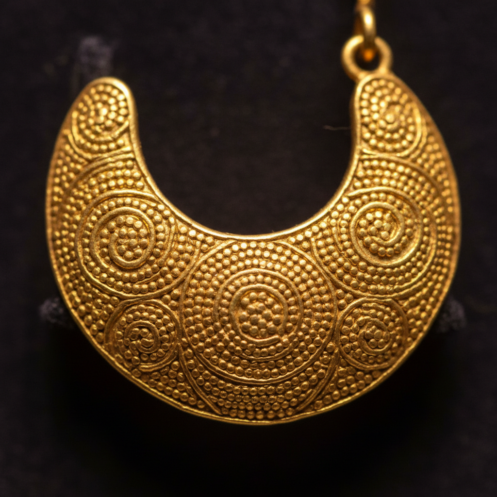

# Granulation Jewelry Art 金珠工艺珠宝艺术

> "Granulation is the goldsmith's pointillism — thousands of tiny gold spheres, each smaller than a grain of sand, are arranged on a metal surface and fused in place without visible solder, creating textures and patterns of extraordinary richness. The ancient Etruscans achieved granules so fine that modern metallurgists still debate exactly how they managed the fusion without melting the spheres into shapeless blobs." — Unknown

## 概述

金珠工艺珠宝艺术（Granulation Jewelry Art）是一种将极小的金属球粒（granules）排列在金属表面并通过特殊焊接技法固定的传统金属装饰工艺——不使用可见的焊料，而是通过扩散焊接或胶体焊接使金珠与基底融合。金珠工艺以古代伊特鲁里亚文明的作品最为著名，其精细程度至今令人惊叹。

金珠工艺珠宝艺术的实践包括：1）制珠——制作均匀的微小金属球粒；2）排列——将金珠精确排列成图案；3）胶体焊接——使用铜盐胶体作为焊接介质；4）扩散焊接——通过高温使金属表面扩散结合；5）线条金珠——将金珠排列成线条；6）面状金珠——用金珠覆盖整个表面；7）当代金珠工艺——将传统技法与现代设计结合的创作。

## 核心特征

| 特征 | 描述 |
|------|------|
| 微小 | 极其微小的金属球 |
| 无焊 | 不使用可见焊料 |
| 古老 | 数千年的传统 |
| 神秘 | 技法曾经失传 |
| 精密 | 极高的精密度 |
| 质感 | 独特的颗粒质感 |

## 视觉特征

- **颗粒**：微小金珠的颗粒感
- **质感**：丰富的表面质感
- **光影**：金珠反射的光影
- **精密**：极其精密的排列
- **华丽**：华丽精美的效果
- **古典**：古典高贵的气质

## 代表作品

| 作品 | 艺术家/文化 | 年代 | 意义 |
|------|-------------|------|------|
| *Etruscan granulation* | 伊特鲁里亚 | 公元前7-5世纪 | 金珠工艺的巅峰 |
| *Greek gold jewelry* | 古希腊 | 古代 | 希腊金珠珠宝 |
| *John Paul Miller works* | 美国 | 20世纪 | 现代金珠复兴 |
| *Elizabeth Treskow works* | 德国 | 20世纪 | 德国金珠大师 |
| *Contemporary granulation* | 国际 | 当代 | 当代金珠工艺 |

## 历史时间线

| 时期 | 事件 |
|------|------|
| 公元前3000年 | 美索不达米亚最早的金珠工艺 |
| 公元前7-5世纪 | 伊特鲁里亚金珠工艺的巅峰 |
| 中世纪 | 金珠技法的逐渐失传 |
| 20世纪 | 金珠工艺的重新发现和复兴 |
| 当代 | 金珠工艺的当代发展 |

## 中国语境

金珠工艺在中国有一定的传统和当代发展。中国古代的金银器中有使用金珠装饰的传统——如唐代金银器上的联珠纹装饰。中国传统的花丝镶嵌工艺中包含类似金珠的技法——将小金珠焊接在花丝框架中。中国当代的珠宝设计师开始学习和应用西方式的金珠工艺——将其与中国传统金属工艺结合。中国的珠宝教育中，金珠工艺作为一种高级的金属装饰技法——在一些专业课程中有所教授。中国的一些珠宝工作室将金珠工艺应用于高端定制珠宝——利用其独特的质感和古典气质。中国的考古发现中，一些出土的古代金器展示了类似金珠的装饰技法——证明了这一技法在中国的历史存在。

## AI生成概念图

## 与其他风格的关系

- **Filigree** → 金银丝细工
- **Goldsmithing** → 金匠工艺
- **Jewelry Design** → 珠宝设计
- **Etruscan Art** → 伊特鲁里亚艺术
- **Metalwork** → 金属工艺
- **Texture Art** → 质感艺术

---

*浮光艺志 | Chronicle of Artistry*
