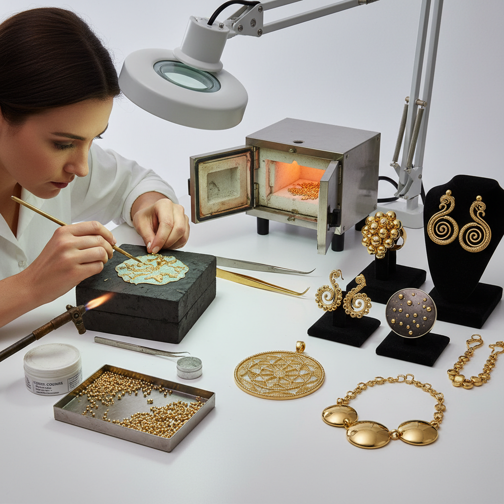

# Granulation Modern 现代粒金

> "Modern granulation revives the ancient Etruscan mystery — fusing thousands of tiny gold spheres to a surface without solder, each granule kissing the metal beneath through a molecular bond as delicate as it is permanent." — Unknown

## 概述

现代粒金（Granulation Modern）是对古代粒金技法的当代复兴和创新。粒金（Granulation）是将微小的金属球粒（通常直径0.2-1mm）排列并融合到金属表面的装饰技法。古代伊特鲁里亚人（Etruscans）在公元前7世纪就掌握了这种技法，但其秘密在中世纪失传。20世纪的金属工艺研究者重新发现了粒金的原理——利用铜盐作为助焊剂，在恰好的温度下使球粒与基底之间形成共晶合金结合，而不需要传统焊料。

现代粒金在传统技法基础上进行了创新——使用更多种类的金属（不仅限于金）、创造更自由的图案设计、与其他当代金属工艺技法结合。现代粒金艺术家将微小的球粒排列成抽象图案、文字、风景或纯粹的质感效果。

## 核心特征

| 特征 | 描述 |
|------|------|
| 球粒 | 微小的金属球粒 |
| 无焊 | 不使用传统焊料 |
| 精密 | 极其精密的排列 |
| 复兴 | 古代技法的复兴 |
| 创新 | 当代的创新应用 |
| 质感 | 独特的表面质感 |

## 视觉特征

- **颗粒**：微小的球粒排列
- **质感**：独特的颗粒质感
- **精密**：精密的排列图案
- **光影**：球粒产生的光影效果
- **奢华**：奢华的视觉感
- **古典**：古典与现代的融合

## 代表作品

| 作品 | 艺术家 | 年代 | 意义 |
|------|--------|------|------|
| *Etruscan granulation jewelry* | 伊特鲁里亚工匠 | 公元前7世纪 | 古代粒金巅峰 |
| *John Paul Miller works* | Miller | 20世纪 | 现代粒金先驱 |
| *Contemporary granulation rings* | Various | 当代 | 当代粒金戒指 |
| *Granulation pendants* | Various | 当代 | 粒金吊坠 |
| *Mixed technique granulation* | Various | 当代 | 混合技法粒金 |

## 历史时间线

| 时期 | 事件 |
|------|------|
| 公元前7世纪 | 伊特鲁里亚粒金的巅峰 |
| 古罗马 | 粒金技法的延续 |
| 中世纪 | 粒金秘密的失传 |
| 1930s | H.A.P. Littledale重新发现原理 |
| 1960s | John Paul Miller的现代粒金 |
| 当代 | 现代粒金的全球传播和创新 |

## 中国语境

粒金技法在中国古代金银器中也有应用——中国的一些汉代和唐代金器上可以看到粒金装饰。现代粒金在中国的当代首饰设计领域正在获得关注。中国的一些珠宝设计学校和金属工艺课程教授现代粒金技法。中国的独立首饰设计师使用现代粒金创作具有古典韵味的当代首饰。粒金的"精密、耐心、不可预测"特点吸引了追求工艺深度的中国设计师。

## AI生成概念图

## 与其他风格的关系

- **Granulation** → 传统粒金
- **Filigree** → 花丝
- **Keum-boo** → 金箔贴合
- **Etruscan Art** → 伊特鲁里亚艺术
- **Jewelry Making** → 首饰制作
- **Goldsmithing** → 金器制作

---

*浮光艺志 | Chronicle of Artistry*
