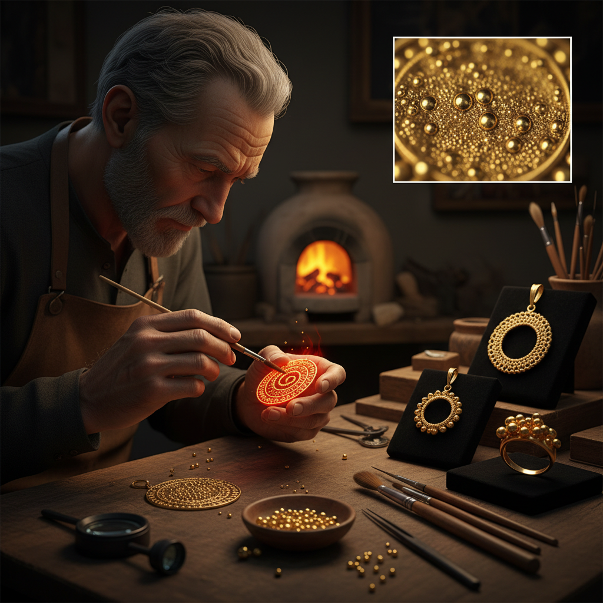

# Granulation 金珠粒工艺

> "Granulation is a constellation of gold — thousands of tiny spheres fused to a surface without visible solder, each one catching light like a miniature sun." — Unknown

## 概述

金珠粒工艺（Granulation）是将极小的金属球粒（通常直径0.2-1mm）排列并焊接到金属表面形成装饰图案的古老珠宝工艺。这种技法的难点在于：如何将如此微小的球粒固定在表面上而不使用可见的焊料——传统的方法是使用铜盐和胶水的混合物作为焊剂，在极精确的温度下使球粒与底面在接触点处融合（colloidal soldering）。金珠粒工艺在伊特鲁里亚文明（公元前7-3世纪）达到了令人难以置信的精细程度——一些作品上的金珠粒小到肉眼几乎无法分辨。

金珠粒工艺的哲学在于：微小的壮观——无数微小的球粒汇聚成宏大的图案，如同星辰组成星座。

## 核心特征

| 特征 | 描述 |
|------|------|
| 球粒 | 极小的金属球粒 |
| 排列 | 精确的排列图案 |
| 焊接 | 无可见焊料的焊接 |
| 精细 | 极其精细的工艺 |
| 光效 | 独特的光线散射 |
| 古老 | 极其古老的技法 |

## 视觉特征

- **颗粒**：密集的金属球粒
- **光泽**：球粒的多角度反光
- **质感**：独特的颗粒质感
- **图案**：球粒排列的图案
- **精细**：极其精细的细节
- **奢华**：黄金的奢华感

## 代表作品

| 作品 | 艺术家 | 年代 | 意义 |
|------|--------|------|------|
| *Etruscan granulation jewelry* | 匿名 | 公元前7世纪 | 伊特鲁里亚巅峰 |
| *Sumerian gold jewelry* | 匿名 | 公元前2500年 | 最早的金珠粒 |
| *Byzantine granulation* | 匿名 | 6-12世纪 | 拜占庭金珠粒 |
| *John Paul Miller works* | John Paul Miller | 1950s+ | 现代金珠粒复兴 |
| *Contemporary granulation* | Various | 当代 | 当代金珠粒艺术 |

## 历史时间线

| 时期 | 事件 |
|------|------|
| 公元前3000年 | 美索不达米亚最早的金珠粒 |
| 公元前7世纪 | 伊特鲁里亚金珠粒的巅峰 |
| 古希腊罗马 | 古典金珠粒珠宝 |
| 中世纪 | 技法的部分失传 |
| 20世纪 | 现代金珠粒技法的重新发现 |
| 当代 | 当代金珠粒工艺的复兴 |

## 中国语境

金珠粒工艺在中国传统金银器中有应用——中国古代金银器上的"炸珠"（将金银熔化成小球粒后焊接到器物表面）与Granulation技法相同。唐代的金银器上可以看到精美的炸珠装饰。中国的花丝镶嵌工艺中也包含"攒珠"技法——将小金珠排列焊接形成图案。当代中国的珠宝设计师也在学习和实践金珠粒技法，将其与中国传统金银器美学结合。一些中国珠宝院校开设了金珠粒工艺课程。

## AI生成概念图

## 与其他风格的关系

- **Filigree** → 花丝工艺
- **Jewelry Making** → 珠宝制作
- **Metalwork** → 金属工艺
- **Goldsmithing** → 金匠工艺
- **Etruscan Art** → 伊特鲁里亚艺术
- **Micro Art** → 微缩艺术

---

*浮光艺志 | Chronicle of Artistry*
