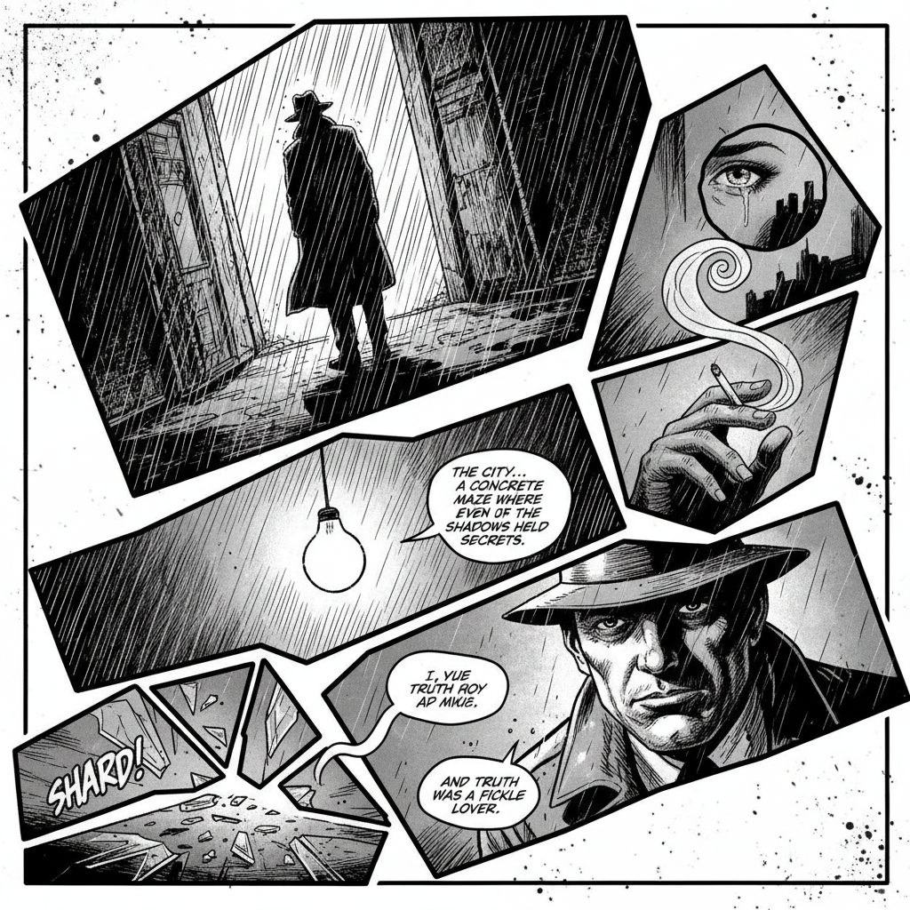

# Graphic Novel Art 图像小说艺术

> **时期：** 1970年代–至今  
> **关键词：** 文学性叙事、实验版式、成人主题、艺术自觉、独立出版

## 概述

Graphic Novel（图像小说）是漫画的文学化形态，强调完整的长篇叙事、成熟的主题和艺术实验性。从威尔·艾斯纳的《与神的契约》到阿特·斯皮格曼的《鼠族》，图像小说打破了"漫画=儿童读物"的偏见，将连续艺术提升为严肃的文学和艺术形式。

## 风格特征

- **文学性叙事**：完整的长篇故事结构
- **实验版式**：打破传统分格的创新布局
- **多元画风**：从写实到抽象的广泛风格光谱
- **成人主题**：战争、身份、记忆、社会批判
- **物质性**：重视印刷、纸张、装帧的整体设计

## 代表人物与作品

- 阿特·斯皮格曼《鼠族》
- 阿兰·摩尔《守望者》
- 玛嘉·莎塔碧《我在伊朗长大》
- 克里斯·韦尔《吉米·科瑞根》

## 概念图

