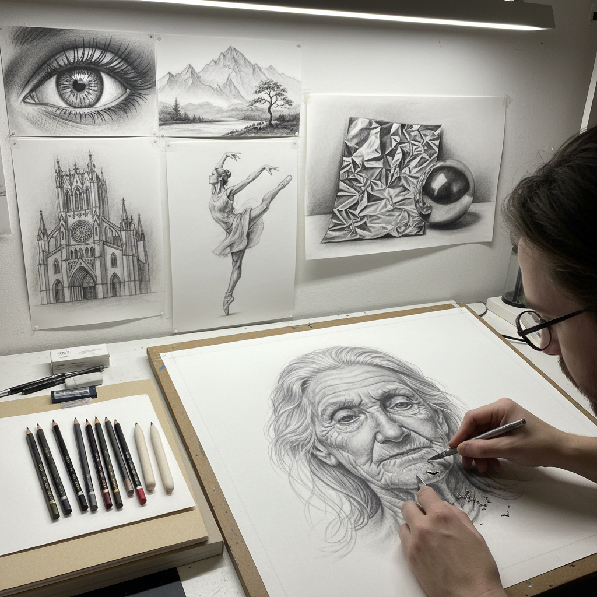

# Graphite Drawing 石墨画

> "Graphite is the most democratic of drawing materials — from the softest whisper of an 8H to the darkest velvet of a 9B, it offers an infinite grayscale that has served everyone from engineering draftsmen to Renaissance masters to schoolchildren sketching their first still life." — Unknown

## 概述

石墨画（Graphite Drawing）是使用石墨铅笔或石墨棒在纸面上作画的技法。石墨是一种天然矿物（碳的同素异形体），与粘土混合后制成不同硬度的铅笔芯——从极硬的9H到极软的9B。石墨画是最基础、最普遍的绘画形式之一，也是所有视觉艺术训练的起点。

石墨画的魅力在于其精确性和控制力——从极细的线条到柔和的色调渐变，从精密的技术制图到自由的艺术表达。石墨画可以极其写实（超写实主义石墨画能达到照片般的精度），也可以极其表现性（速写和草图的自由奔放）。石墨画的灰色调虽然看似局限，但正是这种"限制"迫使艺术家专注于形体、光影和构图的本质。

## 核心特征

| 特征 | 描述 |
|------|------|
| 石墨 | 石墨为主要材料 |
| 灰度 | 灰色调的表现 |
| 精确 | 极其精确的控制 |
| 通用 | 最通用的绘画媒介 |
| 可擦 | 可以擦除修改 |
| 层次 | 丰富的明暗层次 |

## 视觉特征

- **灰度**：丰富的灰色层次
- **精确**：精确的线条
- **光泽**：石墨的金属光泽
- **细腻**：细腻的色调过渡
- **锐利**：锐利的细节
- **深度**：深度的明暗对比

## 代表作品

| 作品 | 艺术家 | 年代 | 意义 |
|------|--------|------|------|
| *Studies and sketches* | Leonardo da Vinci | 15-16世纪 | 文艺复兴素描大师 |
| *Ingres portraits* | J.A.D. Ingres | 19世纪 | 铅笔肖像画巅峰 |
| *Hyperrealistic drawings* | Various | 当代 | 超写实石墨画 |
| *Graphite landscapes* | Various | 当代 | 石墨风景画 |
| *Contemporary graphite art* | Various | 当代 | 当代石墨艺术 |

## 历史时间线

| 时期 | 事件 |
|------|------|
| 1564 | 英国Borrowdale发现大块石墨矿 |
| 1795 | Conté发明现代铅笔制造工艺 |
| 19世纪 | 石墨铅笔成为标准绘画工具 |
| 20世纪 | 石墨画作为独立艺术形式的发展 |
| 当代 | 超写实石墨画的流行 |
| 当代 | 石墨在当代艺术中的创新应用 |

## 中国语境

石墨画（铅笔素描）在中国美术教育中占有核心地位。中国的美术高考中，素描是必考科目——几乎所有学习美术的中国学生都要经过大量的铅笔素描训练。中国的素描教学传统深受苏联学院派影响——强调结构、体积和光影的系统训练。中国的一些当代艺术家使用石墨创作大型装置和概念艺术作品。中国的超写实铅笔画在社交媒体上也有很高的关注度。

## AI生成概念图

## 与其他风格的关系

- **Charcoal Drawing** → 炭笔画
- **Silverpoint** → 银针笔
- **Conté Crayon** → 孔特蜡笔
- **Pencil Sketch** → 铅笔速写
- **Hyperrealism** → 超写实主义
- **Academic Drawing** → 学院素描

---

*浮光艺志 | Chronicle of Artistry*
