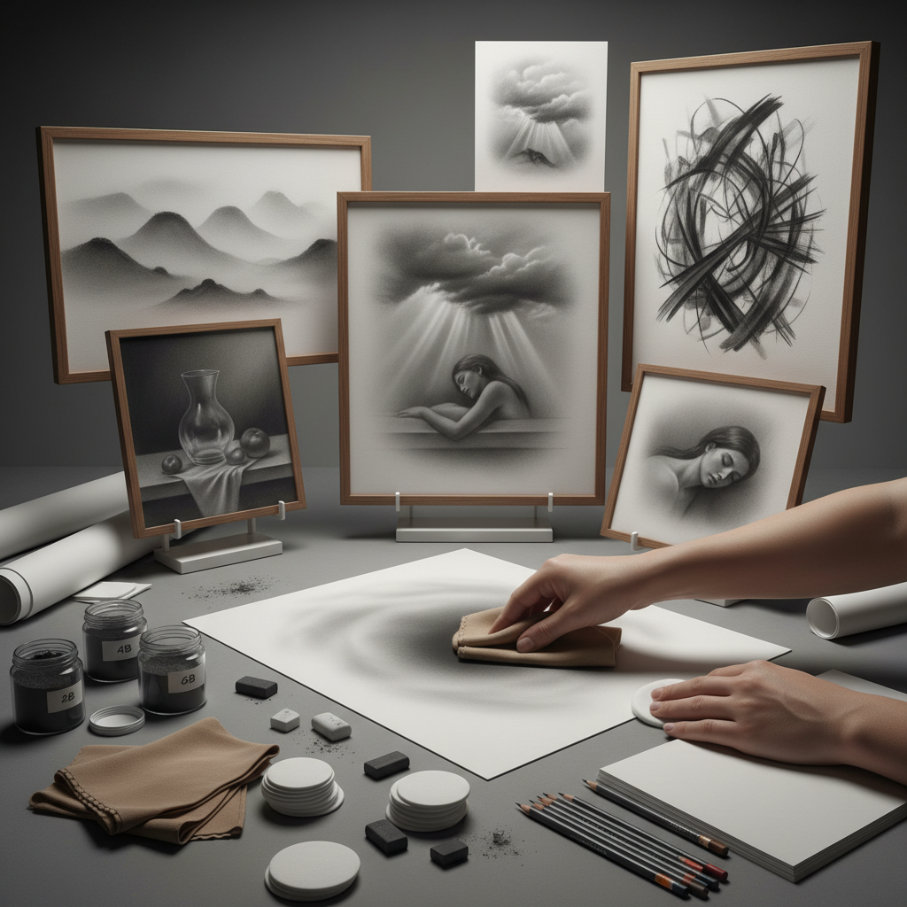

# Graphite Powder 石墨粉画

> "Graphite powder is drawing without the pencil — loose carbon dust swept across paper with chamois, cotton, or fingertips, building atmosphere and tone in broad sweeps that feel more like painting than drawing, yet retain graphite's silvery metallic soul." — Unknown

## 概述

石墨粉画（Graphite Powder）是一种使用松散的石墨粉末（而非铅笔）在纸面上作画的技法。石墨粉可以用棉球、麂皮、纸巾、海绵或手指涂抹到纸面上，产生柔和的色调和大面积的渐变效果。石墨粉画结合了绘画的大面积覆盖能力和素描的灰色调特性。

石墨粉画的优势在于：能快速覆盖大面积、产生极其柔和的渐变、创造大气感和雾气效果。石墨粉可以与铅笔结合使用——先用石墨粉铺设大面积的色调，再用铅笔添加细节和锐利的线条。石墨粉画特别适合：大气风景、柔和的肖像、梦幻的效果。石墨粉的金属光泽在某些角度下会产生独特的反光效果。

## 核心特征

| 特征 | 描述 |
|------|------|
| 粉末 | 松散的石墨粉末 |
| 涂抹 | 用工具涂抹 |
| 柔和 | 极其柔和的效果 |
| 大面积 | 快速覆盖大面积 |
| 大气 | 大气感的表现 |
| 金属光泽 | 石墨的金属光泽 |

## 视觉特征

- **柔和**：极其柔和的色调
- **大气**：大气感和雾气效果
- **银色**：银灰色的金属质感
- **渐变**：平滑的渐变
- **梦幻**：梦幻的视觉效果
- **光泽**：角度变化的光泽

## 代表作品

| 作品 | 艺术家 | 年代 | 意义 |
|------|--------|------|------|
| *Atmospheric landscapes* | Various | 当代 | 大气风景石墨粉画 |
| *Graphite powder portraits* | Various | 当代 | 石墨粉肖像 |
| *Abstract graphite works* | Various | 当代 | 抽象石墨粉作品 |
| *Mixed graphite techniques* | Various | 当代 | 混合石墨技法 |
| *Large-scale graphite installations* | Various | 当代 | 大型石墨装置 |

## 历史时间线

| 时期 | 事件 |
|------|------|
| 传统 | 石墨粉在素描中的辅助使用 |
| 19世纪 | 石墨粉在学院素描中的应用 |
| 20世纪 | 石墨粉作为独立技法的发展 |
| 当代 | 石墨粉在当代艺术中的创新 |
| 当代 | 大型石墨粉装置艺术 |
| 当代 | 石墨粉与其他媒介的结合 |

## 中国语境

石墨粉画在中国的美术教育中有一定的应用——特别是在素描训练中作为辅助技法。中国的一些美术院校在素描教学中介绍石墨粉的使用方法。中国的一些当代艺术家使用石墨粉创作大型作品和装置。石墨粉画的"大气感"和"柔和效果"与中国传统水墨画的"气韵"有某种精神上的相似。中国的素描爱好者在社交媒体上分享石墨粉技法的教程。

## AI生成概念图

## 与其他风格的关系

- **Graphite Drawing** → 石墨画
- **Charcoal Drawing** → 炭笔画
- **Conté Crayon** → 孔特蜡笔
- **Ink Wash** → 水墨
- **Atmospheric Art** → 大气艺术
- **Tonal Drawing** → 色调素描

---

*浮光艺志 | Chronicle of Artistry*
