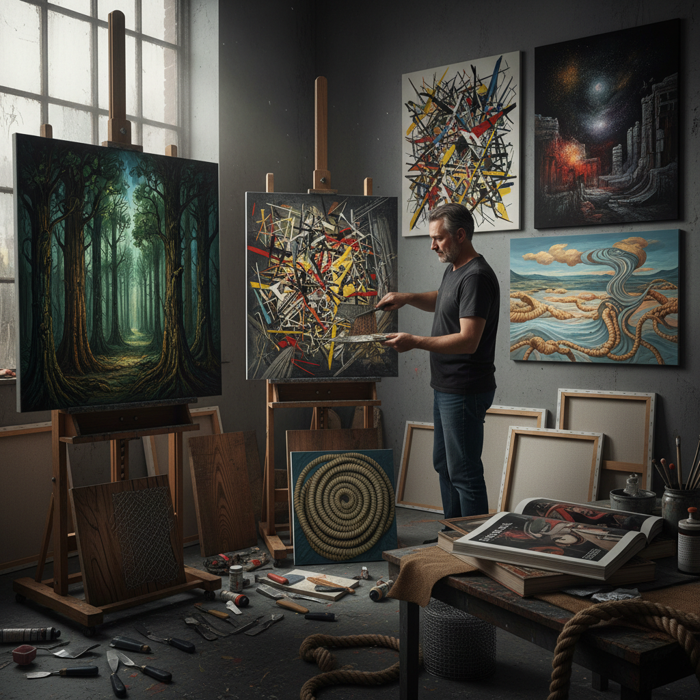

# Grattage 刮擦法

> "Grattage is archaeology in reverse — instead of digging down to find what lies beneath, the artist scrapes away the surface to reveal the ghost impressions of textures hidden below, letting chance and material speak through the wounds in the paint." — Unknown

## 概述

刮擦法（Grattage）是一种由超现实主义艺术家Max Ernst在1927年发展的绘画技法——将画布放在有纹理的物体（如木板、绳索、网格、树叶等）上，然后在画布上涂抹颜料，再用刮刀或其他工具刮擦画面——纹理物体的凸起部分会通过画布影响颜料的分布，产生独特的纹理图案。

刮擦法是拓印法（frottage）的绘画版本——frottage用铅笔在纸上拓印纹理，而grattage用颜料在画布上刮擦纹理。Max Ernst使用grattage创作了大量超现实主义绘画——在随机产生的纹理中"发现"形象，然后加以发展和完善。刮擦法产生的效果既有随机性又有物质感——纹理来自真实的物体，但最终的图像是艺术家的想象力赋予的。

## 核心特征

| 特征 | 描述 |
|------|------|
| 刮擦 | 刮擦画面表面 |
| 纹理 | 底下物体的纹理转印 |
| 超现实 | 超现实主义技法 |
| 偶然 | 偶然性的效果 |
| 物质 | 物质感的表现 |
| 发现 | 在纹理中发现形象 |

## 视觉特征

- **纹理**：丰富的纹理效果
- **刮痕**：刮擦的痕迹
- **层次**：多层次的效果
- **物质**：物质感的表面
- **随机**：随机的图案
- **有机**：有机的形态

## 代表作品

| 作品 | 艺术家 | 年代 | 意义 |
|------|--------|------|------|
| *Forest and Dove* | Max Ernst | 1927 | 早期grattage作品 |
| *The Horde* | Max Ernst | 1927 | grattage杰作 |
| *Grattage paintings* | Max Ernst | 1927-30s | 系列grattage作品 |
| *Surrealist grattage* | Various | 20世纪 | 超现实主义刮擦 |
| *Contemporary grattage* | Various | 当代 | 当代刮擦法 |

## 历史时间线

| 时期 | 事件 |
|------|------|
| 1925 | Max Ernst发展frottage技法 |
| 1927 | Max Ernst将frottage发展为grattage |
| 1927-30s | Ernst的大量grattage绘画 |
| 20世纪中 | 其他艺术家的采用 |
| 当代 | grattage在艺术教育中的教学 |
| 当代 | 当代艺术家的创新应用 |

## 中国语境

刮擦法在中国的美术教育中作为创意技法之一被介绍。中国的一些美术院校在现代艺术技法课程中教授grattage。中国的一些当代艺术家使用刮擦法创作具有物质感和纹理的作品。刮擦法的"偶然性"和"物质性"与中国当代艺术对材料和过程的关注有共鸣。中国的儿童美术教育中，刮擦法（刮画）也是常见的创意活动。

## AI生成概念图

## 与其他风格的关系

- **Frottage** → 拓印法
- **Decalcomania** → 转印法
- **Surrealism** → 超现实主义
- **Sgraffito** → 刮花
- **Texture Art** → 纹理艺术
- **Mixed Media** → 混合媒介

---

*浮光艺志 | Chronicle of Artistry*
