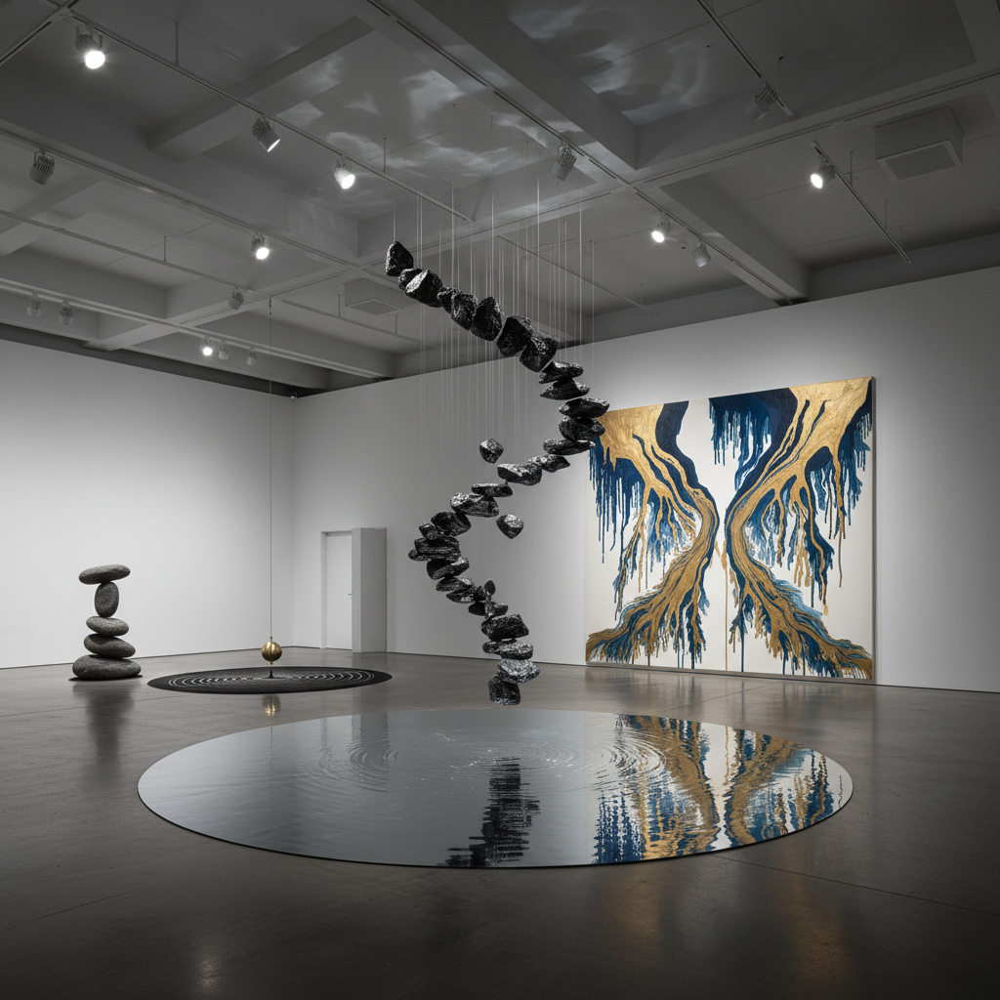

# Gravity Art 重力艺术

> "Gravity art works with the one force that touches everything — the invisible hand that holds us to the Earth, that pulls rivers downhill, that shapes the arc of every thrown ball and falling leaf. Gravity is so constant, so universal, so inescapable that we forget it exists until an artist reminds us — by defying it, by surrendering to it, by making it visible through the behavior of materials under its eternal pull." — Unknown

## 概述

重力艺术（Gravity Art）是以重力——万有引力——为核心创作力量的艺术实践。重力是宇宙中最基本的力之一，它决定了所有物体的运动轨迹、所有液体的流向、所有结构的稳定性。重力艺术通过各种方式让这个无处不在但通常被忽视的力量变得可见和可感。

重力艺术的实践包括：1）悬挂与平衡——探索重力平衡点的雕塑（悬臂、平衡石）；2）坠落艺术——利用自由落体创作（滴画、坠落物体）；3）反重力幻觉——创造视觉上违反重力的作品（悬浮、倒置）；4）重力绘画——让重力引导颜料流动（倾倒画、滴画）；5）重力塑形——让重力塑造柔软材料的形态（悬垂织物、熔化物）；6）失重艺术——在微重力环境中创作的艺术。

## 核心特征

| 特征 | 描述 |
|------|------|
| 坠落 | 自由落体 |
| 平衡 | 重力平衡 |
| 悬挂 | 悬挂与悬垂 |
| 流动 | 液体的流动 |
| 张力 | 结构张力 |
| 普遍 | 无处不在 |

## 视觉特征

- **垂直**：强烈的垂直方向感
- **悬垂**：材料的自然悬垂
- **平衡**：精妙的平衡状态
- **坠落**：坠落的轨迹
- **流淌**：液体的流淌
- **张力**：结构的张力线

## 代表作品

| 作品 | 艺术家 | 年代 | 意义 |
|------|--------|------|------|
| *Mobiles* | Alexander Calder | 1930年代 | 重力平衡雕塑 |
| *Drip paintings* | Jackson Pollock | 1940年代 | 重力绘画 |
| *Balancing rocks* | Bill Dan | 1990年代 | 平衡石艺术 |
| *Suspended installations* | Cornelia Parker | 1990年代 | 悬浮装置 |
| *Zero-gravity art* | Various | 2010年代 | 失重艺术实验 |

## 历史时间线

| 时期 | 事件 |
|------|------|
| 古代 | 平衡石、悬挂装饰 |
| 1930年代 | Calder的动态平衡 |
| 1940年代 | Pollock的重力绘画 |
| 1990年代 | 当代悬浮装置 |
| 2010年代 | 太空中的艺术实验 |

## 中国语境

重力艺术在中国有独特的文化和哲学背景。中国传统文化中对"轻重"的辩证思考——"举重若轻"和"举轻若重"——本质上是对重力的美学化理解。中国传统建筑中的飞檐——看似违反重力的上翘屋角——是一种建筑层面的"反重力"美学。中国书法中的"悬针"和"垂露"——笔画末端的处理——直接体现了重力对墨水的作用。中国杂技中的平衡术——叠椅子、顶碗——是最纯粹的重力艺术表演。中国当代的一些艺术家在探索重力艺术：用中国传统的"太湖石"创作平衡雕塑、将中国书法的"飞白"（墨水在重力作用下的自然断裂）作为创作方法、以及将中国传统建筑的"反重力"美学与当代装置结合。

## AI生成概念图

## 与其他风格的关系

- **Kinetic Art** → 动态艺术
- **Installation Art** → 装置艺术
- **Action Painting** → 行动绘画
- **Balance Art** → 平衡艺术
- **Physics Art** → 物理艺术
- **Wind Art** → 风艺术

---

*浮光艺志 | Chronicle of Artistry*
