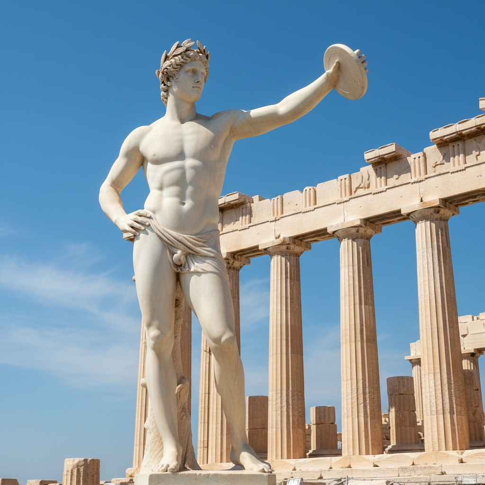

# 古希腊艺术 · Greek Art

> "人是万物的尺度。" —— 普罗泰戈拉

## 概述

古希腊艺术（Greek Art）是公元前8世纪至公元前1世纪在希腊半岛及地中海殖民地发展出的视觉艺术体系，是西方艺术传统的根基。古希腊艺术以对人体美的追求、理想化的自然主义和数学比例的和谐为核心，从几何时期的抽象纹样到古典时期的完美人体雕塑，再到希腊化时期的戏剧性表现，构成了西方艺术史上最具影响力的美学范式。

## 核心特征

| 特征 | 描述 |
|------|------|
| 时期 | 约前800年–前31年 |
| 地域 | 希腊半岛、小亚细亚、南意大利、西西里 |
| 媒介 | 大理石雕塑、青铜铸造、陶器彩绘、壁画、建筑 |
| 核心理念 | 以理想化的人体表达美、真理与神性 |
| 色彩 | 陶器的红黑对比；雕塑原本彩绘（多已褪色） |

## 视觉特征

- **理想化人体**：基于数学比例的完美人体表现
- **对立平衡（Contrapposto）**：重心偏移的自然站姿
- **建筑柱式**：多立克、爱奥尼、科林斯三种柱式体系
- **叙事性陶器**：红绘和黑绘技法的神话叙事
- **黄金比例**：建筑和雕塑中的数学和谐

## 代表作品

| 作品 | 艺术家/地点 | 年代 | 类型 |
|------|-------------|------|------|
| 帕特农神庙 | 伊克提诺斯/卡利克拉特斯 | 前447-432 | 建筑 |
| 《掷铁饼者》 | 米隆 | 约前450 | 青铜雕塑（罗马复制） |
| 《米洛的维纳斯》 | 佚名 | 约前130-100 | 大理石雕塑 |
| 《拉奥孔群像》 | 罗得岛雕塑家 | 约前40-20 | 大理石群雕 |
| 红绘陶瓶 | 多位陶画家 | 前530-前300 | 彩绘陶器 |

## 发展时间线

| 时期 | 事件 |
|------|------|
| 前900-700 | 几何时期，抽象几何纹样 |
| 前700-480 | 古风时期，库罗斯和科瑞雕像 |
| 前480-323 | 古典时期，帕特农神庙，理想化人体巅峰 |
| 前323-31 | 希腊化时期，戏剧性和情感表现增强 |
| 前146 | 罗马征服希腊，希腊艺术融入罗马文化 |

## 中国语境

古希腊艺术与中国先秦至汉代艺术大致同期。两者都追求理想化的表现——希腊追求人体的完美比例，中国追求"气韵生动"的精神表达。希腊雕塑通过丝绸之路影响了犍陀罗佛教艺术，进而间接影响了中国佛教造像。当代中国美术教育中，希腊雕塑的石膏像写生仍是基础训练的核心内容。

## AI 概念图

*AI 生成概念图：古希腊艺术风格*

## 关联词条

- [[egyptian-art]] - 古埃及艺术
- [[romanesque-art]] - 罗马式艺术
- [[byzantine-art]] - 拜占庭艺术

---

*浮光艺志 · Chronicle of Artistry*
