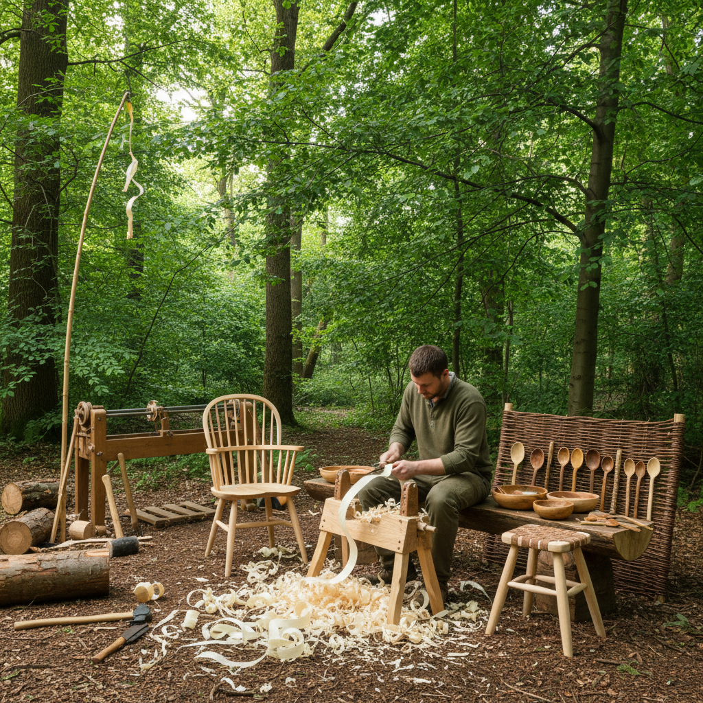

# Green Woodworking Art 绿木工艺术

> "Green woodworking is working with wood while it is still alive — fresh from the tree, full of moisture, supple and willing to be shaped. The green woodworker splits logs along the grain with wedges, shaves them on a shaving horse with a drawknife, and turns them on a pole lathe powered by nothing but a foot and a springy pole. There is no electricity, no sandpaper, no glue — just sharp tools, fresh wood, and the ancient understanding that timber is easiest to work when it has just stopped being a tree." — Unknown

## 概述

绿木工艺术（Green Woodworking Art）是使用新鲜未干燥的木材（"绿木"）进行手工加工的传统木工技艺——利用绿木含水量高、质地柔软、易于劈裂和切削的特性，使用简单的手工工具（斧头、刨刀、弯刀等）将原木加工成各种器具和家具。绿木工是最古老、最环保的木工方式。

绿木工艺术的实践包括：1）劈木——沿木纹劈裂原木；2）刨削——使用刨刀在削马上加工；3）车削——使用脚踏车床车削；4）弯曲——利用绿木的柔韧性弯曲成型；5）匙雕——从绿木中雕刻勺子；6）椅子制作——温莎椅等传统椅子的绿木制作；7）篱笆编织——用绿木条编织活篱笆。

## 核心特征

| 特征 | 描述 |
|------|------|
| 新鲜 | 使用新鲜未干木材 |
| 手工 | 纯手工工具加工 |
| 劈裂 | 沿纹理劈裂而非锯切 |
| 环保 | 最环保的木工方式 |
| 古老 | 最古老的木工传统 |
| 简单 | 工具和设备简单 |

## 视觉特征

- **纹理**：沿纹理劈裂的自然表面
- **刀痕**：刨刀留下的光滑切面
- **有机**：自然有机的形态
- **质朴**：质朴原始的美感
- **轻盈**：绿木制品的轻盈
- **活力**：新鲜木材的生命力

## 代表作品

| 作品 | 艺术家/文化 | 年代 | 意义 |
|------|-------------|------|------|
| *Windsor chairs* | 英国传统 | 18世纪至今 | 绿木温莎椅 |
| *Pole lathe turning* | 欧洲传统 | 中世纪至今 | 脚踏车床车削 |
| *Shaker furniture* | 震教徒 | 18-19世纪 | 震教徒家具 |
| *Bodger's craft* | 英国 | 中世纪至今 | 林中车工 |
| *Contemporary green woodworking* | 当代 | 当代 | 当代绿木工 |

## 历史时间线

| 时期 | 事件 |
|------|------|
| 史前 | 人类最早的木工活动 |
| 中世纪 | 欧洲绿木工传统的发展 |
| 18-19世纪 | 温莎椅和震教徒家具 |
| 工业革命 | 机械化对绿木工的冲击 |
| 当代 | 绿木工作为手工艺运动的复兴 |

## 中国语境

绿木工艺术在中国有悠久但尚未被充分认识的传统。中国传统的木工中有大量使用新鲜木材的实践——如农村的木桶、木盆、扁担等日用品的制作。中国少数民族地区保留着丰富的绿木工传统——如藏族的木碗制作、苗族的木鼓制作等。中国传统的"圆木作"（制作桶、盆等圆形器具）本质上就是绿木工——利用新鲜木材的柔韧性弯曲成型。中国当代的手工艺复兴运动中，绿木工（green woodworking）概念正在被引入——一些工作室开始教授劈木、刨削和匙雕等绿木工技法。中国的一些户外教育和自然教育项目将绿木工作为课程内容——让参与者体验最原始的木工方式。

## AI生成概念图

## 与其他风格的关系

- **Spoon Carving** → 匙雕艺术
- **Woodturning** → 车木艺术
- **Coopering** → 箍桶艺术
- **Chair Making** → 椅子制作
- **Whittling** → 削木艺术
- **Folk Art** → 民间艺术

---

*浮光艺志 | Chronicle of Artistry*
