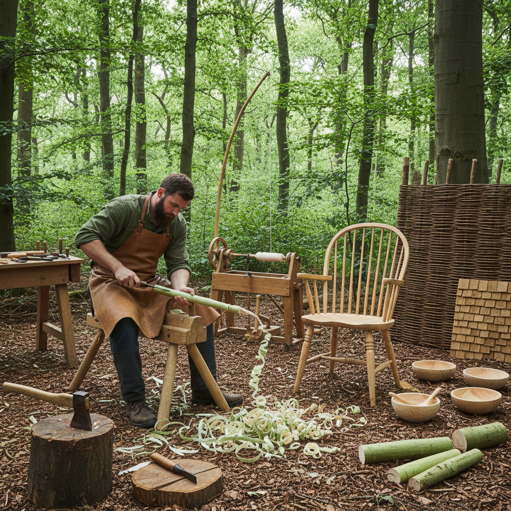

# Green Woodworking 绿木工

> "Green woodworking is the oldest dialogue between hand and tree — working wood while it is still alive with moisture, splitting along the grain rather than sawing against it, following the fiber where it wants to go." — Unknown

## 概述

绿木工（Green Woodworking）是使用新鲜的、未干燥的木材（"绿木"，green wood）进行手工制作的木工传统。与现代木工使用干燥木材和电动工具不同，绿木工使用刚砍伐的木材——含水量高的木材更柔软、更容易用手工工具加工。绿木工的核心工具包括：斧头（劈裂和粗加工）、削马（shaving horse，夹持工件的工作台）、刮刀（drawknife，双手拉削）、弯刀（hook knife）和各种手工刀具。

绿木工的哲学在于：顺应木材的天性——沿着纤维方向劈裂而非锯切，利用木材的自然弹性和可塑性。这种方法产生的制品比锯切的更坚固，因为纤维没有被切断。绿木工的产品包括：椅子（Windsor chair等）、篮子、栅栏、勺子、碗和各种日用器具。

## 核心特征

| 特征 | 描述 |
|------|------|
| 绿木 | 使用新鲜未干木材 |
| 手工 | 纯手工工具 |
| 劈裂 | 沿纤维劈裂 |
| 顺应 | 顺应木材天性 |
| 简单 | 工具简单原始 |
| 可持续 | 可持续的方式 |

## 视觉特征

- **纤维**：可见的木材纤维
- **有机**：有机的形态
- **刀痕**：手工刀痕的质感
- **自然**：自然的木色
- **简洁**：简洁的形式
- **功能**：功能性的美

## 代表作品

| 作品 | 艺术家 | 年代 | 意义 |
|------|--------|------|------|
| *Windsor chairs* | 匿名 | 18世纪+ | 绿木工椅子 |
| *Shaker furniture* | Shaker社区 | 19世纪 | 简约功能家具 |
| *Bodger's chairs* | 匿名 | 传统 | 英国林中椅匠 |
| *Contemporary green woodwork* | Various | 当代 | 当代绿木工 |
| *Carved bowls and spoons* | Various | 当代 | 绿木器物 |

## 历史时间线

| 时期 | 事件 |
|------|------|
| 史前 | 人类最早的木工方式 |
| 中世纪 | 欧洲林中工匠的传统 |
| 18-19世纪 | Windsor椅的黄金时代 |
| 工业革命 | 绿木工的衰落 |
| 1980s+ | 绿木工运动的复兴 |
| 当代 | 全球绿木工社区的繁荣 |

## 中国语境

绿木工在中国有着悠久的传统——中国古代的木工在很多情况下也是使用新鲜木材的。中国传统的竹编、木桶制作等都属于广义的绿木工范畴。当代中国的手工木作爱好者群体中，绿木工（特别是勺雕和碗雕）越来越流行。一些中国的手工工作坊提供绿木工体验课程——使用斧头劈木、削马刮削等传统技法。中国的一些乡村地区仍保留着传统的绿木工技艺，如制作木桶、木勺等日用器具。

## AI生成概念图

## 与其他风格的关系

- **Spoon Carving** → 勺雕
- **Wood Carving** → 木雕
- **Chip Carving** → 刻花木雕
- **Coopering** → 箍桶
- **Basket Weaving** → 编篮
- **Woodturning** → 车木

---

*浮光艺志 | Chronicle of Artistry*
