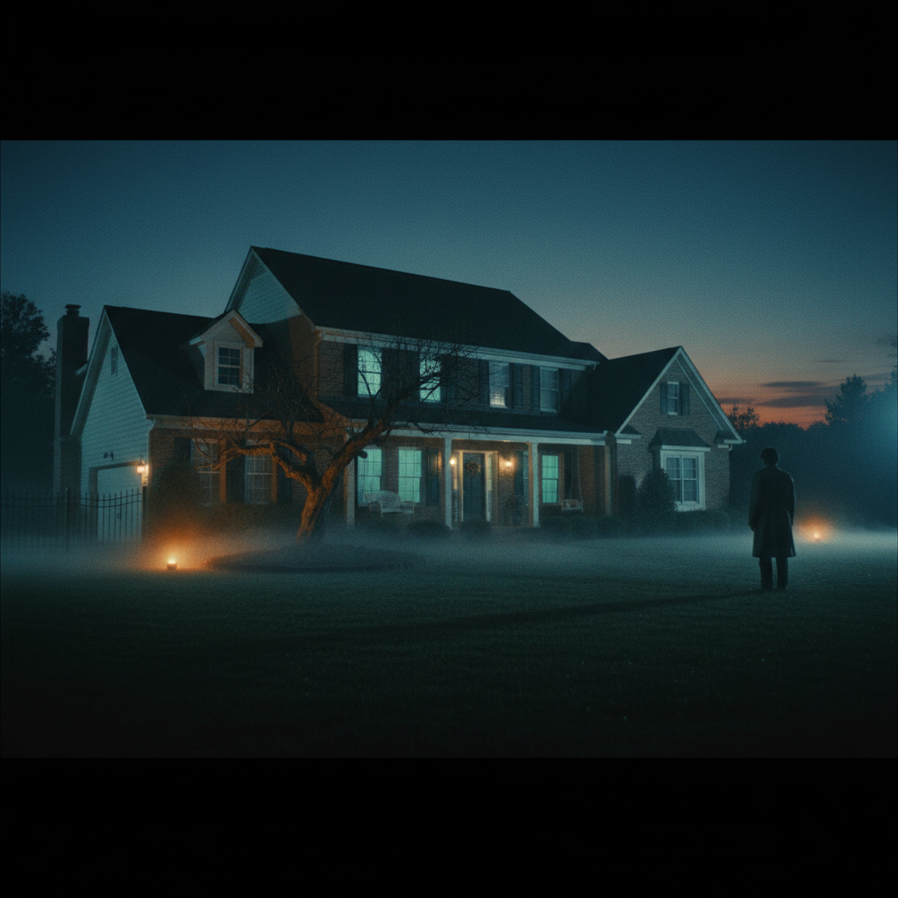

# Gregory Crewdson 格雷戈里·克鲁德森

> **时期：** 1962–至今  
> **关键词：** 电影式摄影、郊区梦魇、人工布光、心理景观

## 概述

Gregory Crewdson 是美国摄影师，以好莱坞级别的制作规模拍摄美国郊区的超现实场景。每张照片都动用数十人的剧组、专业灯光设备和封街许可，将平凡的郊区住宅转化为充满心理张力的电影剧照——孤独的人物、诡异的光线、悬而未决的叙事。

## 风格特征

- **电影制作规模**：每张照片如同一部电影的单帧
- **人工暮光**：黄昏时分的混合光线，自然光与人工光交织
- **郊区场景**：美国小镇的房屋、街道、后院
- **心理悬疑**：画面暗示某个事件刚发生或即将发生
- **孤独人物**：人物陷入沉思或凝视远方，与环境疏离

## 代表作品

- *Beneath the Roses*（2003–2008）
- *Twilight*系列（1998–2002）
- *Cathedral of the Pines*（2013–2014）
- *An Eclipse of Moths*（2018–2019）

## 概念图

