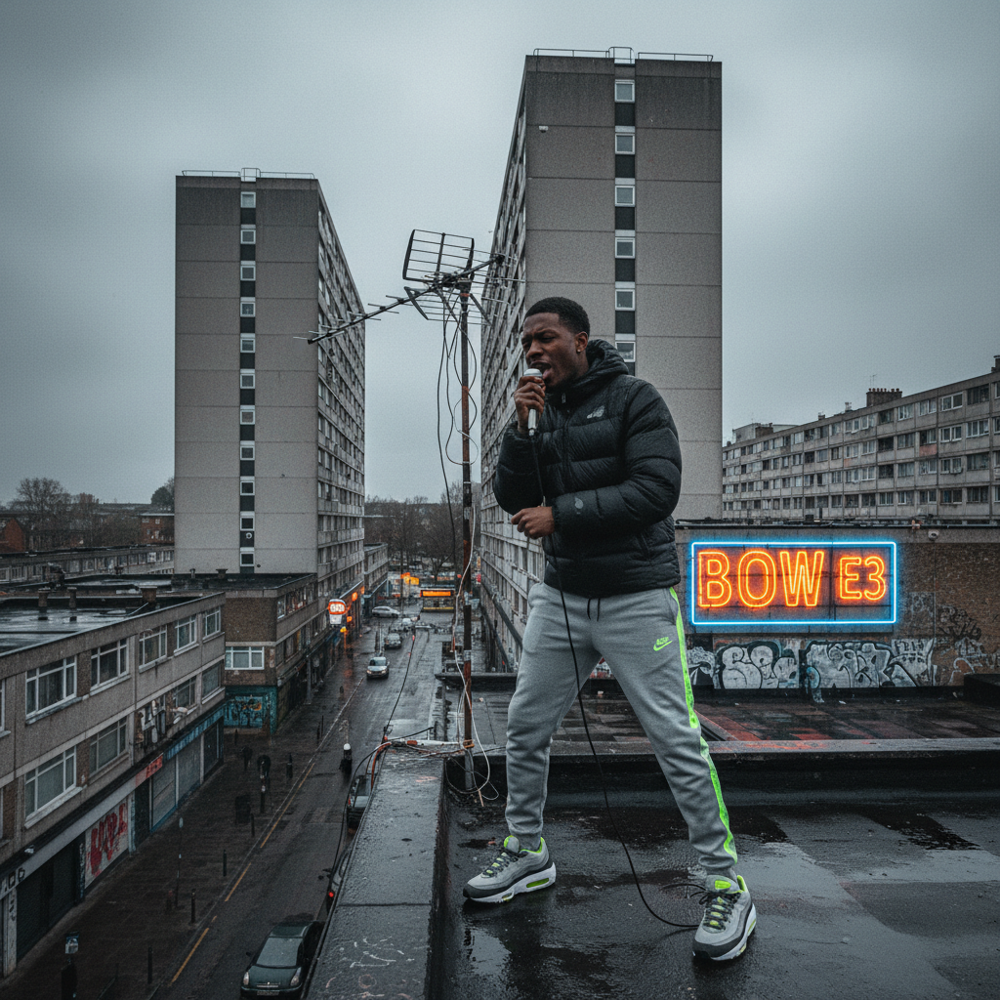

# Grime 英国街头电子



> **"140BPM、MC对战、盗版电台——伦敦东区的愤怒之声。"**

## 概述

| 维度 | 描述 |
|------|------|
| 时期 | 2002–至今 |
| 别名 | Grime, Eskibeat, Sublow |
| 核心色彩 | 黑色、灰色、深蓝、荧光色点缀 |
| 关键元素 | 140BPM、MC/Spitting、盗版电台、Bow E3 |
| 代表人物 | Wiley, Dizzee Rascal, Skepta, Stormzy |
| 关联风格 | UK Garage, Jungle/DnB, Hip-Hop, Dubstep |

---

## 历史脉络

| 年份 | 事件 |
|------|------|
| 2002 | Wiley "Eskimo"——Grime 的诞生 |
| 2003 | Dizzee Rascal "Boy in da Corner"——Mercury Prize |
| 2004 | Rinse FM、Déjà Vu FM——盗版电台全盛期 |
| 2005 | Lord of the Mics——MC 对战文化 |
| 2015 | Skepta "Shutdown"——Grime 复兴 |
| 2017 | Stormzy "Gang Signs & Prayer"——#1专辑 |

### 核心哲学

Grime 的精神是**"这是我们的声音——不需要美国的许可"**：
- 本土 = 骄傲（"我们不是英国 Hip-Hop——我们是 Grime"）
- MC = 核心（"词是武器"）
- 140BPM = 身份（"不快不慢——刚好够狠"）
- 东伦敦 = 根源（"Bow E3 是圣地"）
- "如果你不能在 set 上 spit——你不是 Grime MC"

---

## 视觉语法

### 色彩系统

```
主色：
  黑色 (#000000) — 基底、夜晚
  灰色 (#555555) — 混凝土、城市
  深蓝 (#191970) — 夜空、冷

辅色：
  荧光色 — 点缀（不是主导）
  白色 (#FFFFFF) — Nike、对比
  红色 (#FF0000) — 能量

规则：
  - 暗色调为主
  - 城市/混凝土质感
  - 不华丽——真实
  - 运动服美学

质感：
  混凝土 — 城市、街道
  尼龙 — 运动服
  金属 — 栅栏、建筑
  雾 — 伦敦天气
```

### 标志性元素

| 类别 | 元素 |
|------|------|
| 服装 | Nike Air Max、运动服、帽衫、面罩 |
| 场所 | 东伦敦街头、高层公寓、盗版电台天台 |
| 音乐 | 140BPM、方波贝斯、MC spitting |
| 媒介 | 盗版电台、YouTube、SBTV、GRM Daily |
| 文化 | MC 对战(Clash)、Set、Reload |
| 态度 | 真实、街头、本土、愤怒、骄傲 |

---

## 与千禧怀旧的关系

### 2000s 英国青年文化的声音
- Grime = 2000s 伦敦工人阶级青年的声音
- "Boy in da Corner" = 2003年最重要的英国专辑
- 盗版电台 = 互联网之前的"社交媒体"
- "Grime 是英国对 Hip-Hop 的回答——但完全不同"

### 从地下到主流
- 2002-2014: 地下时期
- 2015-至今: 主流突破（Skepta, Stormzy）
- "Grime 花了15年才被主流接受——但从未妥协"

---

## 中国语境

- 与中国说唱文化的交叉
- 140BPM 在中国电子音乐中的影响
- 中国"地下说唱"与 Grime 的精神共鸣
- 作为"英国街头文化"的研究对象

---

## 设计应用

| 场景 | 应用方式 |
|------|----------|
| 音乐 | MC+140BPM+海报+视频+街头 |
| 品牌 | 真实+街头+本土+年轻+能量 |
| 时尚 | 运动服+Nike+帽衫+面罩+街头 |
| 数字 | 暗色+城市+混凝土+真实+能量 |

---

## 相关风格

← [UK Garage 英国车库](uk-garage.md) | [Hip-Hop Aesthetic 嘻哈美学](hip-hop-aesthetic.md) →

↑ [返回千禧怀旧目录](README.md) | [返回总目录](../README.md)
