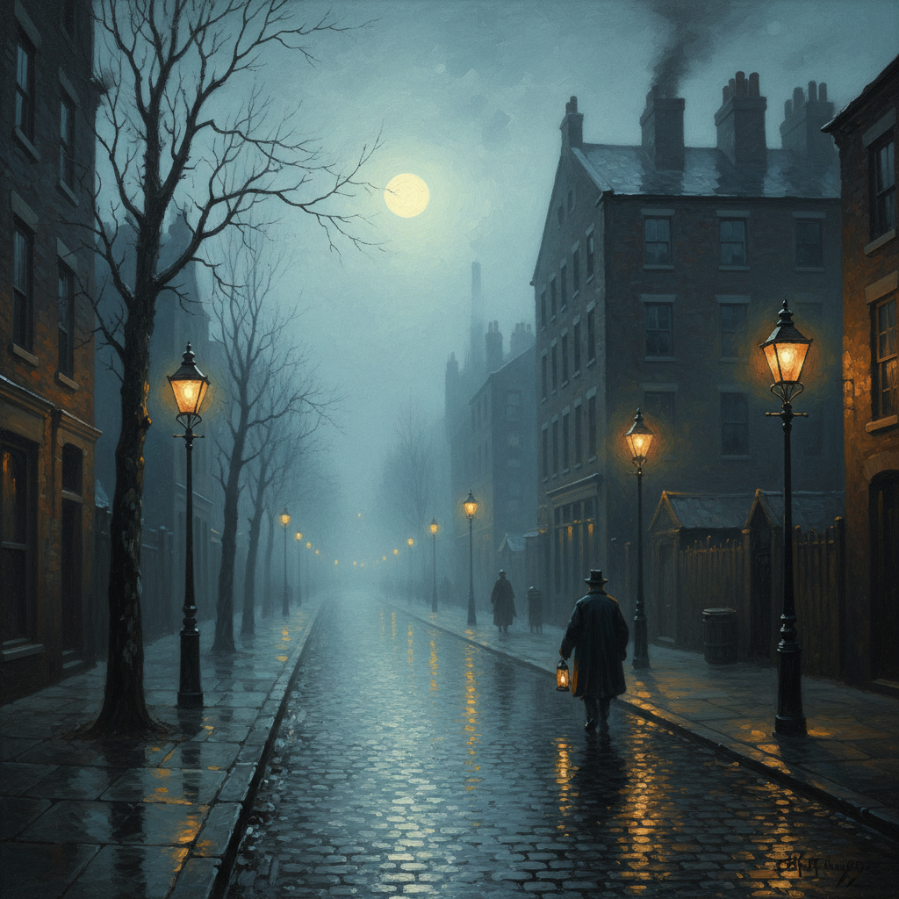

# John Atkinson Grimshaw 格里姆肖 | Victorian Nocturne

> **"没有人比格里姆肖更懂描绘月光——维多利亚时代的夜曲大师，用油画把雨后的煤气灯街道变成银色的诗。"**

## 概述

约翰·阿特金森·格里姆肖（John Atkinson Grimshaw，1836-1893）是英国维多利亚时代最独特的风景画家之一，被誉为"月光画家"。他以描绘月夜城市街景、港口和郊野风光著称——雨后湿漉漉的街道反射着煤气灯的暖黄色光芒，月光穿透薄雾洒在屋顶和树梢，孤独的行人走在空旷的小路上。格里姆肖并非学院派出身，早年是铁路公司职员，24岁才全身心投入绘画，自学成才。他的好友惠斯勒（Whistler）曾说："我一直认为自己是夜曲的发明者，直到我看到了格里米的月光画作。"

## 核心特征

- **月光场景**：几乎所有作品都描绘月夜或黄昏
- **湿润街道**：雨后路面反射光线的镜面效果
- **冷暖对比**：月光的冷绿色 vs 煤气灯的暖黄色
- **空气透视**：薄雾中远近层次的渐变
- **孤独人物**：空旷街道上的单独行人
- **工业城市诗意化**：将维多利亚时代的工业城市变成诗

## 代表性题材

| 题材 | 特征 |
|------|------|
| 月夜街道 | 利兹、伦敦的煤气灯街景 |
| 港口夜景 | 惠特比、格拉斯哥的码头 |
| 郊野月色 | 树影婆娑的乡间小路 |
| 秋日黄昏 | 落叶铺满的小径 |
| 文学场景 | 夏洛特夫人等文学题材 |

## 技法特点

| 技法 | 说明 |
|------|------|
| 消失透视 | 街道延伸至远方的纵深感 |
| 互补色方案 | 冷月光与暖灯光的对比 |
| 白色底层 | 白色打底增强透光感 |
| 透明褐色罩染 | 营造温暖的氛围层次 |
| 湿面反射 | 雨后路面的镜面效果 |
| 树枝剪影 | 精细的裸树枝轮廓 |

## 视觉特征

- 银蓝色月光笼罩的城市
- 雨后街道的镜面反射
- 煤气灯的温暖光晕
- 裸树枝的精细剪影
- 薄雾中的空气透视
- 孤独行人的渺小身影
- 维多利亚时代建筑的轮廓
- 诗意的忧郁和怀旧感

## 历史地位

格里姆肖是维多利亚时代唯美主义画派的代表人物，受前拉斐尔派影响但发展出独特的夜景风格。他的作品在当时主要面向私人收藏家，一生仅在皇家艺术学院展出5幅作品。20世纪后被重新发现，如今被视为英国浪漫主义风景画的重要一环，其月光技法的研究至今仍是油画教学的重要参考。

## 与其他风格的关系

| 风格 | 关系 |
|------|------|
| Pre-Raphaelite前拉斐尔派 | 早期受其影响，注重细节 |
| Whistler惠斯勒 | 共享"夜曲"主题，互相欣赏 |
| Tonalism色调主义 | 共享氛围和色调美学 |
| Impressionism印象派 | 共享光影研究，但更写实 |
| 当代概念艺术/游戏 | Grimshaw风格影响暗黑维多利亚美学 |
| Liminal Space | 共享空旷、孤独的氛围 |

## 概念图

---

*浮光艺志 | Chronicle of Artistry*
