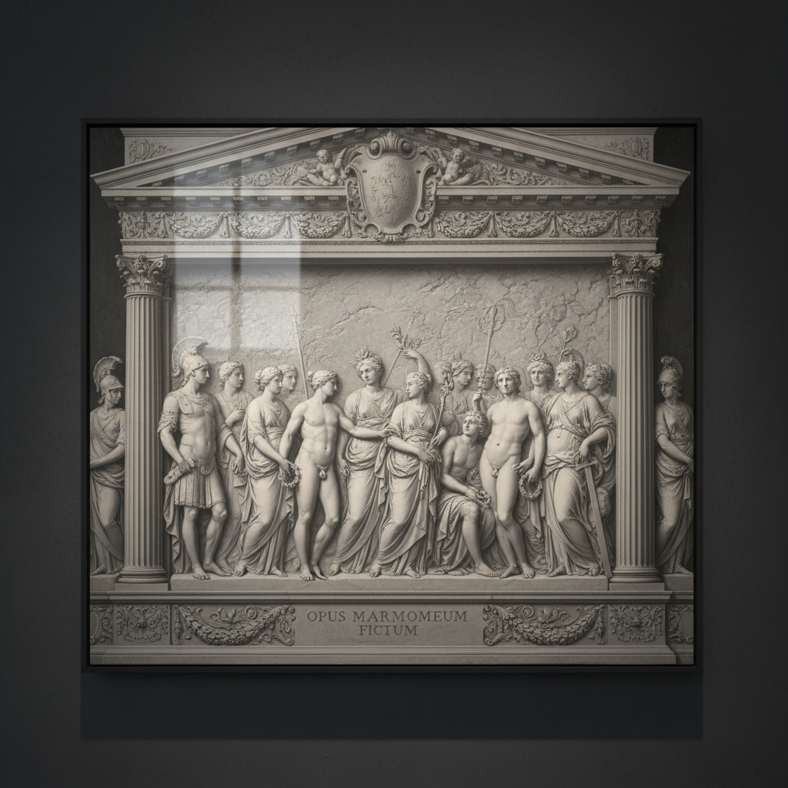

# Grisaille Art 灰色画艺术

> "Grisaille is painting stripped to its essence — by working entirely in shades of gray, the artist eliminates color as a variable and focuses purely on form, light, and shadow. The result is painting that looks like sculpture, images that seem carved from stone rather than brushed onto canvas. Grisaille reveals the skeleton beneath the skin of painting, showing that before color there is always structure, before hue there is always value." — Unknown

## 概述

灰色画艺术（Grisaille Art）是一种完全使用灰色调（从白到黑的各种灰度）进行绘画的技法——通过消除色彩，专注于形体、光影和明暗关系的表现。Grisaille（法语"灰色"的意思）既是一种独立的绘画形式，也是油画底层绘制的传统技法，在中世纪彩色玻璃窗设计、文艺复兴绘画底稿和装饰艺术中广泛应用。

灰色画艺术的实践包括：1）独立灰色画——作为完成作品的灰色画；2）底层灰色画——作为彩色画底层的灰色画；3）仿雕塑效果——模拟石雕或浮雕的灰色画；4）彩色玻璃设计——用灰色画设计彩色玻璃窗；5）装饰壁画——建筑装饰中的灰色画；6）en camaïeu——使用单一色调的变体；7）当代灰色画——将传统技法与现代设计结合的创作。

## 核心特征

| 特征 | 描述 |
|------|------|
| 单色 | 完全的灰色调 |
| 形体 | 专注于形体表现 |
| 光影 | 纯粹的光影关系 |
| 雕塑 | 模拟雕塑的效果 |
| 基础 | 绘画的基础技法 |
| 克制 | 极度克制的表达 |

## 视觉特征

- **灰色**：从白到黑的灰色调
- **雕塑**：石雕般的立体感
- **光影**：纯粹的光影表现
- **形体**：清晰的形体结构
- **克制**：极度克制的美感
- **庄严**：庄严肃穆的氛围

## 代表作品

| 作品 | 艺术家/文化 | 年代 | 意义 |
|------|-------------|------|------|
| *Ghent Altarpiece exterior* | Van Eyck | 1432年 | 根特祭坛画外侧 |
| *Sistine Chapel lunettes* | Michelangelo | 1508-12年 | 西斯廷天顶仿雕塑 |
| *Dead Christ* | Mantegna | 1480年 | 曼特尼亚灰色画 |
| *Gerhard Richter grays* | Richter | 当代 | 里希特灰色系列 |
| *Contemporary grisaille* | 当代 | 当代 | 当代灰色画 |

## 历史时间线

| 时期 | 事件 |
|------|------|
| 中世纪 | 灰色画在手抄本和祭坛画中的应用 |
| 文艺复兴 | 灰色画作为底层技法的发展 |
| 巴洛克 | 装饰性灰色画的流行 |
| 19世纪 | 学院派灰色画训练 |
| 当代 | 灰色画的概念化和创新 |

## 中国语境

灰色画艺术在中国有独特的文化共鸣。中国传统水墨画本质上是一种"灰色画"——完全使用墨的浓淡变化来表现世界。中国水墨画的"墨分五色"理论与灰色画的明暗层次有深刻的对应——都通过单色的变化来表现丰富的视觉世界。中国的素描教育中，灰色调的明暗训练是基础课程——与西方灰色画的教学传统相通。中国当代的一些艺术家将灰色画的西方传统与中国水墨美学结合——创造具有东方韵味的灰色调作品。中国的建筑装饰中，灰色调的壁画和装饰正在获得关注——以其克制和优雅的美感受到欢迎。中国的摄影和影像艺术中，黑白（灰色调）作品有重要的地位——与灰色画的美学追求相通。

## AI生成概念图

## 与其他风格的关系

- **Chiaroscuro** → 明暗法
- **Ink Wash** → 水墨画
- **Trompe-l'œil** → 错视画
- **Monochrome** → 单色画
- **Academic Art** → 学院派
- **Sculpture** → 雕塑

---

*浮光艺志 | Chronicle of Artistry*
