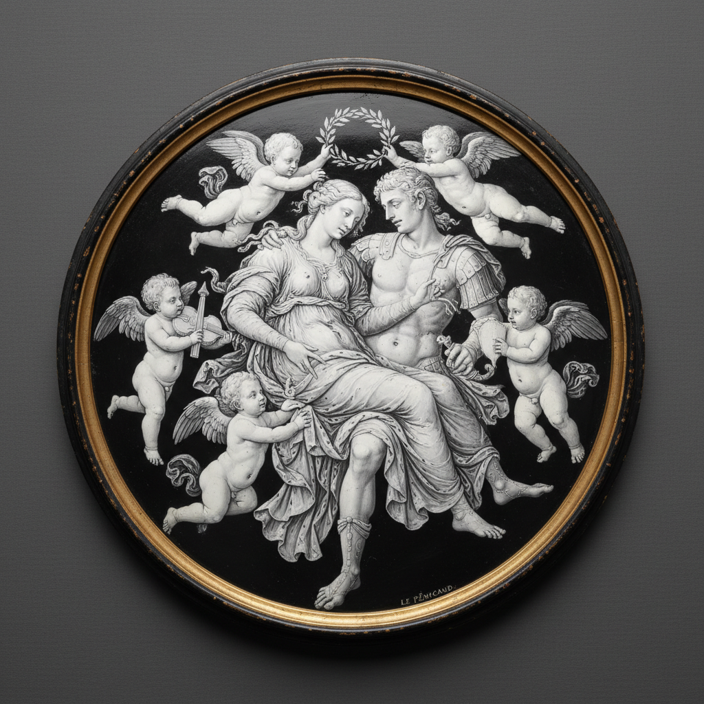

# Grisaille Enamel Art 灰色珐琅艺术

> "Grisaille enamel is painting in light itself — white enamel is applied in varying thicknesses over a dark ground, so that where the layer is thin the dark base shows through as shadow, and where it is thick the white glows with luminous intensity, creating images that possess the sculptural depth of a cameo and the tonal subtlety of a photograph, all rendered in monochrome fire." — Unknown

## 概述

灰色珐琅艺术（Grisaille Enamel Art）是一种在深色（通常为黑色或深蓝色）珐琅底色上用白色珐琅绘制图案的精美技法——通过控制白色珐琅层的厚度来创造从深到浅的灰度变化，产生类似浮雕或照片的立体效果。这种技法以其精湛的明暗控制和雕塑般的质感著称。

灰色珐琅艺术的实践包括：1）底色制作——施加深色珐琅底色并烧制；2）白色珐琅绘制——用白色珐琅在深色底上绘制；3）厚度控制——通过白色珐琅的厚度控制明暗；4）多次烧制——反复烧制以建立层次；5）细节刻画——用针或刮刀刻画细节；6）利摩日传统——法国利摩日的灰色珐琅传统；7）当代灰色珐琅——将传统技法与现代创作结合。

## 核心特征

| 特征 | 描述 |
|------|------|
| 单色 | 黑白灰的单色效果 |
| 厚度 | 通过厚度控制明暗 |
| 浮雕 | 类似浮雕的立体感 |
| 精细 | 极其精细的绘制 |
| 利摩日 | 法国利摩日的传统 |
| 高雅 | 高雅的艺术效果 |

## 视觉特征

- **单色**：黑白灰的色调范围
- **立体**：浮雕般的立体效果
- **光泽**：珐琅的玻璃光泽
- **精细**：极其精细的细节
- **深邃**：深色底色的深邃感
- **典雅**：典雅的整体气质

## 代表作品

| 作品 | 艺术家/文化 | 年代 | 意义 |
|------|-------------|------|------|
| *Limoges grisaille plaques* | 法国 | 16世纪 | 利摩日灰色珐琅板 |
| *Jean de Court works* | 法国 | 16世纪 | 让·德·库尔作品 |
| *Pierre Reymond pieces* | 法国 | 16世纪 | 皮埃尔·雷蒙作品 |
| *Léonard Limousin portraits* | 法国 | 16世纪 | 莱昂纳尔·利穆赞肖像 |
| *Contemporary grisaille enamel* | 国际 | 当代 | 当代灰色珐琅 |

## 历史时间线

| 时期 | 事件 |
|------|------|
| 15世纪末 | 灰色珐琅在利摩日出现 |
| 16世纪 | 利摩日灰色珐琅的黄金时代 |
| 17-18世纪 | 技法的延续和变化 |
| 19世纪 | 灰色珐琅的复兴 |
| 当代 | 高级钟表和珠宝中的应用 |

## 中国语境

灰色珐琅与中国的水墨画有一定的审美共鸣。中国的水墨画——同样通过墨色的浓淡变化创造丰富的层次，与灰色珐琅的明暗控制有相似的美学追求。中国的白描——以线条的粗细和墨色的深浅表现形象，与灰色珐琅的单色表现有对应关系。中国当代的珐琅艺术家——有一些尝试将灰色珐琅技法与中国传统题材结合。中国的高级钟表收藏界——对使用灰色珐琅表盘的钟表有深入的了解和欣赏。中国的工艺美术教育中，灰色珐琅作为珐琅绘画的重要技法——在相关课程中介绍。

## AI生成概念图

## 与其他风格的关系

- **Cloisonné** → 景泰蓝
- **Basse-taille** → 浅浮雕珐琅
- **Grisaille Painting** → 灰色画法
- **Cameo** → 浮雕宝石
- **Limoges Enamel** → 利摩日珐琅
- **Monochrome Art** → 单色艺术

---

*浮光艺志 | Chronicle of Artistry*
