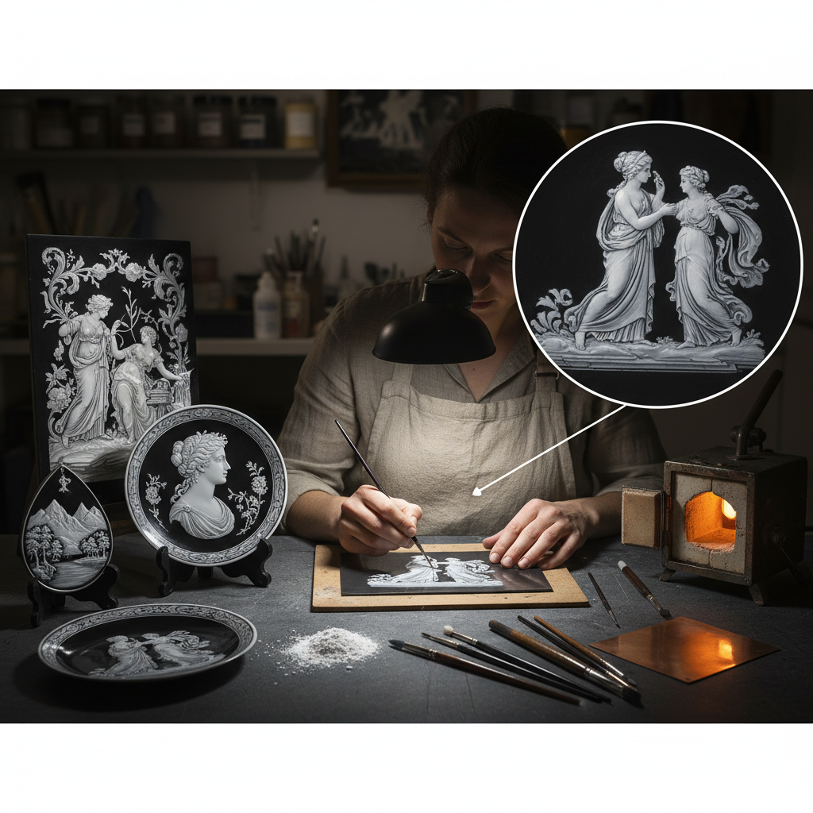

# Grisaille Enamel 灰色珐琅画

> "Grisaille enamel is painting with light and shadow alone — white enamel built up in translucent layers over a dark ground creates the illusion of sculptural relief, as if marble figures were emerging from obsidian." — Unknown

## 概述

灰色珐琅画（Grisaille Enamel）是一种珐琅绘画技法——在深色（通常是黑色或深蓝色）的珐琅底层上，使用白色珐琅（有时加少量色彩）逐层描绘图案。白色珐琅的厚薄不同产生不同的明暗效果——厚处更白更亮，薄处透出底层的深色——从而创造出类似浮雕或素描的单色画效果。

Grisaille（法语意为"灰色"）这个名称来源于其单色的视觉效果——虽然使用的是白色珐琅，但整体呈现灰色调的明暗变化。这种技法在16世纪的法国利摩日（Limoges）达到巅峰——利摩日的珐琅画师创作了大量精美的Grisaille珐琅作品，主要是宗教题材和古典神话场景。

## 核心特征

| 特征 | 描述 |
|------|------|
| 单色 | 单色的明暗效果 |
| 白色 | 白色珐琅在深色底上 |
| 层次 | 通过厚薄创造层次 |
| 浮雕感 | 类似浮雕的效果 |
| 利摩日 | 利摩日的代表技法 |
| 精细 | 极其精细的描绘 |

## 视觉特征

- **单色**：灰色调的单色效果
- **明暗**：丰富的明暗变化
- **浮雕**：类似浮雕的立体感
- **精细**：极精细的人物描绘
- **对比**：黑白的强烈对比
- **优雅**：优雅庄重的美感

## 代表作品

| 作品 | 艺术家 | 年代 | 意义 |
|------|--------|------|------|
| *Léonard Limousin works* | Léonard Limousin | 16世纪 | 利摩日大师 |
| *Pierre Reymond plaques* | Pierre Reymond | 16世纪 | 雷蒙德珐琅板 |
| *Jean Pénicaud works* | Jean Pénicaud | 16世纪 | 佩尼科珐琅 |
| *Limoges grisaille caskets* | Various | 16世纪 | 利摩日珐琅匣 |
| *Contemporary grisaille* | Various | 当代 | 当代灰色珐琅画 |

## 历史时间线

| 时期 | 事件 |
|------|------|
| 15世纪末 | Grisaille珐琅在利摩日的出现 |
| 16世纪 | 利摩日Grisaille的鼎盛 |
| 17世纪 | 技法的衰落 |
| 19世纪 | 维多利亚时代的复兴 |
| 20世纪 | 博物馆收藏和学术研究 |
| 当代 | 少数珐琅艺术家的传承 |

## 中国语境

灰色珐琅画在中国的珐琅工艺体系中较为少见——中国传统珐琅以色彩丰富的掐丝珐琅和画珐琅为主。但中国的一些珐琅艺术家和珠宝设计师对Grisaille技法有所了解和实践。中国的博物馆中收藏有一些利摩日Grisaille珐琅作品。中国的珐琅工艺教育中，Grisaille作为高级珐琅技法被介绍。一些中国的当代珐琅艺术家尝试将Grisaille与中国传统水墨画的审美结合。

## AI生成概念图

## 与其他风格的关系

- **Limoges Enamel** → 利摩日珐琅
- **Painted Enamel** → 画珐琅
- **Champlevé** → 凹雕填珐琅
- **Grisaille Painting** → 灰色画法
- **Enameling** → 珐琅工艺
- **Monochrome Art** → 单色艺术

---

*浮光艺志 | Chronicle of Artistry*
