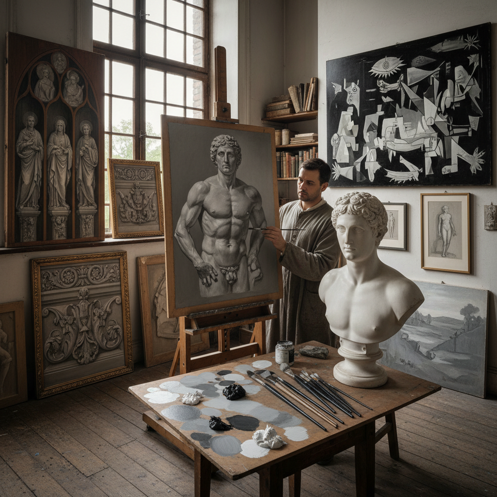

# Grisaille Painting 灰色画法

> "Grisaille is painting stripped to its bones — working entirely in shades of grey to master the architecture of light and shadow before color ever enters the conversation, proving that a painting's power lies not in its hues but in its values, each grey tone a precise measurement of how much light falls on a surface, creating images that feel like sculptures frozen in monochrome." — Unknown

## 概述

灰色画法（Grisaille），来自法语"gris"（灰色），是一种完全使用灰色调（从白到黑的各种灰度）进行绘画的技法。Grisaille有两种主要用途：作为独立的完成作品（模拟石雕或浮雕的效果），或作为彩色绘画的底色层（underpainting），在灰色底层上叠加透明的彩色罩染层（glazes）来建立色彩。

Grisaille在中世纪和文艺复兴时期广泛使用——教堂的彩色玻璃窗设计稿、祭坛画的外侧面板、以及模拟雕塑效果的装饰画都使用grisaille。作为底色技法，grisaille允许画家先解决明暗关系（values），然后再单独处理色彩——将复杂的绘画问题分解为两个独立的步骤。当代古典写实画家仍然广泛使用grisaille底色技法。

## 核心特征

| 特征 | 描述 |
|------|------|
| 灰色调 | 仅使用灰色调 |
| 明暗 | 专注于明暗关系 |
| 底色 | 常作为底色层 |
| 雕塑感 | 模拟雕塑效果 |
| 分步 | 分步解决绘画问题 |
| 古典 | 古典绘画技法 |

## 视觉特征

- **单色**：灰色的单色效果
- **雕塑感**：石雕般的立体感
- **明暗**：精确的明暗层次
- **古典**：古典的庄重感
- **简洁**：色彩的简洁
- **深度**：明暗创造的深度

## 代表作品

| 作品 | 艺术家 | 年代 | 意义 |
|------|--------|------|------|
| *Ghent Altarpiece exterior* | Jan van Eyck | 1432 | 根特祭坛画外侧 |
| *Grisaille panels* | Andrea Mantegna | 15世纪 | 曼特尼亚灰色画 |
| *Allegory of Faith* | Johannes Vermeer | 约1670 | 维米尔灰色画 |
| *Guernica* | Pablo Picasso | 1937 | 毕加索格尔尼卡 |
| *Contemporary grisaille* | Various | 当代 | 当代灰色画法 |

## 历史时间线

| 时期 | 事件 |
|------|------|
| 中世纪 | 灰色画法在教堂装饰中的应用 |
| 文艺复兴 | 灰色画法作为底色技法 |
| 巴洛克 | 灰色画法的装饰应用 |
| 19世纪 | 学院派的灰色底色训练 |
| 当代 | 灰色画法的复兴 |

## 中国语境

灰色画法在中国的西方绘画教育中有重要地位——中国的美术院校在素描和油画基础训练中强调明暗关系的掌握，这与grisaille的理念一致。中国的一些写实油画家使用grisaille底色技法。中国传统水墨画本身就是一种"灰色画法"——仅用墨的浓淡来表现一切。中国画论中的"墨分五色"（焦、浓、重、淡、清）与grisaille的灰度层次有相通之处。

## AI生成概念图

## 与其他风格的关系

- **Underpainting** → 底色画
- **Monochrome** → 单色画
- **Trompe l'oeil** → 错视画
- **Glazing** → 罩染
- **Value Study** → 明暗研究
- **Ink Wash** → 水墨

---

*浮光艺志 | Chronicle of Artistry*
