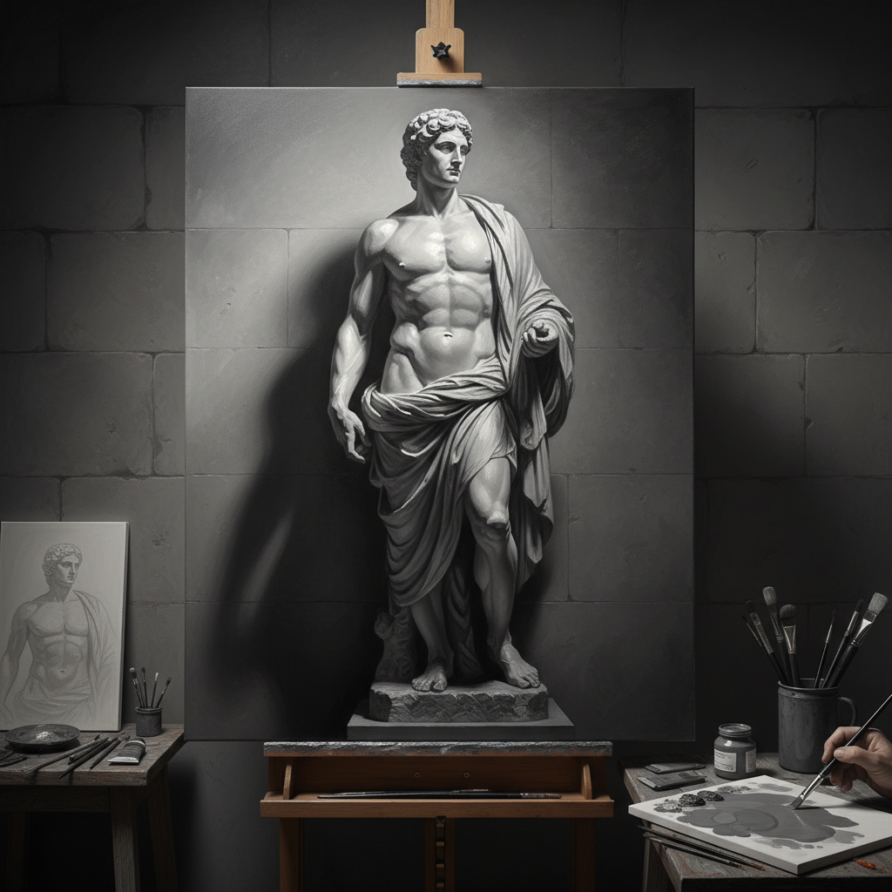

# Grisaille 灰色画法

> "Value does all the work; color gets all the credit." — 画家谚语

## 概述

灰色画法（Grisaille，法语"灰色"之意）是一种完全使用灰色调（黑白及其中间灰）来完成绘画的技法，也指彩色绘画中作为底层的灰色明暗稿。在中世纪和文艺复兴时期，Grisaille 既是独立的艺术形式（模仿石雕浮雕的效果），也是多层油画技法中建立明暗关系的关键步骤。

这一技法至今仍是古典写实绘画训练的核心——先用灰色解决明暗和体积问题，再通过罩染叠加色彩。

## 核心特征

| 特征 | 描述 |
|------|------|
| 单色调 | 仅使用灰色调（或单一色相的明暗变化） |
| 明暗优先 | 先解决明暗关系，再考虑色彩 |
| 雕塑感 | 模仿石雕浮雕的立体效果 |
| 底层功能 | 作为彩色绘画的明暗底稿 |
| 训练价值 | 培养对明暗关系的敏感度 |
| 装饰功能 | 中世纪祭坛画外翼的灰色装饰 |

## 视觉特征

- **色调**：纯灰色，从白到黑的完整明暗阶梯
- **体积**：强烈的三维立体感
- **质感**：模仿石雕或金属浮雕的效果
- **光线**：清晰的光源方向和阴影
- **表面**：光滑精细的过渡
- **变体**：Brunaille（褐色）、Verdaille（绿色）

## 应用场景

| 场景 | 描述 | 代表 |
|------|------|------|
| 独立作品 | 模仿石雕的装饰画 | 凡·艾克祭坛画外翼 |
| 底层稿 | 彩色油画的明暗底层 | 古典油画技法 |
| 彩色玻璃设计 | 玻璃窗的设计稿 | 中世纪教堂 |
| 版画准备 | 为雕版印刷准备的明暗稿 | 文艺复兴版画 |
| 教学训练 | 学习明暗关系的基础练习 | 学院派训练 |

## 代表人物

| 画家 | Grisaille 应用 | 时期 |
|------|---------------|------|
| Jan van Eyck | 根特祭坛画外翼 | 早期佛兰德斯 |
| Andrea Mantegna | 模仿浮雕的天花板画 | 意大利文艺复兴 |
| Rembrandt | 油画底层的灰色稿 | 荷兰黄金时代 |
| Jean-Auguste-Dominique Ingres | 学院派素描训练 | 新古典主义 |

## 与其他技法的关系

- **Glazing** → Grisaille 底层 + 透明罩染 = 古典油画技法
- **Chiaroscuro** → Grisaille 是练习明暗法的最佳方式
- **Underpainting** → Grisaille 是最经典的底层画法
- **Trompe-l'œil** → 灰色画法常用于模仿雕塑的错视画
- **Academic Art** → 学院派训练的核心步骤

## 概念图

---

*浮光艺志 | Chronicle of Artistry*
