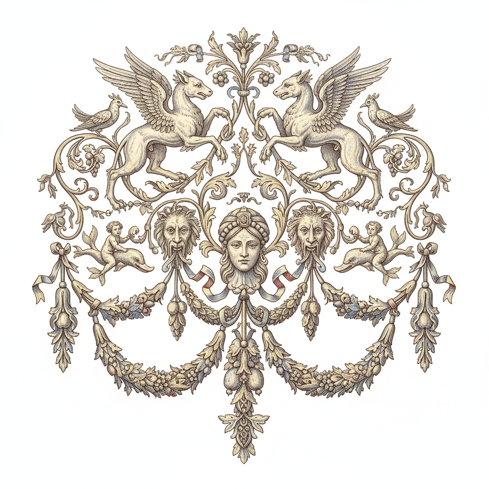

# Grotesque Ornament 怪诞装饰

> **时期：** 15世纪–19世纪  
> **关键词：** 古罗马壁画、幻想生物、对称藤蔓、拉斐尔凉廊、装饰体系

## 概述

Grotesque（怪诞装饰）源自15世纪末罗马地下发现的古罗马壁画——因在"洞穴"(grotta)中发现而得名。它以对称的藤蔓卷须为骨架，穿插幻想生物、面具、花环和建筑碎片，创造出一种轻盈、梦幻、无重力的装饰世界。拉斐尔将其引入梵蒂冈凉廊，使之成为文艺复兴以来最持久的装饰语汇。

## 风格特征

- **对称结构**：以中轴线为核心的镜像构图
- **藤蔓骨架**：卷曲的植物纹样连接各元素
- **幻想生物**：半人半兽、有翼怪物、嵌合体
- **轻盈感**：白色或浅色背景上的悬浮图案
- **无叙事**：纯粹装饰性的视觉游戏

## 代表人物与作品

- 拉斐尔工作室 梵蒂冈凉廊装饰
- 尼禄金宫（Domus Aurea）原始壁画
- 让·贝兰 法国怪诞装饰版画
- 罗伯特·亚当 新古典主义室内装饰

## 概念图

