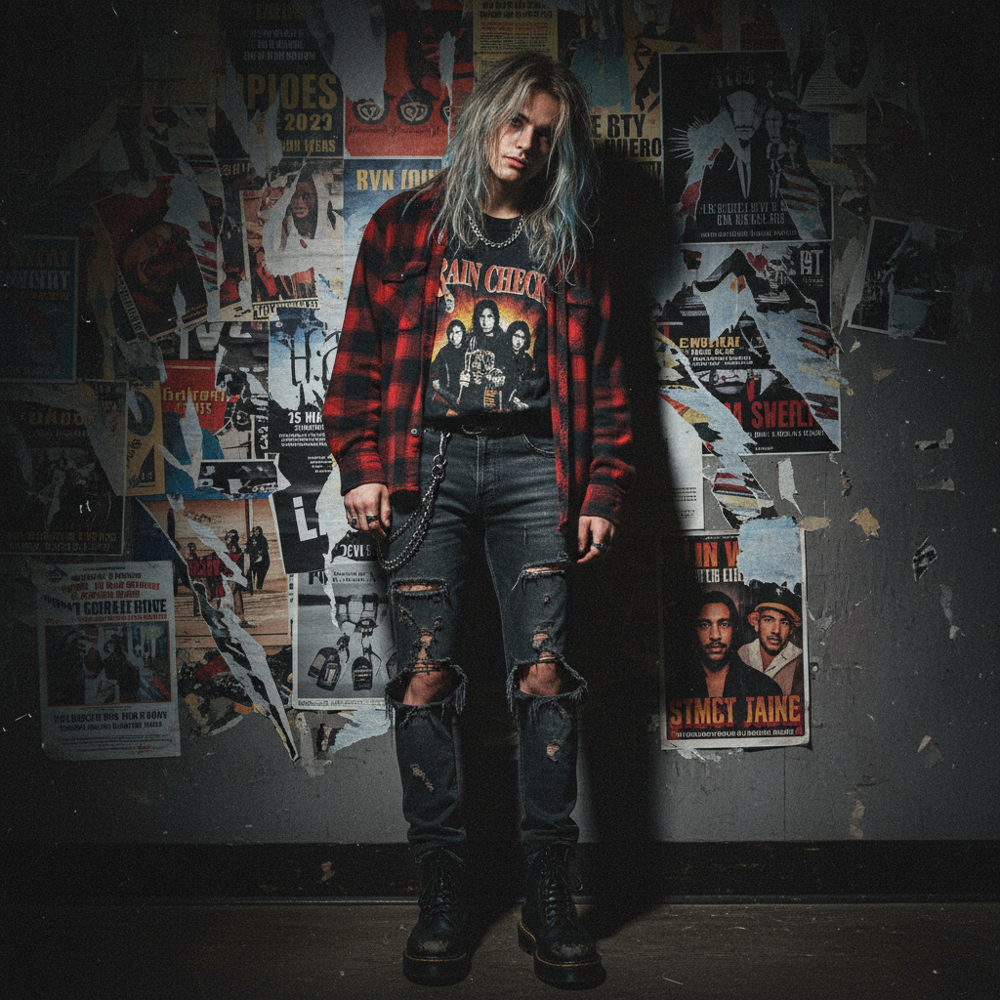

# Grunge Revival 垃圾摇滚复兴



> **"Kurt Cobain 的法兰绒衬衫回到了 Zara 货架上——90s 愤怒的 2020s 重生。"**

## 概述

| 维度 | 描述 |
|------|------|
| 时期 | 2018–至今 |
| 别名 | Grunge Revival, Neo-Grunge, 90s Grunge Redux |
| 核心色彩 | 黑色、深红、军绿、褪色牛仔蓝、灰色 |
| 关键元素 | 法兰绒格子衫、破洞牛仔裤、Doc Martens、band tee |
| 代表人物 | Billie Eilish (早期)、Olivia Rodrigo、Courtney Love 遗产 |
| 关联风格 | Grunge (原版), Soft Grunge, Indie Sleaze, Pale Grunge |

---

## 历史脉络

### 原版 Grunge (1991–1994)

| 维度 | 描述 |
|------|------|
| 音乐 | Nirvana、Pearl Jam、Soundgarden、Alice in Chains |
| 地点 | 西雅图 |
| 态度 | 真正的愤怒、反消费、反主流 |
| 服装 | 二手店的法兰绒、破牛仔裤（因为穷） |
| 结局 | Kurt Cobain 去世 (1994)，运动终结 |

### 2018–至今：第三波复兴

Grunge 的复兴周期：
1. **第一波**：原版 (1991–1994)
2. **第二波**：Soft Grunge / Tumblr Grunge (2011–2015)
3. **第三波**：Grunge Revival (2018–至今)

第三波的特征：
- **Olivia Rodrigo** 的 "brutal" 美学
- **Billie Eilish** 早期的宽松暗黑风格
- TikTok 上的 "grunge outfit" 标签
- 快时尚品牌大量生产"grunge"单品
- 与 Y2K 复兴同步发生

### 原版 vs 复兴的区别

| 维度 | 原版 Grunge | Grunge Revival |
|------|------------|----------------|
| 动机 | 反消费主义 | 消费主义（买"反消费"的衣服） |
| 来源 | 二手店 | Zara、H&M、Depop |
| 态度 | 真正不在乎 | 精心策划的"不在乎" |
| 音乐 | 西雅图地下音乐 | Spotify 播放列表 |
| 意义 | 社会运动 | 美学选择 |

---

## 视觉语法

### 色彩系统

```
主色：
  黑色 (#000000) — 基础色
  深红 (#8B0000) — 法兰绒、唇色
  军绿 (#556B2F) — 军装外套
  褪色牛仔蓝 (#4682B4) — 破洞牛仔裤
  灰色 (#696969) — 做旧、褪色

辅色：
  暗黄 (#DAA520) — 法兰绒格子
  白色 (#FFFFFF) — band tee 底色
  棕色 (#8B4513) — 皮革、靴子

质感：
  做旧/磨损 — 一切都要看起来"旧"
  法兰绒 — 格子衬衫
  牛仔 — 破洞、褪色
  皮革 — 靴子、腰带
  棉质 — band tee、卫衣
```

### 标志性元素

| 类别 | 元素 |
|------|------|
| 上衣 | 法兰绒格子衫、band tee、oversized 卫衣 |
| 下装 | 破洞牛仔裤、黑色紧身裤、格子裙 |
| 鞋 | Doc Martens、Converse、厚底靴 |
| 配饰 | 链条、choker、银色戒指、beanie |
| 妆容 | 烟熏眼、深色唇、"不化妆"的妆 |
| 态度 | 不在乎、叛逆、真实 |

---

## 与千禧怀旧的关系

### 90s 怀旧的核心
- Grunge 是 90s 文化的标志性运动
- 对千禧一代来说，Grunge = 父母的青春
- 对 Z 世代来说，Grunge = 一种"更真实"的时代

### 循环怀旧
- 每 20–30 年，时尚会回顾上一个周期
- 2020s 回顾 1990s = Grunge Revival
- 但每次回顾都会"稀释"原版的意义

---

## 中国语境

- "垃圾摇滚风"/"暗黑系"穿搭
- 格子衬衫+破洞牛仔裤的校园穿搭
- 与"朋克"/"摇滚"标签的交叉
- 独立音乐圈的视觉文化
- 二手店/古着文化的兴起

---

## 设计应用

| 场景 | 应用方式 |
|------|----------|
| 品牌 | 做旧字体+黑白+格子+手写元素 |
| 摄影 | 颗粒感+低饱和+闪光灯+随意构图 |
| 空间 | 裸露砖墙+旧海报+暗色照明 |
| 数字 | 做旧质感+手写字体+黑白滤镜 |

---

## 相关风格

← [Soft Grunge 软垃圾摇滚](soft-grunge.md) | [Indie Sleaze 独立放荡](indie-sleaze.md) →

↑ [返回千禧怀旧目录](README.md) | [返回总目录](../README.md)
