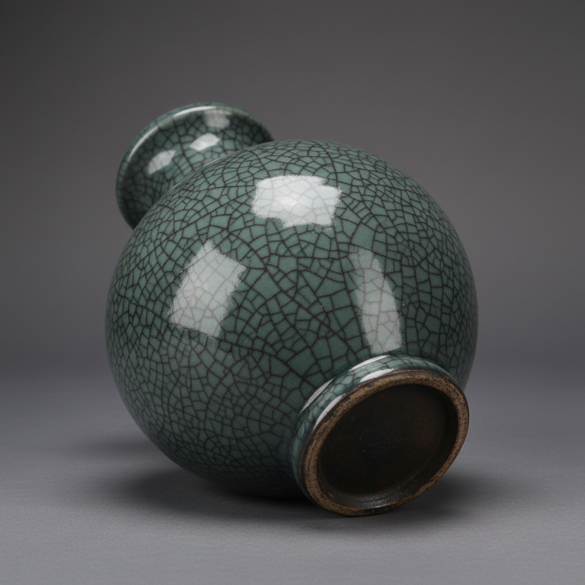

# Guan Ware Art 官窑艺术

> "Guan ware is the state made ceramic — porcelain produced under imperial supervision for imperial use alone, its thick jade-like glaze deliberately crackled into patterns that evoke ancient bronze and weathered jade, each piece carrying the weight of dynastic authority in its restrained perfection, the ceramic embodiment of Song dynasty court culture where understatement was the ultimate luxury." — Unknown

## 概述

官窑艺术（Guan Ware Art）是中国宋代五大名窑之一，专为皇家宫廷烧造的御用瓷器。官窑分为北宋官窑（汴京）和南宋官窑（杭州），以其厚重的青灰色釉和优美的开片纹理著称。官窑的"官"字本身就说明了其皇家身份——它是中国历史上最早由朝廷直接设立和管理的瓷窑，代表了宋代宫廷审美的最高标准。

官窑艺术的核心要素包括：1）皇家御用——朝廷直接管理烧造；2）厚釉开片——厚重釉层的开片美；3）青灰釉色——深沉的青灰色调；4）紫口铁足——口沿和足底的特征；5）仿古造型——仿青铜器的造型；6）宫廷审美——宋代宫廷的审美标准；7）极致工艺——不计成本的精工细作。

## 核心特征

| 特征 | 描述 |
|------|------|
| 皇家御用 | 朝廷直接管理 |
| 厚釉开片 | 厚重釉层开片 |
| 青灰釉色 | 深沉青灰色调 |
| 紫口铁足 | 口沿足底特征 |
| 仿古造型 | 仿青铜器造型 |
| 极致工艺 | 不计成本精工 |

## 视觉特征

- **青灰色**：深沉的青灰色釉面
- **厚釉感**：多层施釉的厚重感
- **开片纹**：优美的开片纹理
- **紫口**：口沿处的紫褐色
- **铁足**：足底露出的深色胎
- **仿古形**：仿青铜器的庄重造型

## 代表作品

| 作品 | 艺术家/文化 | 年代 | 意义 |
|------|-------------|------|------|
| *官窑贯耳瓶* | 南宋官窑 | 南宋 | 仿古造型经典 |
| *官窑弦纹瓶* | 南宋官窑 | 南宋 | 简洁的造型美 |
| *官窑圆洗* | 南宋官窑 | 南宋 | 文房用器 |
| *官窑琮式瓶* | 南宋官窑 | 南宋 | 仿玉琮造型 |
| *郊坛下官窑* | 南宋 | 南宋 | 南宋官窑遗址 |

## 历史时间线

| 时期 | 事件 |
|------|------|
| 北宋 | 北宋官窑的设立（汴京） |
| 南宋 | 南宋官窑的建立（杭州） |
| 元代 | 官窑的衰落 |
| 明清 | 仿官釉的大量生产 |
| 当代 | 官窑遗址的考古发掘 |

## 中国语境

官窑代表了中国陶瓷中"国家意志"的最高体现。宋代官窑的设立标志着中国陶瓷从民间手工业向国家工程的转变——朝廷直接投入资源，不计成本地追求完美。官窑的审美深受宋代宫廷文化影响——崇尚古朴、含蓄、典雅，器形多仿古代青铜器和玉器。南宋官窑的厚釉开片被认为是有意为之——模仿古玉的沁色和古铜器的锈蚀，体现了宋人"尚古"的审美趣味。官窑的"紫口铁足"特征成为鉴定的重要依据——口沿釉薄露出紫褐色胎，足底无釉露出铁黑色胎骨。官窑传统延续到明清——景德镇的御窑厂继承了官窑的皇家烧造制度，但审美风格已有很大变化。

## AI生成概念图

## 与其他风格的关系

- **Song Dynasty Kilns** → 宋代名窑
- **Ge Ware** → 哥窑
- **Ru Ware** → 汝窑
- **Crackle Glaze** → 开片釉
- **Imperial Ware** → 御用瓷
- **Archaism** → 仿古主义

---

*浮光艺志 | Chronicle of Artistry*
